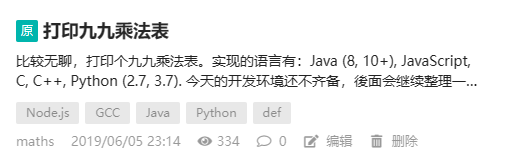

# 打印九九乘法表

[Index](index.md)

比较无聊，打印个九九乘法表。实现的语言有：Java (8, 10+), JavaScript, C, C++, Python (2.7, 3.7).
今天的开发环境还不齐备，後面会继续整理一些其他语言的写法：

Java 8:

``` java
public class MultiTable {
    public static void main(String[] args) {
        for (int i = 1; i <= 9; i++) {
            for (int j = 1; j <= i; j++) {
                System.out.print(j + " \u00d7 " + i + " = " + i * j);
                if (j < i) {
                    System.out.print(", ");
                }
            }
            System.out.println();
        }
    }
}
```

编译执行：

```
$ javac MultiTable.java
$ java MultiTable
```

Java 10+:

``` java
public class MultiTable2 {
    public static void main(String[] args) {
        for (var i = 1; i <= 9; i++) {
            for (var j = 1; j <= i; j++) {
                System.out.print(j + " \u00d7 " + i + " = " + i * j);
                if (j < i) {
                    System.out.print(", ");
                }
            }
            System.out.println();
        }
    }
}
```
编译执行，同上。

JavaScript (node.js):

```javascript
let content = '';
for (let i = 1; i <= 9; i++) {
    for (let j = 1; j <= i; j++) {
        content += j + " \u00d7 " + i + " = " + i * j;
        if (j < i) {
            content += ", ";
        }
    }
    content += "\n";
}

console.log(content);
```

编译执行：

```plaintext
$ node file_name.js
```

C:
``` C
#include <stdio.h>

int main() {
    for (int i = 1; i <= 9; i++) {
            for (int j = 1; j <= i; j++) {
                printf("%d  × %d =  %d",  j,  i, i * j);
                if (j < i) {
                    printf(", ");
                }
            }
            printf("\n");
    }
}
```

编译执行：

```plaintext
$ gcc file_name.c -o file_name
$ ./file_name
```

C++:

``` cpp
#include <iostream>

using namespace std;

int main() {
    for (int i = 1; i <= 9; i++) {
            for (int j = 1; j <= i; j++) {
                cout  << j << "×" << i << " = " << i * j;
                if (j < i) {
                    cout << (", ");
                }
            }
            cout << ("\n");
    }
}
```

编译执行：

```plaintext
$ g++ file_name.c -o file_name
$ ./file_name
```

注意这里使用 ``g++`` 而非 ``gcc``

Python 2, Python 3

``` python
# coding=utf-8
from __future__ import print_function # 本行保留，代码可运行于 Python 2.7，注释掉即为 Python 3.7 版本

def print_multi_table():
    for  i in range(1, 10):
        for j in range(1, i + 1):
            print("%d x %d = %d" % (j, i, i * j), end = "")
            if (j  <  i ):
                print(", ", end = "")
        print("")
    return

print_multi_table()
```

编译执行：
Python 2:

```plaintext
$ python file_name.py
```

Python 3:

```plaintext
$ python3 file_name.py
```

输出结果：

```plaintext
1 × 1 = 1   
1 × 2 = 2, 2 × 2 = 4   
1 × 3 = 3, 2 × 3 = 6, 3 × 3 = 9   
1 × 4 = 4, 2 × 4 = 8, 3 × 4 = 12, 4 × 4 = 16   
1 × 5 = 5, 2 × 5 = 10, 3 × 5 = 15, 4 × 5 = 20, 5 × 5 = 25   
1 × 6 = 6, 2 × 6 = 12, 3 × 6 = 18, 4 × 6 = 24, 5 × 6 = 30, 6 × 6 = 36   
1 × 7 = 7, 2 × 7 = 14, 3 × 7 = 21, 4 × 7 = 28, 5 × 7 = 35, 6 × 7 = 42, 7 × 7 = 49   
1 × 8 = 8, 2 × 8 = 16, 3 × 8 = 24, 4 × 8 = 32, 5 × 8 = 40, 6 × 8 = 48, 7 × 8 = 56, 8 × 8 = 64   
1 × 9 = 9, 2 × 9 = 18, 3 × 9 = 27, 4 × 9 = 36, 5 × 9 = 45, 6 × 9 = 54, 7 × 9 = 63, 8 × 9 = 72, 9 × 9 = 81   
```

---

本文于2019.06.05 23:14发布在[OSC](https://my.oschina.net/iridium/blog/3058988)。


<script src="https://giscus.app/client.js"
        data-repo="iridiumcao/iridiumcao.github.io"
        data-repo-id="MDEwOlJlcG9zaXRvcnkyOTUwNTIyODQ="
        data-category="Announcements"
        data-category-id="DIC_kwDOEZYj_M4Cxfqj"
        data-mapping="pathname"
        data-strict="0"
        data-reactions-enabled="1"
        data-emit-metadata="0"
        data-input-position="bottom"
        data-theme="preferred_color_scheme"
        data-lang="zh-CN"
        crossorigin="anonymous"
        async>
</script>