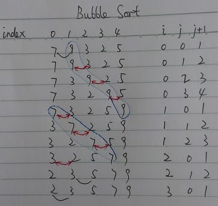

<script>
MathJax = {
  tex: {
    inlineMath: [['$', '$'], ['\\(', '\\)']]
  }
};
</script>
<script id="MathJax-script" async
  src="https://cdn.jsdelivr.net/npm/mathjax@3/es5/tex-chtml.js">
</script>

# 冒泡排序(Bubble Sort)

[返回目录](../index.md)

冒泡排序(Bubble Sort)，一趟一趟从头遍历数组，每次遍历元素的数量比前一次少1，每次遍历，都排好该次遍历的最后一个位置。它和选择排序有两点不同：

1. 冒泡排序是相邻元素比较，选择排序不是。
2. 冒泡排序对元素归位的方向是从右到左（先找到最后一个元素），[选择排序](../selection-sort/content.md)的归位方向是从左到右。

【举例】将7, 9, 3, 2, 5这几个整数，按升序（从小到大）排列。

【分析】每相邻两元素比较，如果顺序错误，就交换，遍历一趟，可以把最后一个元素定下来，然后再在剩下的未归位元素中反复使用该方法，直到所有的元素都排序完成。



从上图也可以看出「冒泡排序」这一名称的由来。第一趟遍历，9浮起来了，第二趟遍历，7浮起来了，以此类推，直到所有的值都浮到合适的位置。

代码示例如下：

```java
public class BubbleSort {

    private static Scanner scanner;

    public static void main(String[] args) {
        System.out.println("Please input 5 integers splited by comma (do not input blank): ");
        scanner = new Scanner(System.in);
        String sc = scanner.next();
        String[] ints = sc.split(",");
        int[] arrays = new int[ints.length];
        for (int i = 0; i < ints.length; i++) {
            arrays[i] = Integer.parseInt(ints[i]);
            // System.out.println(arrays[i]);
        }

        int[] sortedArrays = bubbleSort(arrays);
        for (int i = 0; i < ints.length; i++) {
            System.out.println(sortedArrays[i]);
        }
    }

    private static int[] bubbleSort(int[] arrays) {
        for (int i = 0; i < arrays.length; i++) {
            for (int j = 0; j < arrays.length - i - 1; j++) {
                if (arrays[j] > arrays[j + 1]) {
                    int temp = arrays[j];
                    arrays[j] = arrays[j + 1];
                    arrays[j + 1] = temp;
                }
            }
        }
        return arrays;
    }
}
```

它是最初级的排序方法，凡接触排序算法，不会不知道它。

【复杂度】

冒泡排序，元素的比较次数，在最坏的情况下，和选择排序是一样的，都是 $\dfrac{n(n-1)}{2}$，因此复杂度也是 $O(n^2)$. 效率较差，该算法基本上只有理论意义，生产环境中罕有用到。

个人认为冒泡排序的代码实现比选择排序要麻烦一些，也不如选择排序的实现好理解。不知道为何很多教科书要把冒泡排序放在排序算法的第一种里。

冒泡排序在有些算法讲述上，可以制作出很形象的动画。

---

本文是从[旧站](https://sites.google.com/site/iridiumsite/it/algorithms/bubble-sort)搬运过来的。

<script src="https://giscus.app/client.js"
        data-repo="iridiumcao/iridiumcao.github.io"
        data-repo-id="MDEwOlJlcG9zaXRvcnkyOTUwNTIyODQ="
        data-category="Announcements"
        data-category-id="DIC_kwDOEZYj_M4Cxfqj"
        data-mapping="pathname"
        data-strict="0"
        data-reactions-enabled="1"
        data-emit-metadata="0"
        data-input-position="bottom"
        data-theme="preferred_color_scheme"
        data-lang="zh-CN"
        crossorigin="anonymous"
        async>
</script>