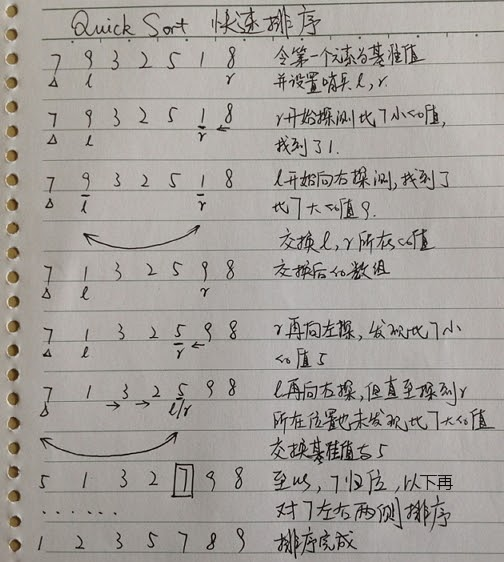
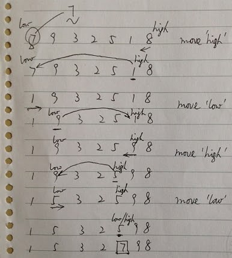

# 快速排序(Quick Sort)

[返回目录](../index.md)

快速排序(Quick Sort) 是基于二分法的一种排序方式，基本思路是：在需要排序的元素中，任意选一个元素作为基准元素，比该元素大的，排在该元素右边，其余排在左边，排好后，再对该元素左右两侧以同样的方式排序，直至全部排完。

在一般编程实践中，基准元素就选第一个元素。具体代码一般通过递归完成，因为使用语言和个人习惯不同，代码实现也可能并不一样。

举例：将7, 9, 3, 2, 5, 1, 8这几个整数，按升序（从小到大）排列。

用快速排序的过程如下：



【代码】

相关代码如下：

（参：[QuickSort.java](QuickSort.java)）

```java
public class QuickSort3 {
    private static Scanner scanner;

    public static void main(String[] args) {
        System.out.println("Please input integers split by comma (do not input blank): ");
        scanner = new Scanner(System.in);
        String sc = scanner.next();
        String[] ints = sc.split(",");
        int[] arrays = new int[ints.length];
        for (int i = 0; i < ints.length; i++) {
            arrays[i] = Integer.parseInt(ints[i]);
            // System.out.println(arrays[i]);
        }

        QuickSort3 qs = new QuickSort3();
        qs.quickSort(arrays, 0, arrays.length - 1);
        for (int i = 0; i < ints.length; i++) {
            System.out.print(arrays[i] + ", ");
        }
    }

    // 把基准值放到合适的位置后，并返回基准值的 index
    public int moveBase(int[] list, int left, int right) {
        if (list.length == 1 || left == right) {
            return left;
        }

        int baseIndex = left;
        int base = list[baseIndex]; // 数组的第一个作为基准值
        while (left + 1 < right) { // 这里比较的是哨兵的 index，左边哨兵的 index = left + 1
            while (left + 1 < right && list[right] >= base) {
                right--;
            }

            while (left + 1 < right && list[left + 1] <= base) {
                left++;
            }

            int tmp = list[left + 1];
            list[left + 1] = list[right];
            list[right] = tmp;
        }

        // 交换基准值和 left 哨兵位置的值
        list[baseIndex] = list[left + 1];
        list[left + 1] = base;
        return left + 1; // 返回基准值的 index
    }

    /**
     * @param list  array
     * @param left  left index
     * @param right right index
     */
    public void quickSort(int[] list, int left, int right) {
        if (left < right) {
            int baseIndex = moveBase(list, left, right); // 将 list 数组进行一分为二
            quickSort(list, left, baseIndex - 1); // 对左边的元素排序
            quickSort(list, baseIndex + 1, right); // 对右边的元素排序
        }
    }
}
```

以上代码需要注意，先使用 r 哨兵探测，然后再使用 l 哨兵。如果要先使用 l 探，再使用 r 探，不是不可以，但程序需要再重新。这里不再描述此问题。可以思考，对 3, 1, 2, 5, 4 如果选择3为基准量，然后从左边先探得到的结果。

其他：pzhtpf from CSDN 的办法

在前几天研究快速排序代码实现时，在 CSDN 上发现 pzhtpf 是这样实现的：

```java
// 将基准量移动到合适的位置，并返回基准值的 index 
public int getMiddle(int[] list, int low, int high) {
    int tmp = list[low]; // 数组的第一个作为中轴
    while (low < high) {
        while (low < high && list[high] >= tmp) { // 从右往左扫描，探测比基准量小的元素
            high--;
        }
        list[low] = list[high]; // 比中轴小的记录移到低端
        while (low < high && list[low] <= tmp) { // 从左往右扫描，探测比基准量大的元素
            low++;
        }
        list[high] = list[low]; // 比中轴大的记录移到高端
    }
    list[low] = tmp; // 中轴记录到尾
    return low; // 返回中轴的位置
}

public void quickSort(int[] list, int low, int high) {
    if (low < high) {
        int middle = getMiddle(list, low, high); // 将list数组进行一分为二
        quickSort(list, low, middle - 1); // 对低字表进行递归排序
        quickSort(list, middle + 1, high); // 对高字表进行递归排序
    }
}
```

注意，代码中的「中轴」，即「基准量」，代码来源于本页「参考」部分的链接，写得比较有技巧，但效率不太优。它将左哨兵设置到基准量上，导致了一个多余的比较操作，同时，它的左边移动到右边，右边再移动左边往右的方式，有很强的技巧性，理解起来也不够直观。虽然如此，它的代码仍然给我启发。这部分代码对第一个值归位的图示如下：



由上图可见，基准值归位移动的次数比较多。更好的方式是基准量不再探测，可以参见本文的第一个实现。

---

参考：

* [程序员必知的8大排序(三)-------冒泡排序，快速排序（java实现）](http://blog.csdn.net/pzhtpf/article/details/7560294) (by pzhtpf)
* 本文是从Google Sites的旧站转移过来的。

<script src="https://giscus.app/client.js"
        data-repo="iridiumcao/iridiumcao.github.io"
        data-repo-id="MDEwOlJlcG9zaXRvcnkyOTUwNTIyODQ="
        data-category="Announcements"
        data-category-id="DIC_kwDOEZYj_M4Cxfqj"
        data-mapping="pathname"
        data-strict="0"
        data-reactions-enabled="1"
        data-emit-metadata="0"
        data-input-position="bottom"
        data-theme="preferred_color_scheme"
        data-lang="zh-CN"
        crossorigin="anonymous"
        async>
</script>