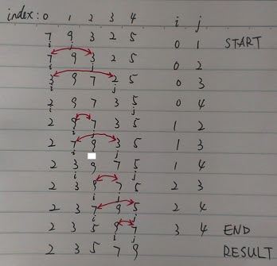

<script>
MathJax = {
  tex: {
    inlineMath: [['$', '$'], ['\\(', '\\)']]
  }
};
</script>
<script id="MathJax-script" async
  src="https://cdn.jsdelivr.net/npm/mathjax@3/es5/tex-chtml.js">
</script>

# 选择排序(Selection Sort)

[返回目录](../index.md)

选择排序(Selection Sort)是非常直观的排序方法。算法的基本思路是从要排序的数组的第一个元素开始，和之后的每一个元素进行比较，如果是逆序，则交换之。

【举例】将7, 9, 3, 2, 5这几个整数，按升序（从小到大）排列。

【分析】从数组的第一个位置开始(index=0)，挑出整个数组中最小的值，并放置在这个位置。具体做法就是，将第一位置的值，依次和数组的其他值比较，凡是比该值大，就交换两数，直到比较到数组的最后一个值。

将数组中最小的值找到，并放置在第一个位置后，再在从第二值开始到最后一值的子数组中用类似的方法找到最小的值，相对整个数组来说，是第二小的值。

以此类推，直到数组的每个位置都放置了从此位置到最后一值的子数组的最小值。

具体执行过程可参下图：



【代码】用 Java 代码，选择排序算法可以表达如下：

```java
import java.util.Scanner;

public class SelectionSort {

    private static Scanner scanner;

    public static void main(String[] args) {
        System.out.println("Please input 5 integers splited by comma (do not input blank): ");
        scanner = new Scanner(System.in);
        String sc = scanner.next();
        String[] ints = sc.split(",");
        int[] arrays = new int[ints.length];
        for (int i = 0; i < ints.length; i++) {
            arrays[i] = Integer.parseInt(ints[i]);
            // System.out.println(arrays[i]);
        }

        int[] sortedArrays = selectionSort(arrays);
        for (int i = 0; i < ints.length; i++) {
            System.out.print(sortedArrays[i]);
        }
    }

    private static int[] selectionSort(int[] arrays) {
        for (int i = 0; i < arrays.length; i++) {
            for (int j = i + 1; j < arrays.length; j++) {
                if (arrays[i] > arrays[j]) {
                    int temp = arrays[i];
                    arrays[i] = arrays[j];
                    arrays[j] = temp;
                }
            }
        }
        return arrays;
    }

}
```

以上粗体部分即选择算法的具体步骤，j 的起点是 i+1，这点很重要，在前面的配图中也也可以看到。算法中的交换两数的方式，是 C 语言中最经典的交换方式。程序中的双重循环是该算法的核心。

【复杂度】

选择排序，值与值之间作比较的次数是确定的，如果有 n 个值需要排序，则需要执行的次数是：

1. 第1趟：n-1 次
2. 第2趟：n-2 次
3. ……
4. 第 n-1 趟：1 次

因此共执行：$(n-1) + (n-2) + ... + 1 = \dfrac{n(n-1)}{2}$ 次，时间复杂度是 $O(n^2)$

它的时间复杂度很高哇！

---

本文是从Google Sites上的旧站搬运过来的。

<script src="https://giscus.app/client.js"
        data-repo="iridiumcao/iridiumcao.github.io"
        data-repo-id="MDEwOlJlcG9zaXRvcnkyOTUwNTIyODQ="
        data-category="Announcements"
        data-category-id="DIC_kwDOEZYj_M4Cxfqj"
        data-mapping="pathname"
        data-strict="0"
        data-reactions-enabled="1"
        data-emit-metadata="0"
        data-input-position="bottom"
        data-theme="preferred_color_scheme"
        data-lang="zh-CN"
        crossorigin="anonymous"
        async>
</script>