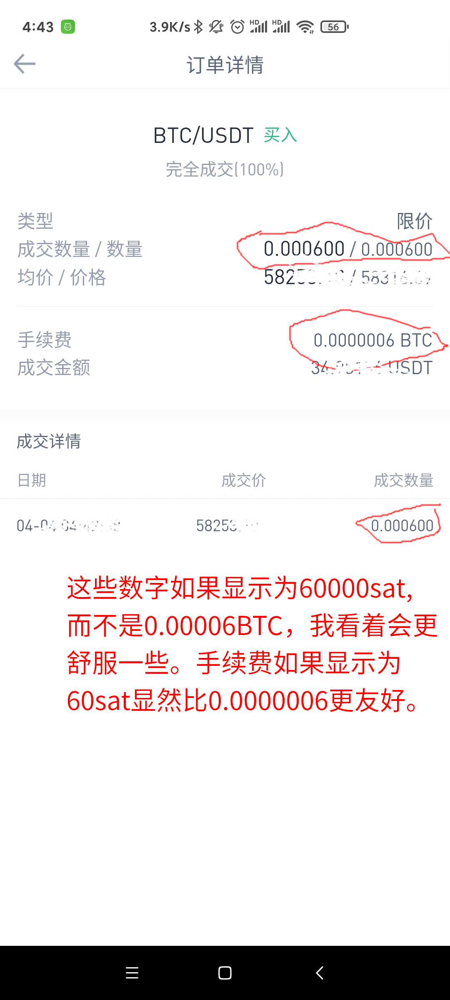

# 给币安的一条产品建议

内容如下：

```plaintext
支持以“聪”为单位显示比特币金额

目前比特币的单价约40万人民币，大部分散户已不可能单次购买一个以上。以我自己为例，每次购买量可能在数万聪而已。但系统显示的金额以BTC为单位，小数点后有很多0，给我带来一些困扰：
1. 小数点太多，不便计算。
2. 小数点太多，贫穷感很强烈，挫败。

【解决方案】
我的建议是，让用户可以选择其他单位展示比特币金额，比如BTC, mBTC, μBTC (bits), Satoshi (sat)等，但考虑到操作的简便性，一般给用户提供BTC和sat两个单位选项就够了。

【预期结果】
1. 计算方便。
2. 幸福感增强了。（从用户心理上讲，这么做是有意义的。）
3. 用户的小额交易更活跃。
```

配图如下：

 {:height=”30%” width=”30%”}
