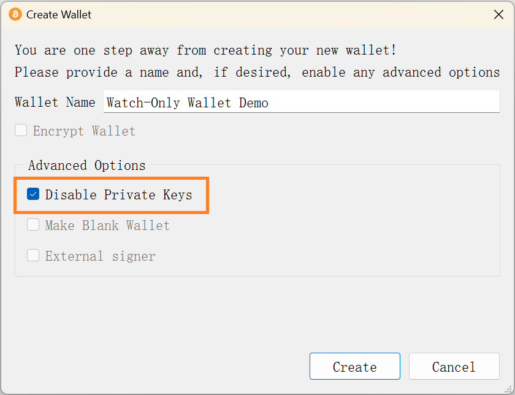
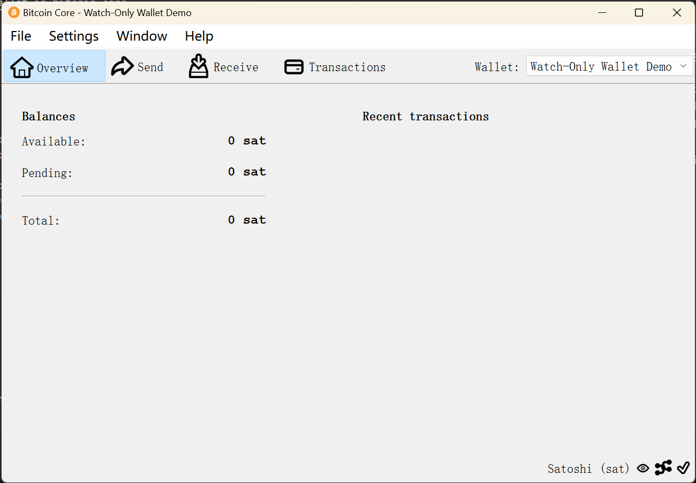
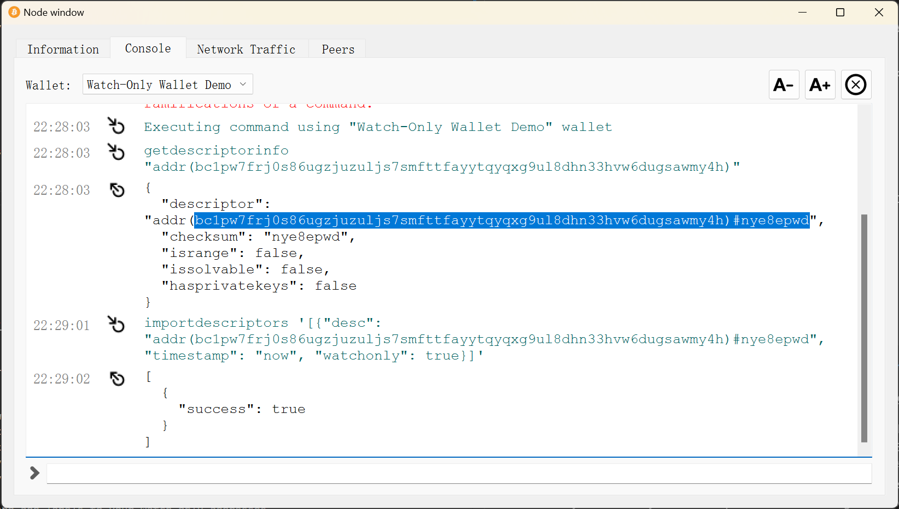
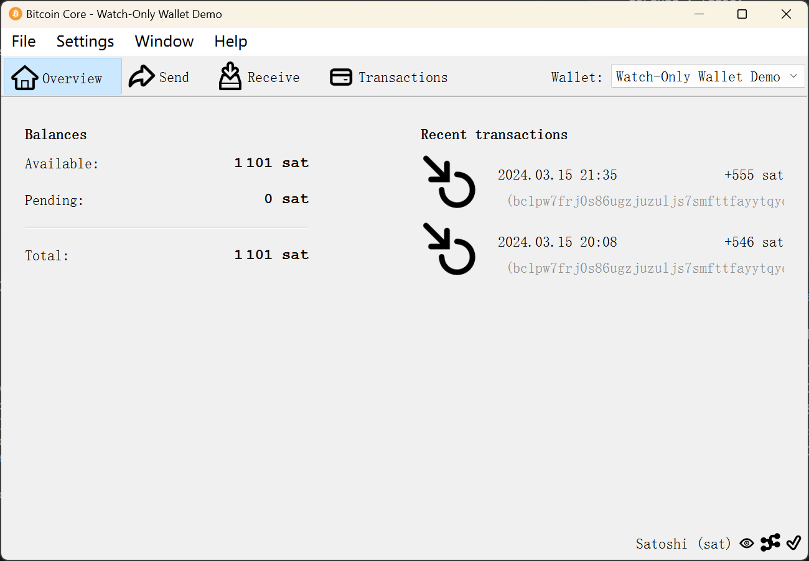

# Create a Watch-Only Wallet with Bitcoin Core

[Index](../index_en.md)

> A watch-only wallet is a type of cryptocurrency wallet that allows users to monitor their balances and transactions without having the ability to spend or move the funds. This type of wallet is useful for individuals who want to keep track of their cryptocurrency holdings without exposing their private keys to potential security risks. Without the private key associated with the wallet, you can never make any withdrawals from the wallet. You will be restricted to viewing only, making deposits, but NOT withdrawing.
> 
> Ref: <https://medium.com/@knowledgecrypticles/how-to-withdraw-from-a-watch-only-wallet-5e4696565cbf>

## Create Wallet

Menu Path: File -> Create Wallet...

- Set wallet name (e.g., Watch-Only Wallet Demo)
- Choose "Disable Private Keys" in "Advance Options"
- Click "Create"



Yes, the wallet is generated



However, it's a blank wallet with no Bitcoin adreeses.

## Import Addresses for Watching

Menu Path: Window -> Console

We can set arbitrary addresses to watch. For this demo, we can randomly pick a Bitcoin address from <https://mempool.space/>. OK, the latest block is [834804](https://mempool.space/block/0000000000000000000054f00eea5bb58ffcb26b2dafc18db8b255164fb0549a), I picked address [bc1pw7frj0s86ugzjuzuljs7smfttfayytqyqxg9ul8dhn33hvw6dugsawmy4h](https://mempool.space/address/bc1pw7frj0s86ugzjuzuljs7smfttfayytqyqxg9ul8dhn33hvw6dugsawmy4h) from this block.

```plaintext
getdescriptorinfo "addr(bc1pw7frj0s86ugzjuzuljs7smfttfayytqyqxg9ul8dhn33hvw6dugsawmy4h)"

{
  "descriptor": "addr(bc1pw7frj0s86ugzjuzuljs7smfttfayytqyqxg9ul8dhn33hvw6dugsawmy4h)#nye8epwd",
  "checksum": "nye8epwd",
  "isrange": false,
  "issolvable": false,
  "hasprivatekeys": false
}


importdescriptors '[{"desc": "addr(bc1pw7frj0s86ugzjuzuljs7smfttfayytqyqxg9ul8dhn33hvw6dugsawmy4h)#nye8epwd", "timestamp": "now", "watchonly": true}]'

[
  {
    "success": true
  }
]
```

`getdescriptorinfo` get the address' descriptor that can be imported to the wallet.




Its transactions can be viewed from the Overview tab:



The details of transactions can be found via Transactions tab. The address can be set a tag via Windos -> Receiving Addresses.

Ref: <https://bitcoin.stackexchange.com/questions/114722/how-to-use-a-watch-only-wallet-in-bitcoin-core>

<script src="https://giscus.app/client.js"
        data-repo="iridiumcao/iridiumcao.github.io"
        data-repo-id="MDEwOlJlcG9zaXRvcnkyOTUwNTIyODQ="
        data-category="Announcements"
        data-category-id="DIC_kwDOEZYj_M4Cxfqj"
        data-mapping="pathname"
        data-strict="0"
        data-reactions-enabled="1"
        data-emit-metadata="0"
        data-input-position="bottom"
        data-theme="preferred_color_scheme"
        data-lang="en"
        crossorigin="anonymous"
        async>
</script>