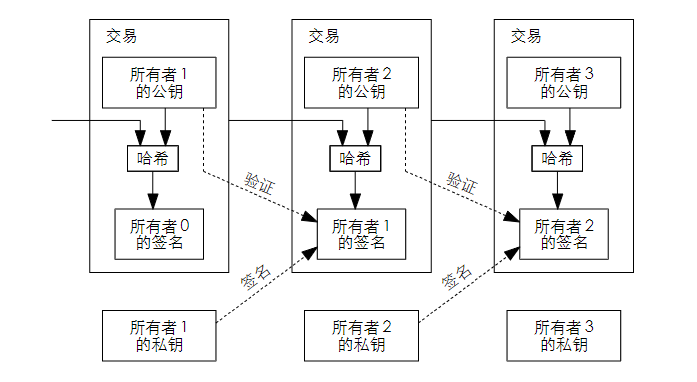

# Reading Through the Bitcoin White Paper, 通读比特币白皮书

[⇦上一章](wp01.md) - [返回目录📖](whitepaper.md) - [下一章⇨](wp03.md)

---

按：本章解决信任问题

## 2. Transactions 交易

> We define an electronic coin as a chain of digital signatures. Each owner transfers the coin to the next by digitally signing a hash of the previous transaction and the public key of the next owner and adding these to the end of the coin. A payee can verify the signatures to verify the chain of ownership.

> The problem of course is the payee can't verify that one of the owners did not double-spend the coin. A common solution is to introduce a trusted central authority, or mint, that checks every transaction for double spending. After each transaction, the coin must be returned to the mint to issue a new coin, and only coins issued directly from the mint are trusted not to be double-spent. The problem with this solution is that the fate of the entire money system depends on the company running the mint, with every transaction having to go through them, just like a bank.
>
> We need a way for the payee to know that the previous owners did not sign any earlier transactions. For our purposes, the earliest transaction is the one that counts, so we don't care about later attempts to double-spend. The only way to confirm the absence of a transaction is to be aware of all transactions.  In the mint based model, the mint was aware of all transactions and decided which arrived first. To accomplish this without a trusted party, transactions must be publicly announced [[1]](http://www.weidai.com/bmoney.txt), and we need a system for participants to agree on a single history of the order in which they were received. The payee needs proof that at the time of each transaction, the majority of nodes agreed it was the first received.

解读如下：

> We define an electronic coin as a chain of digital signatures. 

我们用一个数字签名的链条来定义一枚电子硬币。

> Each owner transfers the coin to the next by digitally signing a hash of the previous transaction and the public key of the next owner and adding these to the end of the coin. 

每个持有人将币转给下一个持有人，技术上是如何实现的？

1. 将上次交易的哈希和下个持有人的公钥组合在一起，并计算hash
2. 对上面生成的hash值进行数字签名
3. 构成转账算一个哈希，再进行数字签名，并把这个签名添加到币的末尾。上一句定义“币”的概念提到，币就是一个数字签名的链条，所有有“添加到币的末尾”这个说法。

翻译，真的太难了。理解就好，本文的目的不是翻译，是理解。如果想要获取比较好的翻译文本，请自行翻译或者参考文首给出的几个中文译本链接。

ChatGPT解读如下：这句话的意思是，每个持有人通过对上一次交易的哈希值和下一个持有人的公钥进行数字签名，并将它们添加到硬币的末尾，将硬币转移给下一个持有人。这种方式被称为“链式交易”，因为每个交易都链接到上一个交易，并且可以通过这个链来追踪硬币的历史交易记录。这个过程使用的是公钥密码学的技术，它可以确保交易是安全和可靠的，并且只有持有人可以使用他们的私钥来转移硬币。

> A payee can verify the signatures to verify the chain of ownership.

被支付人能够验证签名以验证链上的所有权。白皮书中译本译作：收款人可以通过验证数字签名来证实其为该链的所有者。

这个译本非常不错。这里理解时，有“币”和“链”等价的概念会很有帮助。

* payee 直接意思是“被支付人”，即“收款人”。

这幅图形象说明了交易链（注意不是区块链）中相邻交易的关系。观察当中（第二）那笔交易，它包含上一笔交易信息和Bob的公钥组合起来生成一个hash值，这个hash值即非对称加密体系中的摘要信息digest，然后交易发起者Alice再用私钥对这个hash值签名。Bob使用Alice的公钥可以验证签名的正确性，从而确认发送者Alice身份和交易的真实性。

有个疑问，交易时，上家只要知道下家的地址就可以转账，但这里一笔交易记录里包含下家的公钥，这是怎么回事？公钥和地址之间可以互相推导出来吗？

比特币中其实有两个很重要的链：

1. 交易链 transaction chain，本节里提到的
2. 区块链 block chain，后续章节会提到

> The problem of course is the payee can't verify that one of the owners did not double-spend the coin.

有个明显的问题是，收款人无法确实付款人是否把这枚硬币支付了两次。

> A common solution is to introduce a trusted central authority, or mint, that checks every transaction for double spending.  

常用的解决方案是引入第三方中心化信任机构或铸币厂，让它们去检查全部交易是否存在双花问题。

> After each transaction, the coin must be returned to the mint to issue a new coin, and only coins issued directly from the mint are trusted not to be double-spent.

在每一笔交易结束后，这枚硬币都必须返回铸币厂并由它重新发行一枚新的硬币，只有铸币厂直接发行的硬币才能被信任，才不会有双花问题。

> The problem with this solution is that the fate of the entire money system depends on the company running the mint, with every transaction having to go through them, just like a bank.

但这个方案的问题在于整个现金系统依赖于运营铸币厂的公司，每笔交易都得经过它们，就像银行一样。

>
> We need a way for the payee to know that the previous owners did not sign any earlier transactions.

我们需要一种新方式让收款人晓得上一个硬币所有者没有更早的签名交易。

这里，发送方签名就意味将币发送出去。这里想到的防止双花，就是确认系统当前验证的交易所花的这笔钱在这次交易之前没有被支付过。具体怎么操作，看[第三章](wp03.md)的讲述，这里说不清楚。

> For our purposes, the earliest transaction is the one that counts, so we don't care about later attempts to double-spend. 

对我们来说，最早的交易是唯一有效的，所以我们不担心之后的双花问题。

这里说的优点神，具体内容可能还要后面支撑。

> The only way to confirm the absence of a transaction is to be aware of all transactions.  

唯一能确认某条交易不存在的方法是知晓全部交易。

> In the mint based model, the mint was aware of all transactions and decided which arrived first. 

在铸币厂模式里，铸币厂会知晓全部交易，并决定哪笔交易最先实现。

> To accomplish this without a trusted party, transactions must be publicly announced, and we need a system for participants to agree on a single history of the order in which they were received. 

为了在没有可信第三方的情况下实现这一点（确认交易），必须公开宣布交易，并且我们需要一个系统，让参与者达成一致意见，确定它们接收到交易的顺序。

> The payee needs proof that at the time of each transaction, the majority of nodes agreed it was the first received.

收款人需要证明，在每次交易发生时，大多数节点都同意该交易是第一个被接收的。

这个句子的从句里带了逗号，一不小心断句错误，半天懂不起。

---

[⇦上一章](wp01.md) - [返回目录📖](whitepaper.md) - [下一章⇨](wp03.md)
