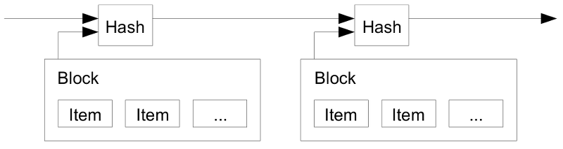

# Reading Through the Bitcoin White Paper, 通读比特币白皮书

[⇦上一章](wp02.md) - [返回目录📖](whitepaper.md) - [下一章⇨](wp04.md)

---

按：本章解决双花问题

## 3. Timestamp Server 时间戳服务器

> The solution we propose begins with a timestamp server. A timestamp server works by taking a hash of a block of items to be timestamped and widely publishing the hash, such as in a newspaper or Usenet post [2–5]. The timestamp proves that the data must have existed at the time, obviously, in order to get into the hash. Each timestamp includes the previous timestamp in its hash, forming a chain, with each additional timestamp reinforcing the ones before it.
>
> 

解读如下：

> The solution we propose begins with a timestamp server. 

我们提出了使用时间戳服务器的解决方案。

这里要结合前文理解，[第二章](wp02.md)多次提到了双花的问题。

> A timestamp server works by taking a hash of a block of items to be timestamped and widely publishing the hash, such as in a newspaper or Usenet post [2–5]. 

时间戳服务器的工作模式是这样的：一坨需要打时间戳的项一起构成一个块（区块，block），求这个块的hash，就像报纸或新闻组那样。

> The timestamp proves that the data must have existed at the time, obviously, in order to get into the hash. 

时间戳证明要得到这个hash值，显然当时数据必然存在过的。

这句话有点绕，不过就是“时间戳”证明一些数据必然在过去某个时刻存在过，证明的方式是生成一个和它们相关的hash。应该就是后面章节将会提到的默克尔树的root hash.

> Each timestamp includes the previous timestamp in its hash, forming a chain, with each additional timestamp reinforcing the ones before it.

每一个时间戳都包含前一个时间戳的hash，这些时间戳串成链，每个时间戳都在强化之前的时间戳。

这是链式结构的特点，连越长，对上链越早的数据的承认越强。

---

参考资料

* [2] H. Massias, X.S. Avila, and J.-J. Quisquater, "Design of a secure timestamping service with minimal trust requirements," In 20th Symposium on Information Theory in the Benelux, May 1999.
* [3] S. Haber, W.S. Stornetta, "How to time-stamp a digital document," In Journal of Cryptology, vol 3, no 2, pages 99-111, 1991.
* [4] D. Bayer, S. Haber, W.S. Stornetta, "Improving the efficiency and reliability of digital time-stamping," In Sequences II: Methods in Communication, Security and Computer Science, pages 329-334, 1993.
* [5] S. Haber, W.S. Stornetta, "Secure names for bit-strings," In Proceedings of the 4th ACM Conference on Computer and Communications Security, pages 28-35, April 1997.

---

[⇦上一章](wp02.md) - [返回目录📖](whitepaper.md) - [下一章⇨](wp04.md)

