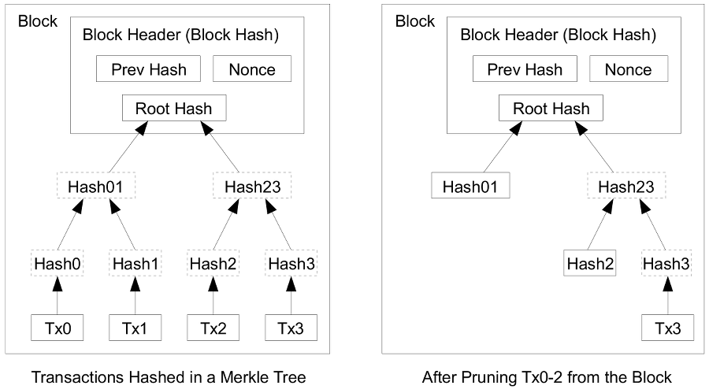

# Reading Through the Bitcoin White Paper, 通读比特币白皮书

[⇦上一章](wp06.md) - [返回目录📖](whitepaper.md) - [下一章⇨](wp08.md)

---

按：本章的关键是Merkle树。

## 7. Reclaiming Disk Space 回收磁盘空间

> Once the latest transaction in a coin is buried under enough blocks, the spent transactions before it can be discarded to save disk space. To facilitate this without breaking the block's hash, transactions are hashed in a Merkle Tree [^7][^2][^5], with only the root included in the block's hash. Old blocks can then be compacted by stubbing off branches of the tree. The interior hashes do not need to be stored.
> 
> 
>
> A block header with no transactions would be about 80 bytes. If we suppose blocks are generated every 10 minutes, 80 bytes * 6 * 24 * 365 = 4.2MB per year. With computer systems typically selling with 2GB of RAM as of 2008, and Moore's Law predicting current growth of 1.2GB per year, storage should not be a problem even if the block headers must be kept in memory.

解读如下：

> Once the latest transaction in a coin is buried under enough blocks, the spent transactions before it can be discarded to save disk space. 

一旦一个硬币最近的交易被足够多的节点覆盖，这个交易之前的交易就可以丢弃以节省磁盘空间。

* bury，埋，经过九年义务教育的学习，一般只晓得它的意思是“埋葬”，但其实它的本意是“埋”，不只是埋死人。这里的用法很形象，把一个交易埋在区块里。可以这么想象，这条交易被某个区块包含后，就埋进去了，新的区块增加了，埋它的“土”也增厚了。翻译的话，就译成“覆盖”也还行。

> To facilitate this without breaking the block's hash, transactions are hashed in a Merkle Tree [^7][^2][^5], with only the root included in the block's hash. 

为了让这（节省磁盘空间）容易一些，并且不破坏区块的哈希，区块中的哈希使用默克尔（Merkle）树，只有根哈希包含在区块哈希中。

> Old blocks can then be compacted by stubbing off branches of the tree. 

旧的区块可以通过剪掉默克尔树的枝干进行压缩。

> The interior hashes do not need to be stored.

内部的哈希无需保存。

其实就是除了根哈希，其余的哈希都不必保存。

> 
> 
>
> A block header with no transactions would be about 80 bytes. 

一个不带交易信息的区块头大约占80字节。

> If we suppose blocks are generated every 10 minutes, 80 bytes * 6 * 24 * 365 = 4.2MB per year. 

如果我们假定每10分钟生成一个区块，一年生成的数据是 80 bytes * 6 * 24 * 365 = 4.2MB

> With computer systems typically selling with 2GB of RAM as of 2008, and Moore's Law predicting current growth of 1.2GB per year, storage should not be a problem even if the block headers must be kept in memory.

2008年在售的电脑基本上都有2GB的内存，按照摩尔定律预测每年增长1.2GB，即使区块头需要存放在内存中，存储也不是问题。

---

参考资料：

* [^2] H. Massias, X.S. Avila, and J.-J. Quisquater, "Design of a secure timestamping service with minimal trust requirements," In 20th Symposium on Information Theory in the Benelux, May 1999.
* [^5] S. Haber, W.S. Stornetta, "Secure names for bit-strings," In Proceedings of the 4th ACM Conference on Computer and Communications Security, pages 28-35, April 1997.
* [^7] R.C. Merkle, "Protocols for public key cryptosystems," In Proc. 1980 Symposium on Security and Privacy, IEEE Computer Society, pages 122-133, April 1980.

---

[⇦上一章](wp06.md) - [返回目录📖](whitepaper.md) - [下一章⇨](wp08.md)
