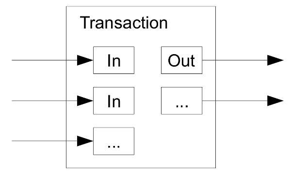

# Reading Through the Bitcoin White Paper, 通读比特币白皮书

[返回目录](whitepaper.md)

## 9. Combining and Splitting Value 合并和分割交易额

> Although it would be possible to handle coins individually, it would be unwieldy to make a separate transaction for every cent in a transfer. To allow value to be split and combined, transactions contain multiple inputs and outputs. Normally there will be either a single input from a larger previous transaction or multiple inputs combining smaller amounts, and at most two outputs: one for the payment, and one returning the change, if any, back to the sender.
>
> 
>
> It should be noted that fan-out, where a transaction depends on several transactions, and those transactions depend on many more, is not a problem here. There is never the need to extract a complete standalone copy of a transaction's history.

解读如下：

> Although it would be possible to handle coins individually, it would be unwieldy to make a separate transaction for every cent in a transfer. 

尽管可以单独处理每个硬币，但如果将一次交易中每一分都拆成单独的交易，也是不现实的。

> To allow value to be split and combined, transactions contain multiple inputs and outputs. 

为了让交易额可分割和组合，交易可以有多个输入和输出。

> Normally there will be either a single input from a larger previous transaction or multiple inputs combining smaller amounts, and at most two outputs: one for the payment, and one returning the change, if any, back to the sender.

通常，输入可以是其次交易额比较大的作为单个输入，或者若干个小额输入组合起来。输出至多只有两个：一个用于支付，一个用于找零——如果有的话，那就返还给发送者。

> 

> It should be noted that fan-out, where a transaction depends on several transactions, and those transactions depend on many more, is not a problem here. 

需要注意扇出(fan-out)，一个交易依赖多个交易，那些交易又依赖更多的交易，但这并非问题。

问：计算机学科中的扇出fan-out是什么意思？

答：扇出（fan-out）是指一个模块、函数或者类对其他模块、函数或者类的直接依赖数目。在计算机学科中，扇出常用于软件工程中的模块设计和分析中，用于衡量一个模块对其他模块的影响程度，以及模块之间的耦合度。通常来说，扇出越大，模块之间的耦合度越高，系统的维护和扩展难度也相应增加。因此，设计和优化模块的扇出是软件工程中非常重要的问题。

> There is never the need to extract a complete standalone copy of a transaction's history.

永远不需要提取一笔交易的历史的完整独立副本。在区块链技术中，每个区块都包含了多个交易的记录，每个区块都通过哈希值与前一个区块相连，形成了一个不可篡改的链条。因此，如果需要查看一笔交易的历史记录，只需要查找包含该交易的区块即可，而无需提取该交易的完整独立副本。

比特币系统的数据相互的依赖性非常高，基本上可以说是牵一发而动全身，部分数据正确即可认为整个系统正确。