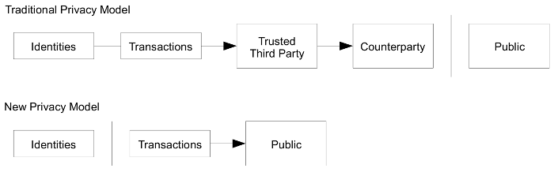

# Reading Through the Bitcoin White Paper, 通读比特币白皮书

[⇦上一章](wp09.md) - [返回目录📖](whitepaper.md) - [下一章⇨](wp11.md)

---

## 10. Privacy 隐私

> The traditional banking model achieves a level of privacy by limiting access to information to the parties involved and the trusted third party. The necessity to announce all transactions publicly precludes this method, but privacy can still be maintained by breaking the flow of information in another place: by keeping public keys anonymous. The public can see that someone is sending an amount to someone else, but without information linking the transaction to anyone. This is similar to the level of information released by stock exchanges, where the time and size of individual trades, the "tape", is made public, but without telling who the parties were.
>
> 
>
> As an additional firewall, a new key pair should be used for each transaction to keep them from being linked to a common owner. Some linking is still unavoidable with multi-input transactions, which necessarily reveal that their inputs were owned by the same owner. The risk is that if the owner of a key is revealed, linking could reveal other transactions that belonged to the same owner.

解读如下：

> The traditional banking model achieves a level of privacy by limiting access to information to the parties involved and the trusted third party. 

传统银行通过限制包含可信第三方机构的一些机构访问用户信息来达到一定水平的隐私保护。

> The necessity to announce all transactions publicly precludes this method, but privacy can still be maintained by breaking the flow of information in another place: by keeping public keys anonymous. 

但在比特币网络中，必须广播所有交易，这就阻止了前述传统银行的方式。但是，隐私仍然可以以在另外一个地方打断信息流的方式来保护：保持公钥的匿名性。

> The public can see that someone is sending an amount to someone else, but without information linking the transaction to anyone. 

公众可以看到某人正在将一定金额的比特币支付给某人，但是没有任何关联交易和支付者的信息。

> This is similar to the level of information released by stock exchanges, where the time and size of individual trades, the "tape", is made public, but without telling who the parties were.

这类似于股票交易中的一定成都的信息披露，有每个交易的时间和规模，即“行情”是公开的，但没有告诉谁是参与者。

区块链技术所披露的信息水平与股票交易所所披露的信息水平相似。股票交易所会披露交易的时间、价格和数量等基本信息，而区块链技术也会披露交易的时间、数量和参与方等基本信息。这意味着，区块链技术可以提供与股票交易所类似的透明度和可追溯性，使得交易更加公开和公正。

> As an additional firewall, a new key pair should be used for each transaction to keep them from being linked to a common owner. 

作为额外的防火墙，每次交易都使用一个新的密钥对可以防止它们被关联到一个共同的拥有者。

在区块链技术中，密钥对是用于加密和解密交易信息的工具。使用新的密钥对可以有效地防止黑客攻击和信息泄露。因为如果同一个密钥对被多次使用，一旦其中一个被攻破，所有的交易信息都会暴露。同时，一个密钥如果多次使用，也增大了被社会工程学分析和攻破的风险。因此，为每一次交易使用一个新的密钥对可以为交易提供额外的保障，增加安全性。

> Some linking is still unavoidable with multi-input transactions, which necessarily reveal that their inputs were owned by the same owner. 

在多个输入的交易中，某些链接仍然是不可避免的，这些交易必然会揭示它们的输入是由同一所有者拥有的。

这句话意味着，即使在多输入交易中，我们也无法完全避免信息泄露。因为这些交易揭示了它们的输入是由同一所有者拥有的，这意味着这些输入的所有权与所有者有关联。因此，尽管我们可以尽力保护交易的隐私，但在某些情况下，我们仍然需要承认信息泄露是不可避免的。

> The risk is that if the owner of a key is revealed, linking could reveal other transactions that belonged to the same owner.

风险在于如果一个密钥的拥有者暴露了，和它关联的属于同一个拥有者的其他交易也都要暴露。

---

[⇦上一章](wp09.md) - [返回目录📖](whitepaper.md) - [下一章⇨](wp11.md)

