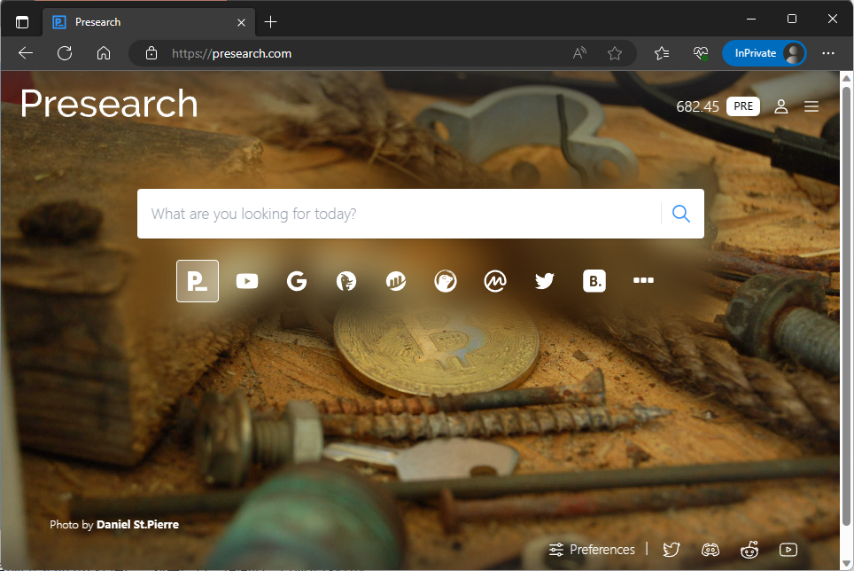

# Presearch: A Decentralized Search Engine for Exploring the Unknown and Earning Rewards

[Index](index.md)

2023-06-14

This article recommends the use of the decentralized search engine [Presearch](https://presearch.org/signup?rid=2341760).

Presearch is a decentralized search engine that not only has its own search engine but also integrates a variety of other search engines, such as [Google](https://www.google.com), [DuckDuckGo](https://duckduckgo.com), and even some blockchain tools such as [Etherscan](https://etherscan.io/).



Currently, Presearch is actively promoting and providing users with rewards for their usage. Specifically:

Each time a user searches with Presearch, the system rewards 0.1 PRE, with a maximum of 25 rewards per day. PRE is the token of Presearch, and the exchange rates between PRE, USD, and CNY are approximately:

```text
1 PRE ≈ 0.0359 USD ≈ 0.0359 * 7.5 CNY = 0.256685 CNY
```

(Note: This is the current exchange rate, and the price of PRE may significantly increase in the future when it is listed on more platforms. [Ref](https://coinmarketcap.com/currencies/presearch/))

Initially, users can receive a maximum of 25 rewards per day, equivalent to approximately.

> Each user can earn PRE rewards when using the search engine. The reward per search and max. rewards per day differ each day, as per our Tokenomics engine V1.0. ([Ref](https://support.presearch.io/support/solutions/articles/33000260038-how-do-pre-rewards-work-))

Once a user has accumulated 1000 PRE, they can withdraw it to their own wallet and also convert it into fiat currency on an exchange.

Registration instructions: By registering through [my invitation link](https://presearch.org/signup?rid=2341760), users can receive an additional 25 PRE reward. If you use Presearch normally for 30 days, I can also receive an additional 25 PRE reward.

Exploring the unknown and earning rewards are both wonderful things. Start using [Presearch](https://presearch.org/signup?rid=2341760) now, and explore the unknown while earning rewards!

---

Update (2024.06.03): The reward for each search is currently only 0.01 PRE, far less generous than it used to be. However, the engine itself is still quite useful.