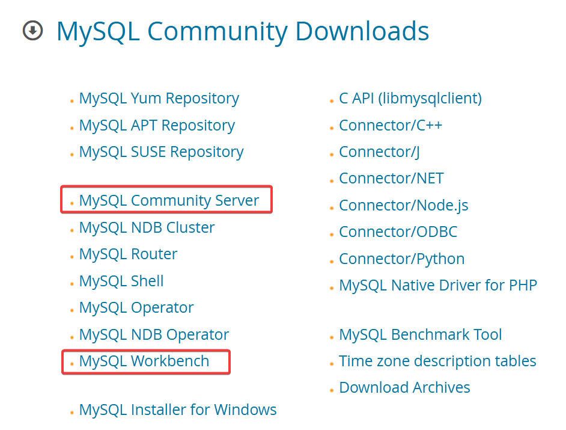
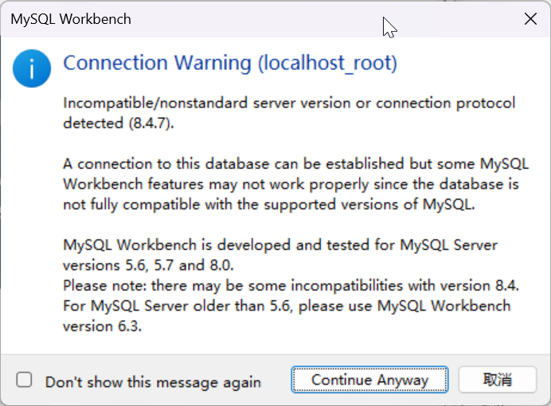

# 本地 Windows 开发机器配置 MySQL 免安装版

[Index](index.md)

---

- [本地 Windows 开发机器配置 MySQL 免安装版](#本地-windows-开发机器配置-mysql-免安装版)
  - [1. 下载](#1-下载)
  - [2. 配置](#2-配置)
    - [2.1 创建配置文件](#21-创建配置文件)
    - [2.2 初始化数据库](#22-初始化数据库)
    - [2.3 添加服务](#23-添加服务)
    - [2.4 删除服务](#24-删除服务)
  - [3. 图形化客户端 Workbench](#3-图形化客户端-workbench)
  - [4. 常见错误与排查](#4-常见错误与排查)

---

2025.11.29

我仅仅需要在本机用 MySQL 测试一些数据库功能，_Windows (x86, 64-bit), ZIP Archive_ 这个免安装版本解压即可使用。

- OS: Windows 11
- MySQL: 8.4.7
- MySQL Workbench: 8.0.45

## 1. 下载

URL: <https://dev.mysql.com/downloads/>



访问前面的[下载链接](https://dev.mysql.com/downloads)，并下载上图中框选的软件即可。

## 2. 配置

### 2.1 创建配置文件

解压 MySQL 免安装包，我这里的目录是：`C:/Programs/mysql-8.4.7-winx64`. 再在此目录下创建配置文件 `my.ini`，内容如下：

```plaintext
[mysqld]
# 必须项
basedir = C:/Programs/mysql-8.4.7-winx64
datadir = C:/Programs/mysql-8.4.7-winx64/data

# 推荐项（可以按需改）
port = 3306
character-set-server = utf8mb4
collation-server = utf8mb4_unicode_ci
explicit_defaults_for_timestamp = 1

# Windows 专属
default-storage-engine = InnoDB
innodb_buffer_pool_size = 2G   # 内存大于8G的机器建议设成物理内存的50%-70%
max_connections = 500

[client]
default-character-set = utf8mb4
```

### 2.2 初始化数据库

通过**管理员权限**启动 PowerShell，并对数据库初始化。

这里执行了命令 `.\mysqld --defaults-file="C:\Programs\mysql-8.4.7-winx64\my.ini" --initialize --console`，日志如下：

```plaintext
PS C:\Programs\mysql-8.4.7-winx64\bin> .\mysqld --defaults-file="C:\Programs\mysql-8.4.7-winx64\my.ini" --initialize --console
2025-11-29T04:15:50.549619Z 0 [System] [MY-015017] [Server] MySQL Server Initialization - start.
2025-11-29T04:15:50.555004Z 0 [System] [MY-013169] [Server] C:\Programs\mysql-8.4.7-winx64\bin\mysqld.exe (mysqld 8.4.7) initializing of server in progress as process 14512
2025-11-29T04:15:50.575970Z 1 [System] [MY-013576] [InnoDB] InnoDB initialization has started.
2025-11-29T04:15:50.903431Z 1 [System] [MY-013577] [InnoDB] InnoDB initialization has ended.
2025-11-29T04:15:52.155347Z 6 [Note] [MY-010454] [Server] A temporary password is generated for root@localhost: %uOiuZdaA4/1
2025-11-29T04:15:53.300408Z 0 [System] [MY-015018] [Server] MySQL Server Initialization - end.
```

日志中提到 `A temporary password is generated for root@localhost: %uOiuZdaA4/1`，这里的临时密码后续需要修改。

### 2.3 添加服务

把 MySQL 设置为 Windows 服务，具体代码如下：

```plaintext
PS C:\Programs\mysql-8.4.7-winx64\bin> .\mysqld --install MySQL84 --defaults-file="C:\Programs\mysql-8.4.7-winx64\my.ini"
Service successfully installed.
```

启动服务并登录：

```plaintext
net start MySQL84
C:\Programs\mysql-8.4.7-winx64\bin\mysql.exe -u root -p"%uOiuZdaA4/1"
```

注意上面的登录语句，`-p`和密码之间不能有空格，也可以不带密码，输入 `.\mysql.exe -u root -p` 后回车，根据提示再输入密码。

登录后修改临时密码：

```sql
ALTER USER 'root'@'localhost' IDENTIFIED BY '新密码（至少12位，包含大小写、数字、符号）';
FLUSH PRIVILEGES;
EXIT;
```

### 2.4 删除服务

将来想要删除服务需要如何操作？首先需要停止服务：

```powershell
net stop MySQL84
```

删除服务：

```plaintext
PS C:\Programs\mysql-8.4.7-winx64\bin> .\mysqld.exe --remove MySQL84
Service successfully removed.
```

## 3. 图形化客户端 Workbench

目前 Workbench 还没有和8.4.7精确匹配的版本，不过不要紧，也可以用。安装后打开会有个提醒：



不用理会，点 "Continue Anyway" 继续就行。安装好后，就可以登录使用了。本文就不表了，到此结束。

## 4. 常见错误与排查

- unknown variable 'default_authentication_plugin'  
  → MySQL 8.4 已移除此选项，my.ini 中不要写 `default_authentication_plugin`
- unknown option '--skip-ssl'  
  → MySQL 8.4 已移除此选项，my.ini 中不要写 `skip-ssl`
- 初始化后 data 目录有内容但启动报错  
  → 先停服务 → 删除整个 data 文件夹 → 重新初始化
- 登录报错 Access denied for user '-p'@'localhost'  
  → -p 与密码之间不能有空格，正确写法：`-p临时密码`（紧挨）或单独回车输入


<script src="https://giscus.app/client.js"
        data-repo="iridiumcao/iridiumcao.github.io"
        data-repo-id="MDEwOlJlcG9zaXRvcnkyOTUwNTIyODQ="
        data-category="Announcements"
        data-category-id="DIC_kwDOEZYj_M4Cxfqj"
        data-mapping="pathname"
        data-strict="0"
        data-reactions-enabled="1"
        data-emit-metadata="0"
        data-input-position="bottom"
        data-theme="preferred_color_scheme"
        data-lang="zh-CN"
        crossorigin="anonymous"
        async>
</script>