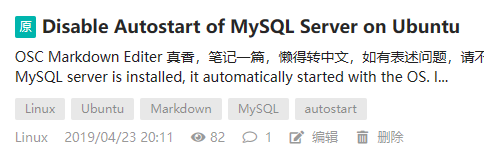

# Disabling Autostart of MySQL or PostgreSQL Server on Ubuntu

[Index](index.md)

Operating System: Ubuntu 19.04

## MySQL

By default, the MySQL server automatically starts with the operating system, which can slow down the OS loading process. However, if your computer is for personal use and not intended to be a database server, you may prefer to start MySQL only when needed.

To check the status of the MySQL server and stop it, use the following commands:

```
$ service mysql status
$ service mysql stop
```

To disable autostart of MySQL, execute the following command with sudo privileges:

```
$ sudo systemctl disable mysql
```

When you need to start MySQL, you can do so using the following command:

```
$ service mysql start
```

References:
- [How to stop MySQL from running at boot time](https://askubuntu.com/questions/57381/how-to-stop-mysql-from-running-at-boot-time)
- [How can I disable autostart of MySQL server?](https://askubuntu.com/questions/833094/how-can-i-disable-autostart-of-mysql-server)

## PostgreSQL

The process is similar for PostgreSQL:

```
$ service postgresql status
$ service postgresql stop
$ sudo systemctl disable postgresql
$ service postgresql start
```

---

This article was originally posted on [OSC](https://my.oschina.net/iridium/blog/3041476) on April 23, 2019, at 20:11.

