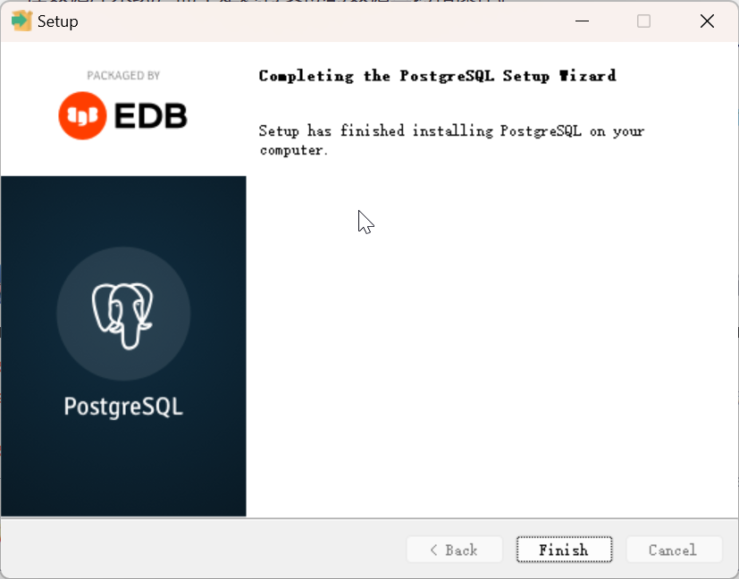

# PostgreSQL 的安装和网络配置

[返回目录](index.md)

---

- [PostgreSQL 的安装和网络配置](#postgresql-的安装和网络配置)
  - [1. Windows](#1-windows)
    - [1.1 安装 PostgreSQL](#11-安装-postgresql)
      - [第01步 选择目录](#第01步-选择目录)
      - [第02步 选择安装组件](#第02步-选择安装组件)
      - [第03步 选择数据目录](#第03步-选择数据目录)
      - [第04步 设置密码](#第04步-设置密码)
      - [第05步 设置端口](#第05步-设置端口)
      - [第06步 本地化](#第06步-本地化)
      - [第07步 确认设置](#第07步-确认设置)
      - [第08步 安装完成](#第08步-安装完成)
    - [1.2 验证数据库服务](#12-验证数据库服务)
    - [1.3 远程访问设置](#13-远程访问设置)
  - [2. Ubuntu](#2-ubuntu)
    - [远程访问设置](#远程访问设置)
  - [3. Rocky Linux](#3-rocky-linux)


---

PostgreSQL 诞生于1996年，是一个功能丰富的免费开源的数据库管理系统，并且支持多种操作系统。更详细的介绍可以参考：

- 官网链接：<https://www.postgresql.org/>
- 维基百科词条链接：<https://zh.wikipedia.org/zh/PostgreSQL>

## 1. Windows

### 1.1 安装 PostgreSQL

下载链接可以在官网找到，即：<https://www.enterprisedb.com/downloads/postgres-postgresql-downloads>

下载 Windows 版本的安装包之后，**并不是**双击就可以安装了。但是，需要特别注意的是，**一定要使用管理员权限安装**，即右键单击安装文件，选择「显示更多选项」-「以管理员身份运行」。


我现在的时间是2024年12月15日，PostgreSQL 的最新版本是17.2，下面就用这个版本来演示说明。

#### 第01步 选择目录

根据我的经验，目录里有空格也是可以的，我这里直接按默认目录安装。


#### 第02步 选择安装组件

这步弹出了4个组件共选择：

- PostgreSQL Server, 数据库服务器
- pgAdmin 4, 客户端管理工具，如果不用它，也可以用其他客户端工具。
- Stack Builder, 方便使用 PostgreSQL 模块和插件用的。(TODO, 还没经验)
- Command Line Tools, 这部分功能全部包含在 pgAdmin 4 中。

我这里把4个全部选中。


#### 第03步 选择数据目录

这步是选择数据的存放目录，很重要，你可以设置自己的目录。我这里为了演示方便，直接使用默认目录。


#### 第04步 设置密码

这步是为默认的超级用户`postgres`设置密码。

先记下这个密码，安装后的验证还需要用到它。


#### 第05步 设置端口

PostgreSQL 的默认端口是 5432，你可以自定义端口。为了演示方便，我直接使用默认端口。


#### 第06步 本地化

用很多国家和地区选择，我选的是 "English, United States", 你也可以选其他的。


#### 第07步 确认设置

这步把安装过程的一些配置汇总展示出来，可以拷贝出来备用。注意里边的 

- Database Service: postgresql-x64-17

它就是 Windows 中的数据库服务名，将来会用到。


完整的文本信息抄录如下：

```plaintext
Installation Directory: C:\Program Files\PostgreSQL\17
Server Installation Directory: C:\Program Files\PostgreSQL\17
Data Directory: C:\Program Files\PostgreSQL\17\data
Database Port: 5432
Database Superuser: postgres
Operating System Account: NT AUTHORITY\NetworkService
Database Service: postgresql-x64-17
Command Line Tools Installation Directory: C:\Program Files\PostgreSQL\17
pgAdmin4 Installation Directory: C:\Program Files\PostgreSQL\17\pgAdmin 4
Stack Builder Installation Directory: C:\Program Files\PostgreSQL\17
Installation Log: C:\Users\iridi\AppData\Local\Temp\install-postgresql.log
```

#### 第08步 安装完成




**注意**。前面提到过需要使用管理员权限安装，如果不使用的话，安装结束后会出现警告信息：


### 1.2 验证数据库服务

PostgreSQL 安装好后，服务自动启动。我们可以通过 pgAdmin 使用默认账号 `postgres` 登录验证。

首先打开 pgAdmin 设置，展开左侧对象栏里的 Server → PostgreSQL 17，输入之前设置的密码。


如果数据库服务正常开启，成功登录后就会出现如下的界面：


数据库服务可以通过 Windows 的服务控制台(快捷键：Win + R → services.msc)开启和关闭。


至此，PostgreSQL 就在 Windows 上成功安装了。

### 1.3 远程访问设置

PostgreSQL 默认只允许本机访问，如果想要局域网的其他机器也能访问到，需要编辑两个文件

编辑 ``C:\Program Files\PostgreSQL\17\data\postgresql.conf`

确保 `listen_addresses = '*' `，这个在17版里默认就是如此

编辑 `C:\Program Files\PostgreSQL\17\data\pg_hba.conf`

在

`host    all             all             127.0.0.1/32            scram-sha-256`

之下增加一行：

`host    all             all             192.168.0.0/24            scram-sha-256`

设置防火墙设置，允许外部主机通过端口5432访问本机：

1. 打开「控制面板(Control Panel)」→ 「系统与安全(System and Security)」→ 「Windows Defender 防火墙(Windows Firewall)」，「高级设置」，「入站规则」
2. 点击「新建规则...」
3. 选择「端口」，点击「下一页(N)」
4. 选择「TCP」，特定本地端口(S)填 5432
5. 点击「下一页(N)」，选「允许连接(A)」,进入下一步，设置以下域(D)，专用(P)，公用(U)
6. 给新建规则顺便起个名字，结束。

参[How to Configure PostgreSQL on Windows for Remote Access](https://masterdaweb.com/en/blog/how-to-configure-postgresql-on-windows-for-remote-access/) by Lucas, July 12, 2024

设置好这些之后，重启 PostgreSQL 的服务，再从其他机器来访问即可，如示例：

在另一台机器上通过 psql 访问数据库的效果如下：

```
$ psql -h 192.168.0.110 -U postgres
Password for user postgres:
psql (16.6 (Ubuntu 16.6-0ubuntu0.24.04.1), server 17.2)
WARNING: psql major version 16, server major version 17.
         Some psql features might not work.
Type "help" for help.

postgres=#
```

## 2. Ubuntu

在 Ubuntu 上安装 PostgreSQL 要比在 Windows 上容易得多，一条指令就搞定了：

```bash
$ sudo apt install postgresql
```

详细内容参[这里](https://www.postgresql.org/download/linux/ubuntu/)

不过，默认的版本不是最新版，是16，但对于一般使用场景来说，也是完全够用的。

```bash
$ psql --version
psql (PostgreSQL) 16.6 (Ubuntu 16.6-0ubuntu0.24.04.1)
```

正常情况下，安装好后数据库服务会自动启动。我们用下面的方法检查服务状态：

```bash
$  sudo systemctl status postgresql
● postgresql.service - PostgreSQL RDBMS
     Loaded: loaded (/usr/lib/systemd/system/postgresql.service; enabled; preset: enabled)
     Active: active (exited) since Sun 2024-12-15 13:18:11 CST; 14min ago
   Main PID: 8083 (code=exited, status=0/SUCCESS)
        CPU: 1ms

12月 15 13:18:11 caoyipc systemd[1]: Starting postgresql.service - PostgreSQL RDBMS...
12月 15 13:18:11 caoyipc systemd[1]: Finished postgresql.service - PostgreSQL RDBMS.
```

以用户 `postgres` 的身份执行 psql

```bash
$ sudo -u postgres psql
[sudo] password for caoyi:
psql (16.6 (Ubuntu 16.6-0ubuntu0.24.04.1))
Type "help" for help.

postgres=#
```

在 Linux 上的安装和 Windows 有一些不同，安装过程中没有设置超级用户 postgres 的密码，所以安装后需要设置：

```bash
postgres=# ALTER ROLE postgres PASSWORD 'Abc-1234';
ALTER ROLE
```

注意上面指令中的分号必不可少，表示语句结束并执行。

修改密码后退出

```bash
postgres=# \q
```

再登录

```bash
$ psql -h 127.0.0.1 -U postgres
Password for user postgres:
psql (16.6 (Ubuntu 16.6-0ubuntu0.24.04.1))
SSL connection (protocol: TLSv1.3, cipher: TLS_AES_256_GCM_SHA384, compression: off)
Type "help" for help.

postgres=#
```

### 远程访问设置

PostgreSQL 默认只允许本机访问，如果想要局域网的其他机器也能访问到，需要编辑两个文件

编辑 `/etc/postgresql/16/main/postgresql.conf`

将 `#listen_addresses = 'localhost'` 的注释取消，并改成：`listen_addresses = '*' `

编辑 `/etc/postgresql/16/main/pg_hba.conf`

将

`host    all             all             127.0.0.1/32            scram-sha-256`

改成

`host    all             all             192.168.0.0/24            scram-sha-256`


设置防火墙并重启数据库服务

```plaintext
$ sudo ufw allow 5432/tcp
Rules updated
Rules updated (v6)

$ sudo systemctl restart postgresql
$ sudo systemctl status postgresql
```

尝试连接：

从 Ubuntu 的 Terminal 连接过去

```plaintext
$ psql -h 192.168.0.103 -U postgres
Password for user postgres:
psql (16.6 (Ubuntu 16.6-0ubuntu0.24.04.1))
SSL connection (protocol: TLSv1.3, cipher: TLS_AES_256_GCM_SHA384, compression: off)
Type "help" for help.

postgres=#
```

从 Windows 客户端连接过去

```plaintext
Server [localhost]: 192.168.0.103
Database [postgres]:
Port [5432]:
Username [postgres]:
用户 postgres 的口令：

psql (17.2, 服务器 16.6 (Ubuntu 16.6-0ubuntu0.24.04.1))
SSL connection (protocol: TLSv1.3, cipher: TLS_AES_256_GCM_SHA384, compression: 关闭, ALPN: none)
输入 "help" 来获取帮助信息.

postgres=#
```

参考：

- [How to Install PostgreSQL On Ubuntu 22.04 Step-by-Step](https://www.linuxtechi.com/how-to-install-postgresql-on-ubuntu/), By Narendra K / Last Updated: March 20, 2024

## 3. Rocky Linux

请参 <https://www.postgresql.org/download/linux/redhat>

