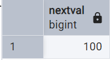
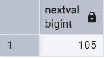
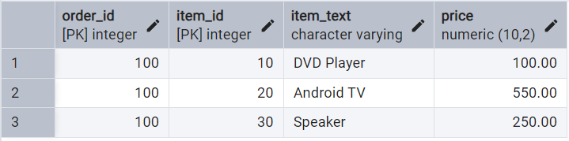

# PostgreSQL 序列（翻译）

[返回目录](index.md)

按：今天在查关于 PostgreSQL 序列的资料时，看到一篇特别好的文章 [PostgreSQL Sequences, NEON](https://neon.tech/postgresql/postgresql-tutorial/postgresql-sequences)，特此编译如下。
   
概述：在这篇教程中，你将学会 PostgreSQL 序列的概念以及如何使用序列对象创建一个由数字组成的序列。

## PostgreSQL 序列介绍

在 PostgreSQL 中，序列(sequence)是一个数据库对象，它允许你生成由不同数字构成的一个序列。

典型地，你用序列去为表中的主键生成唯一的标识，甚至你还可以用序列去跨表生成唯一标志！

你可以使用 `CREATE SEQUENCE` 指令创建一个新的序列。

## PostgreSQL `CREATE SEQUENCE` 指令

下面是`CREATE SEQUENCE`的语法说明

```sql
CREATE SEQUENCE [ IF NOT EXISTS ] sequence_name
    [ AS { SMALLINT | INT | BIGINT } ]
    [ INCREMENT [ BY ] increment ]
    [ MINVALUE minvalue | NO MINVALUE ]
    [ MAXVALUE maxvalue | NO MAXVALUE ]
    [ START [ WITH ] start ]
    [ CACHE cache ]
    [ [ NO ] CYCLE ]
    [ OWNED BY { table_name.column_name | NONE } ]
```

### sequence_name

序列名称，跟在 `CREATE SEQUENCE` 语句之后。`IF NOT EXISTS` 表示只有在这个名称不存在时才创建一个新的序列。

在同一个模式(schema)中，序列的名称必须唯一，即不能和其他序列(sequence)，表(table)，索引(index)，视图(view) 或外部表(foreign table)同名。

### [ AS { SMALLINT | INT | BIGINT } ]

这句用来设定 sequence 的数据类型，可选的值有：`SMALLINT`, `INT`, 和 `BIGINT`。默认类型是 `BIGINT`。序列的数据类型确定了序列的最大和最小值。

### [ INCREMENT [ BY ] increment ]

`increment` 规定了每次产生新值时，从当前值起的增加量。如果它是正数值，这个序列将是递增的，如果它是负的，则这个序列是递减的。它的默认值是1.

### [ MINVALUE minvalue | NO MINVALUE ]
### [ MAXVALUE maxvalue | NO MAXVALUE ]

设置序列的最小和最大值。如果是用默认的 `NO MINVALUE` 和 `NO MAXVALUE`，序列将使用默认值。

- 对递增序列来说，最大值就是它的数据类型支持的最大值，而最小值是1. 
- 对递减序列来说，它的最大值是 -1，而最小值是它的数据类型支持的最小值。

### [ START [ WITH ] start ]

`START` 语句用来设定序列的起始值。对递增序列，它的默认值是 `minvalue`，对递减序列，它的默认值是 `maxvalue`.

### cache

`CACHE` 用来设定有多少个序列项的值会被预分配到内存中以便快速访问。默认情况是 `no cache`, 即一次生成一个值。

### CYCLE | NO CYCLE

当序列的值到达极限时，`CYCLE` 允许你重启序列。如果是递增序列，序列到达极限值后，下一个值会从最小值重新开始，如果是递减序列，会从最大值重新开始。

如果使用了 `NO CYCLE`，当序列的值到达极限后，再取下一个值时就会报错。默认值是 `NO CYCLE`。

### OWNED BY table_name.column_name

`OWNED BY` 允许你把序列和某个表的列关联起来。当那个列或表删除时，PostgreSQL 将会自动删除被关联的序列。

注意，当你用 [`SERIAL`](https://neon.tech/postgresql/postgresql-tutorial/postgresql-serial) 伪类型定义表的某一列时，PostgreSQL 会在后台自动创建一个与该列关联的序列。

## PostgreSQL `CREATE SEQUENCE` 示例

让我们通过一些示例来更好地理解。

### 1) 创建一个递增序列

这个语句使用 `CREATE SEQUENCE` 创建一个新的递增序列，它从100开始，并且每次增加5.

```sql
CREATE SEQUENCE mysequence
INCREMENT 5
START 100;
```

你可以通过函数 `nextval()` 获取下一个值：

```sql
SELECT nextval('mysequence');
```



如果你再次执行上面的的语句，你将得到序列的下一个值：

```sql
SELECT nextval('mysequence');
```



### 2) 创建一个递减序列

下面的示例创建了一个递减序列，从3到1，并且支持循环：

```sql
CREATE SEQUENCE three
INCREMENT -1
MINVALUE 1
MAXVALUE 3
START 3
CYCLE;
```

当你多次执行下面的语句，你会发现序列的值在不断循环 3 - 2 - 1

```sql
SELECT nextval('three');
```

### 3) 创建和表的列关联的序列

首先，[创建表](https://neon.tech/postgresql/postgresql-tutorial/postgresql-create-table) `order_details`:

```sql
CREATE TABLE order_details(
    order_id SERIAL,
    item_id INT NOT NULL,
    item_text VARCHAR NOT NULL,
    price DEC(10,2) NOT NULL,
    PRIMARY KEY(order_id, item_id)
);
```

现在打开 pgAdmin 可以看到数据库里已经自动创建了一个名为 `order_details_order_id_seq` 的序列，它和列 `order_id` 关联。

再创建一个新的序列 `order_item_id` 和上表的列 `item_id` 关联：

```sql
CREATE SEQUENCE order_item_id
START 10
INCREMENT 10
MINVALUE 10
OWNED BY order_details.item_id;
```

然后在表中插入三条数据：

```sql
INSERT INTO
    order_details(order_id, item_id, item_text, price)
VALUES
    (100, nextval('order_item_id'),'DVD Player',100),
    (100, nextval('order_item_id'),'Android TV',550),
    (100, nextval('order_item_id'),'Speaker',250);
```

在上面的语句中，我们用函数 `nextval()` 去序列 `order_item_id` 取值。

[查询](https://neon.tech/postgresql/postgresql-tutorial/postgresql-select) 表中的数据：

```sql
SELECT
    order_id,
    item_id,
    item_text,
    price
FROM
    order_details;
```



## 列出数据库中所有的序列

用下面的查询可以列出当前数据库中所有的序列：

```sql
SELECT
    relname sequence_name
FROM
    pg_class
WHERE
    relkind = 'S';
```

## 删除序列

如果一个序列和某个表的列关联，则当关联的表或列删除时，序列也就自动删除了。

你还可以使用 `DROP SEQUENCE` 语句手动删除序列。

```sql
DROP SEQUENCE [ IF EXISTS ] sequence_name [, ...]
[ CASCADE | RESTRICT ];
```

语法讲解：

- 首先，确定准备删除的序列名。`IF EXISTS` 选项表示如果存在就删除。如果你希望一次删除多个序列，可以用逗号隔开序列名。
- 其次，使用 `CASCADE` 选项递归删除依赖该序列的对象。

## PostgreSQL `DROP SEQUENCE` 语句示例

下面示例删除表 `order_details`. 由于序列 `order_item_id` 和 item_id of the order_details 关联，所以序列会自动删除。

```sql
DROP TABLE order_details;
```

在这篇教程中，你已经学习了 PostgreSQL 序列，也知道了怎么用一个序列去创建一系列序列。

<script src="https://giscus.app/client.js"
        data-repo="iridiumcao/iridiumcao.github.io"
        data-repo-id="MDEwOlJlcG9zaXRvcnkyOTUwNTIyODQ="
        data-category="Announcements"
        data-category-id="DIC_kwDOEZYj_M4Cxfqj"
        data-mapping="pathname"
        data-strict="0"
        data-reactions-enabled="1"
        data-emit-metadata="0"
        data-input-position="bottom"
        data-theme="preferred_color_scheme"
        data-lang="zh-CN"
        crossorigin="anonymous"
        async>
</script>