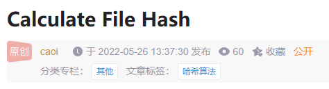

# Calculate File Hash

[Index](index.md)

This article introduces how to calculate a file's MD5, SHA1, and SHA256 hashes.

## 1. Linux or Git Bash

You can easily calculate file hashes using the following commands:

```bash
$ sha256sum velocity.7z
b488f0ed92010bf17063b07eb22f079112f8dbb3e055b5eb0b799314771cc03a *velocity.7z

$ sha1sum velocity.7z
9caf3b9d2814045d31e49cae8438229f6660635c *velocity.7z

$ md5sum velocity.7z
3331dbc1ed7ff83e19ff519e5058dab3 *velocity.7z
```

## 2. Windows

Windows offers different terminals for calculating hashes.

### 2.1 CMD

You can calculate hashes using the `certutil` command. Here’s how:

```cmd
D:\test>certutil -hashfile velocity.7z sha256
SHA256 的 velocity.7z 哈希:
b488f0ed92010bf17063b07eb22f079112f8dbb3e055b5eb0b799314771cc03a
CertUtil: -hashfile 命令成功完成。

D:\test>certutil -hashfile velocity.7z sha1
SHA1 的 velocity.7z 哈希:
9caf3b9d2814045d31e49cae8438229f6660635c
CertUtil: -hashfile 命令成功完成。

D:\test>certutil -hashfile velocity.7z md5
MD5 的 velocity.7z 哈希:
3331dbc1ed7ff83e19ff519e5058dab3
CertUtil: -hashfile 命令成功完成。
```

* [Ref](https://cloud.tencent.com/developer/article/1562603)

### 2.2 PowerShell

In PowerShell, the default encryption algorithm is SHA256. You can use the `Format-List` command to improve readability:

```cmd
PS ...> Get-FileHash .\ubuntu-24.10-live-server-amd64.iso | Format-List

Algorithm : SHA256
Hash      : 4FCE7C02A5E5DBE3426DA4AA0F8B7845E9A36AFF29C5884D206A08E51B2C4C47
Path      : D:\path\to\virtualbox\ubuntu-24.10-live-server-amd64.iso
```

To verify files against a given hash file, you can use:

```cmd
PS ...> certutil.exe -hashfile .\SHA256SUMS_ubuntu.txt SHA256
SHA256 的 .\SHA256SUMS_ubuntu.txt 哈希:
cadba0413c6b66fd13b42e8be43a1f73ae123df35157844adbd12f9797f71b9b
CertUtil: -hashfile 命令成功完成。
```

Ref:

- [Get-FileHash Documentation](https://learn.microsoft.com/en-us/powershell/module/microsoft.powershell.utility/get-filehash?view=powershell-7.4)
- [How to Create SHA256SUM](https://help.ubuntu.com/community/HowToSHA256SUM)

---

* This blog post was originally published to [CSDN](https://blog.csdn.net/caoi/article/details/124983043).


