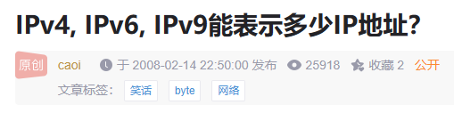

# IPv4, IPv6, IPv9能表示多少IP地址？

[Index](index.md)

|   | IPv4 | IPv6 | IPv9 |
|---|------|------|------|
| 位数 | 32 | 128 | 2256     |
| 地址容量  | $2^{32}$ | $2^{128}$ | $2^{2256}$ |

## IPv4

目前使用的IPv4是用4个字节(byte)来表示IP地址，1字节是8个位(bit)，所以IPv4表示的IP地址是$4 \times 8 = 32$位。

我现在的IP地址是：221.137.148.209

实际上它表示：11011101.10001001.10010100.11010001

数字中间的点并仅仅是为了看起来方便而已，可以认为我现在的IP地址是11011101100010011001010011010001。

理论上，32位的二进数的个数是：0b 1 00000000 00000000 00000000 00000000 = 1 * $2^{32}$ = **4294967296**

也就是：四十二亿九千四百九十六万七千二百九十六

IPv4能表示的地址总数也就这么多了。

## IPv6

目前地球上的人数已经超过50亿，已经超过IPv4的总容量。随着网络的发展，个人对IP地址的需求的提出，IPv4的IP地址将用尽，这也是IPv6提出的一个原因。

IPv6地址由128个bit表示，它能表示的地址是$2^{128}$ = **340282366920938463463374607431768211456**

我不知道用怎么读这个数字。一般认为，地球上的每一粒沙子都可以有一个IP地址。

IPv6表示的地址量是IPv4的 $2^{128} / 2^{32} = 2^{96} = 79228162514264337593543950336$倍。

## IPv9

IPv9来源于1994年IETF的愚人节搞笑提案[RFC1606](https://www.rfc-editor.org/info/rfc1606)（[Ref1](https://en.wikipedia.org/wiki/April_Fools%27_Day_Request_for_Comments), [Ref2](https://docs.google.com/document/d/1KDP2zYBdWRTuP1D9eDle4jbvTuEYsTptOkq_h067SR8/edit?usp=sharing))，它很夸张，用2256位来表示IP地址，因此它的总容量是：$2^{2256}$ = **132944451923298367730126293421418014134826848629969328973290687788547481832748792
579505606075824495859787835458256100625513720126656794358727605193096741161067859
588072877563529678078874144676565788647246381723680624011251853359969882630781082
769263079639374652201725804089316421500306416303833851104179531986937023575010648
915798937097238787676872721953839570947267152435802468539901725522865299283042719
785118317824148194579387207839740762469434029044743378121313524281552653560609187
626607957605932378451641369610419326641895660637296560991096909854992115467570724
175845724272369164593161163788253377278594494745448845341196266786869957426321782
20277631789733176581982766759936**

每一个地球上每一个原子都要有一个IP，它可能用得上。这也是IPv9为什么还只是愚人节笑话，并不值得实践(implement)的一个原因。

附记：
在实际使用中，有一部分IP地址有特殊用途，如分割子网用，广播用，等等，但总量相对很小，上面的就没有专门除去它们。

---

这篇文章曾发布在CSDN.

​