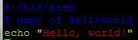
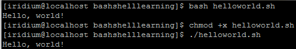

# HelloWorld of Bash Shell

[Index](../index.md)

---

- [HelloWorld of Bash Shell](#helloworld-of-bash-shell)
  - [代码解析](#代码解析)
  - [执行脚本](#执行脚本)

---

按：这篇文章是很早之前发布在个人 Google Site 上的，已经不知具体时间了。在转移到本地时，有少许更新。

按惯例，先来一个 Hello, world!

用 vi 新建一个文件 helloworld.sh

内容如下：



```shell
#!/bin/bash
# demo of HelloWorld
echo "Hello, world!"
```

以上即 HelloWorld 脚本的代码。

## 代码解析

第一行

```shell
#!/bin/bash
```

说明脚本的类型是 bash shell script, Linux 还有很多其他类型的 shell, 这里指定是 bash.

第二行

```shell
# demo of HelloWorld
```

井号是注释的标识，这是一行注释内容。

第三行

```shell
echo "Hello, world!"
```

直接在屏幕上写 `Hello, world!`

字串是否加引号的效果是一样的，因此也可以写作：

```shell
echo Hello, world!
```

虽然如此，但最好还是加上引号，代码的可读性也很重要。

## 执行脚本

方式一：

直接执行 `bash helloworld.sh`

方式二：

对脚本赋予可行性权限并执行。Bash shell 脚本文件，在没有歧义的情况下，也常简称脚本文件或脚本。

```shell
chmod +x helloworld.sh
./helloworld.sh
```

用以上两种方式之一，都可以得到输出：在屏幕上显示 `Hello, world!`


