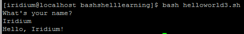

# Bash Shell Script Syntax

[Index](../index.md)

---

- [Bash Shell Script Syntax](#bash-shell-script-syntax)
  - [变量](#变量)
  - [用户输入](#用户输入)
  - [分支（判断）结构](#分支判断结构)
  - [循环](#循环)
    - [for 循环](#for-循环)
    - [while 死循环](#while-死循环)
    - [普通的 while 循环](#普通的-while-循环)
  - [函数 Function](#函数-function)
    - [无参函数](#无参函数)
    - [带参函数](#带参函数)
    - [有返回值的函数](#有返回值的函数)
    - [局部变量](#局部变量)

---

按：这篇文章是很早之前发布在个人 Google Site 上的，已经不知具体时间了。在转移到本地时，有少许更新。

Bash shell 作为一种解释性脚本语言，有一套完整的，和其他编程语言类似的语法。这里从简单的角度，记录一番，不求全。

前面一篇描述了如何写 [Bash shell HelloWorld](helloworld.md).

## 变量

bash 的变量没有类型，定义很简单，直接变量名=变量值就算定义了，如：

```shell
#!/bin/bash
HELLO="Hello, world!"
echo $HELLO
```

执行后，会输出 `Hello, world!`

其中，第2行：

```shell
HELLO="Hello, world!"
```

- 等号左边是变量名，右边是变量初值。右边可以为空。本句可以不顶格写，即 HELLO 的左边可以留一些空格。
- <strong>等号两边不能有空格！</strong>这个特别容易给其他编程语言使用者造成困惑！
- **等号的右边的字串如果有空格，必须用双引号包围！**

第3行：

```shell
echo $HELLO
```

使用变量的方式是：$后跟变量名，变量名也可以用大括号包起来，比如这句也可以写作：

```shell
echo ${HELLO}
```

前面提到的都是**全局变量**，另外还有**局部变量**，参本页的「函数-局部变量」部分。

## 用户输入

通过接受用户输入，可以书写具有交互性的脚本。如：

```shell
#!/bin/bash
echo "What's your name?"
read name
echo Hello, $name!
```

在 shell 中执行的情况如下：



## 分支（判断）结构

所有的程序语言都必须处理一些相同的流程问题：顺序，分叉，循环。这里用一个例子说明分支结构：

随机生成一个随机数（0到2之间随机抽取一个整数），用户输入一个数字，脚本判断两书的大小比较情况。

```shell
#!/bin/bash

NUM=$(( RANDOM % 3 ))
echo "Please guess a number between 0 and 2"
read num

if [ $num = $NUM ]; then
    echo "Congr! U R RIGHT!"
elif [ $num > $NUM ]; then
    echo "greater"
else
    echo "litter"
fi
```

`elif` 是 `else if` 的简写形式

Bash 里条件判断写在中括号中，这点和 C/Java 语言有些不一样。

其中，第5行：

```shell
if [ $num = $NUM ]; then
```

- **中括号内，两侧必须留有空格！**
- 右中括号后跟分号
- `then` 是必要的关键字

## 循环

和其他语言一样，Bash shell 同样有 while, for 这两种循环。

### for 循环

for 循环示例如下：

```shell
#!/bin/bash

for i in Bob Iridium Jenny
do
    echo Hello, $i!
done
```

输出如下：

```plaintext
Hello, Bob!
Hello, Iridium!
Hello, Jenny!
```

### while 死循环

示例如下：

```shell
#!/bin/bash

while true
do
    echo hello, $RANDOM
done
```

这是一个死循环，不断输出 hello, 随机数，如它的一部分输出：

```plaintext
hello, 20391
hello, 1404
hello, 13958
hello, 21021
hello, 8402
hello, 29312
```

### 普通的 while 循环

举例如下：

```shell
#!/bin/bash

i=1
while [ $i -lt 10 ]
do
  echo $i
  let i=i+1
done
```

会依次按行输出 `1, 2, ..., 9`

本段 Shell 的第6行：

```shell
let i=i+1
```

是赋值语句，注意等号和**加号左右都不能有空格**。Shell 变量的赋值，要使用 `let` 关键字。

这段代码用等价的 `for` 循环，是如下代码：

```shell
#!/bin/bash

for ((i=1; i<10; i++))
do
  echo $i
done
```

其中要注意的循环条件用双层括号包围。`i<10` 的小于号两侧不能有空格，小于号不能用 `-lt`.

## 函数 Function

bash 支持函数，函数定义格式很简单：

```shell
function func_name { func_code }
```

- function 是关键字
- func_name 后可以没有括号

### 无参函数

例如：

```shell
#!/bin/bash

function hello() {
    echo "Hello, world!"
}

hello
```

执行后会输出 `Hello, world!`

调用函数的语句是最后一句，仅仅写一下函数名即可，**不能带括号写成 `hello()`**。

### 带参函数

再举一个带参的函数：

```shell
#!/bin/bash

function hello() {
   echo $1
   echo $2
}

hello "a" "b"
```

执行后，输出：

```plaintext
a
b
```

`$1` 表示第一个参数，`$2` 表示第二个参数，以此类推。

### 有返回值的函数

Bash 函数是可以有返回值的，但**不能用 return 语句，而是用 echo 语句**。例如：

```shell
#!/bin/bash

function getDirName() {
    if [ $1 = "dir11" ]; then
        echo "0101"
    elif [ $1 = "dir14" ]; then
        echo "0102"
    else
        echo "others"
    fi
}

for dir in dir11 dir14 dir3
do
    echo $(getDirName $dir)
done
```

输出：

```plaintext
0101
0102
others
```

### 局部变量

Bash 的局部变量以 local 关键字标识，例如：

```shell
#!/bin/bash

i=3 # this is global
function hello() {
   local i=9 # this is local
   echo "in funcition $i"
}

echo "out function $i"
echo "revoke function: $(hello)"
```

输出：

```plaintext
out function 3
revoke function: in funcition 9
```
