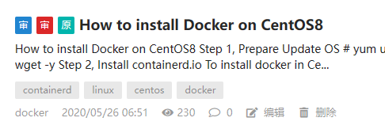

# Archival Note

*The following guide was written on May 26, 2020, for installing Docker on CentOS 8. Since CentOS 8 is no longer supported (EOL: December 31, 2021), this article is preserved as an archive and may not reflect current best practices or software versions. Users are encouraged to consult up-to-date resources for modern Linux distributions.*

---

# How to Install Docker on CentOS8

[Index](index.md)

(2020.05.26)

## Step 1, Prepare

Update OS

```plaintext
# yum update -y
```

Install download tool ``wget``

```plaintext
# yum install wget -y
```

## Step 2, Install containerd.io

To install docker in CentOS 8 is different from other CentOS versions, if you do not install this package manually, the docker service will not work.

Access page https://download.docker.com/linux/centos/7/x86_64/stable/Packages/ and copy the latest version's link, run the following commands in the new CentOS8:

```plaintext
# wget https://download.docker.com/linux/centos/7/x86_64/stable/Packages/containerd.io-1.2.13-3.2.el7.x86_64.rpm
# dnf install containerd.io-1.2.13-3.2.el7.x86_64.rpm
```

The latest version of ``containerd.io`` is ``containerd.io-1.2.13-3.2.el7.x86_64.rpm`` till 2020-05-25
Ref:  https://www.cnblogs.com/zbseoag/p/11736006.html

## Step 3, Install ``docker-ce`` by ``yum``

```plaintext
# yum install -y yum-utils
# yum-config-manager --add-repo https://download.docker.com/linux/centos/docker-ce.repo
# yum install docker-ce docker-ce-cli containerd.io
```

Ref:  https://docs.docker.com/engine/install/centos/

## Step 4, Add user to `docker` group

The user who will use Docker needs to be added to the `docker` group.

```plaintext
# gpasswd -a root docker
# newgrp docker
```

The above example is for ``root``, you can replace it by any other user for docker. If you do not apply this step, you have to use ``sudo`` to run docker commands, with non-root user.

## Step 5, Enable & Start

```plaintext
# systemctl enable docker
# systemctl start docker
```

## Step 6, Run Hello-World

```plaintext
# docker run hello-world
```

OK, it's done.

---

This article was originally published to OSC, but I don't know why it was in censorship.

