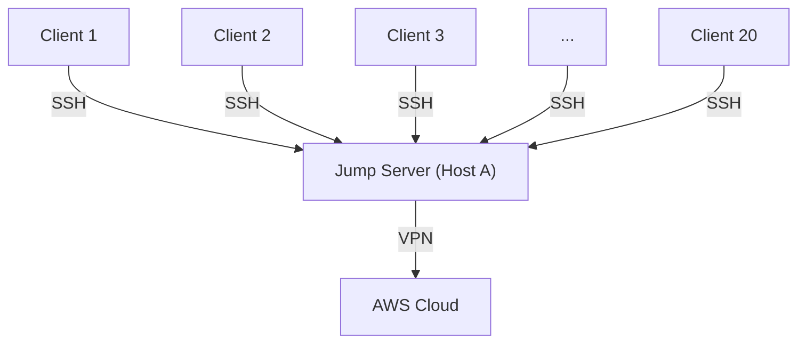

# Using SSH Tunneling to Share a VPN Connection to AWS

[Index](index.md)

We connect to AWS using VPN accounts, but the number of VPN accounts is limited. Sometimes we have to wait for others to release their connections.

Luckily, we discovered SSH tunneling, which can act as a proxy for all of us. With just one VPN connection on a jump server, everyone can connect to AWS through it.



I'll explain the process below.

## How SSH Tunneling Works

SSH tunneling creates a secure, encrypted channel between the client and the jump server. When you forward a port (e.g., with `-L` or `-D`), the SSH client listens on your local machine, encrypts the traffic, and sends it to the jump server. The jump server then decrypts and forwards it to the target, allowing secure access to remote resources.

## Preconditions

Jump Server (Host A):

- OS: Linux
- IP: 192.168.0.100
- `sshd` is running
- Connected to AWS via VPN

**Client**:

- OS: Windows, Linux, or macOS
- Can connect to the jump server via SSH

## 1. Simple Way (Local Port Forwarding)

If there’s a Jenkins service accessible in AWS at `https://10.10.11.123:8443`, run the following command on the client:

```bash
ssh -L 18443:10.10.11.123:8443 user@192.168.0.100
```

- `-L 18443:10.10.11.123:8443`: Maps the client’s local port `18443` to the Jenkins service.
  - `-L`: Local forwarding, which binds a local port to a remote target’s IP and port.
  - `18443`: Local port on the client.
  - `10.10.11.123:8443`: Remote IP and port of the Jenkins service.
- `user@192.168.0.100`: Username and IP of the jump server.

This command instructs the SSH client to listen on port `18443`. All requests to `localhost:18443` are forwarded to Host A via the SSH tunnel, and Host A then forwards them to `10.10.11.123:8443`.

Keep the connection alive (e.g., by keeping the terminal open or running it in the background), open your browser, and enter `https://localhost:18443`. If everything works, you should see the Jenkins login page or dashboard. **Note**: If the terminal is closed, the SSH session will terminate, and the forwarding will stop.

For multiple services in AWS, you can append more targets, e.g.:

```bash
ssh -L 18443:10.10.11.123:8443 \
    -L 18444:10.10.1.100:8443 \
    -L 18445:10.10.2.101:8443 \
    user@192.168.0.100
```

## 2. Dynamic Way (SOCKS Proxy)

If there are many services in AWS that need to be accessed, listing multiple `-L` options becomes cumbersome, as each service requires a unique local port.

SSH supports dynamic forwarding mode (`-D`), which turns Host A into a SOCKS proxy. This allows the client to access any target Host A can reach, without preassigning ports for each service.

Run this command on the client:

```bash
ssh -D 1080 user@192.168.0.100
```

- `-D 1080`: Starts a SOCKS5 proxy on the client, listening on local port `1080`.

Then configure the browser on the client:

- Proxy address: `localhost`
- Port: `1080`

Alternatively, set a global SOCKS proxy in the system settings (e.g., in Windows, go to Settings > Network & Internet > Proxy).
Test the result:

- Access `https://10.10.11.123:8443` directly in the browser. The data will be forwarded by the jump server via the SSH tunnel.

**Note**: This method requires applications (e.g., browsers) to support the SOCKS protocol. Not all tools or services may work seamlessly with a SOCKS proxy.

## Summary

SSH tunneling provides a simple and secure way to share a single VPN connection, reducing the need for multiple AWS VPN accounts. Whether using local forwarding for specific services or dynamic forwarding for broader access, it’s a flexible solution for teams. If you encounter issues, check the jump server’s connectivity to AWS or the client’s SSH configuration.
