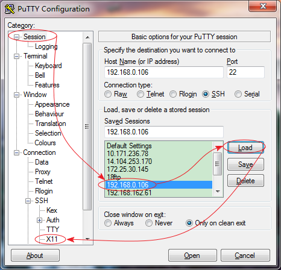
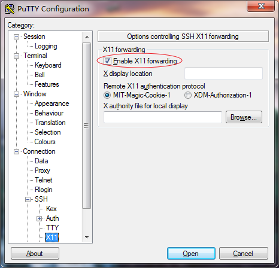

# SSH X Forwarding

[Index](index.md)

---

- [SSH X Forwarding](#ssh-x-forwarding)
  - [远程主机的设置](#远程主机的设置)
  - [本地设置](#本地设置)
    - [1. Linux Desktop](#1-linux-desktop)
    - [2. Windows](#2-windows)
  - [-X 的传递性](#-x-的传递性)

---

按：这篇文章是很早之前发布在个人 Google Site 上的，已经不知具体时间了。在转移到本地时，有少许更新。

在[《SSH Server/Client 安装和连接》](ssh_server_client.md)中已经提到 `SSH -X`，通过它可以在在本地桌面系统上使用远程的 Linux Server 上的 GUI 程序，远程系统有无 X 环境都无关紧要。

Linux 的 X 环境，运行 GUI 程序，分为两个部分，X Server 和 X Client。X Server 负责 GUI 展示，它管理显示器、键盘和鼠标。X Client 负责程序逻辑，在需要 GUI 界面时，则向 X Server 发送请求。X Client 和 X Server 是分开的，可以运行在相同或不同的机器上。

X11Forwarding 机制使得远程系统上执行的 GUI 程序(X Client)，在本地展示 GUI 界面(X Server)。在 local 通过 X 操作 remote 的程序，X Client 是 remote server, X Server 是 local，这点要注意。

## 远程主机的设置

OS: Ubuntu Server 14.04 LTS(不支持 GUI)

打开 `/etc/ssh/sshd_config`, 检查下面两条，是否存在并开启：

```plaintext
X11Forwarding yes
AllowTcpForwarding yes
```

如果不存在，则添加，如果没开启，则开启。

保存并重启，重启的方法依据不同的发行版可能不同，具体参《用SSH 的记录》

## 本地设置

### 1. Linux Desktop

我做实验时，用的是 Debian 7 和 Ubuntu Kylin 14.10，其他 Linux 发行版是类似的。

执行下面这条命令即可：

```shell
ssh -X iridium@192.168.0.106
```

当在 Shell 中执行 GUI 程序时，就会自动调用本地的 X Server 了。

Linux 对程序员真是太友好了，下面是 Windows 的方式，就比较麻烦了。

### 2. Windows

可以结合 [XMing](https://sourceforge.net/projects/xming/) 和 [putty](https://www.putty.org/) 实现在 Windows 中操作远程 Linux Server 的 GUI 程序。

1. 安装 XMing 后，开启 Ming 的服务。开启了就不用管它了。
2. 设置并开启 putty。打开 putty，选中登录的 session，点 Load, 选 Connection -> SSH -> X11



打开 X11 的设置页，选中 Enable X11 forwarding



再返回 Session 界面，点击 Open 登录即可。执行 GUI 程序时，本地 XMing 的 X Server 就会启动。

## -X 的传递性

ssh -X 是可以传递的。A 通过 ssh -X 登录 B，再以 ssh -X 登录 C，在 A 中可以打开 C 的 GUI 程序。

实验如下：

- 我在家使用的主机是 hostHome, Windows 7, 安装有 XMing 和 pttuy
- 公司服务器的主机是 hostCompany, Ubuntu Server, 无 GUI 支持
- 我在公司的工作用主机是 hostWork， Ubuntu Kylin，有 GUI 支持

我先从 hostHome 以 ssh -X 登录到 hostCompany，再从 hostCompany 以 ssh -X 登录到 hostWork，结果，我可以在家里的电脑上操作我的工作主机的 GUI 程序。

参：

1. Oracle: 使用 SSH <https://docs.oracle.com/cd/E41492_01/E41718/html/ssh.html>
2. 使用SSH的X11 Forwarding远程执行GUI程序 <http://fosschef.com/2010/12/x11-forwarding-of-ssh/>