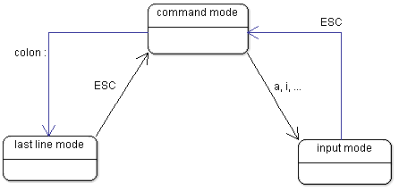

# vi 笔记

[Index](index.md)

按：这篇文章是很早之前发布在个人 Google Site 上的，已经不知具体时间了。在转移到本地时，有少许更新。

vi 是 Linux 上的经典文本编辑器，差不多是所有发行版的缺省装备。vi 的衍生软件有[vim](vim.md), gvim等。

`vi HelloWorld.java` 编辑一个文件 HelloWorld.java，如果文件不存在，则创建一个空文件进行编辑。
如果 HelloWorld.java 不存在，直接执行 `:wq` 是不能保存退出的，但可以先执行 `:w` 保存，然后执行 `:q` 退出。

## 三种模式

vi 有所谓的三种模式：命令模式，文本输入模式，末行模式。
这与现在常用的文本编辑器 Notepad, Notepad++, gedit 等有很大不同，后者并没有「模式」这个概念。

【**命令模式**】vi 启动后，默认进入的模式是「命令模式」，在该模式下，可以输入和执行一些 vi 内置的命令，但这些输入不会显示在屏幕上，如果输入的字串不匹配，系统会响铃报错。

【**文本输入模式**】在「命令模式」下，输入 `i` 或 `o` 将以插入(insert)或附加(append)的方式进入「文本输入模式」，在「文本输入模式」下，任何输入都将记录到文本中。在该模式下，无论何时，敲 ESC 键会转到「命令模式」。

【**末行模式**】在「命令模式」下，输入冒号即进入「末行模式」，在「末行模式」下，可以输入和执行该模式下的指令。在该模式下，无论何时，敲 ESC 键会转到「命令模式」。

以上三种模式的跳转关系如下图所示：

## 常用指令

| 模式      |  指令             |  说明                                                                                     |
|-----------|-------------------|-------------------------------------------------------------------------------------------|
|  命令模式 |  h                |  向左（前）移动光标                                                                       |
|  命令模式 |  j                |  向下移动光标                                                                             |
|  命令模式 |  k                |  向上移动光标                                                                             |
|  命令模式 |  l                |  向右（后）移动光标                                                                       |
|  命令模式 |  0(数字零)        |  将光标移动到行首                                                                         |
|  命令模式 |  $                |  将光标移动到行尾                                                                         |
|  命令模式 |  gg               |  将光标移动到页首                                                                         |
|  命令模式 |  G                |  将光标移动到页尾                                                                         |
|  命令模式 |  b                |  将光标移动到上一个单词的第一个字母的位置                                                 |
|  命令模式 |  L                |  移动光标到页底                                                                           |
|  命令模式 |  x                |  删除光标处字符                                                                           |
|  命令模式 |  yw               |  复制光标位置到当前单词的尾部字串                                                         |
|  命令模式 |  xx 或 dd         |  删除当前行                                                                               |
|  命令模式 |  yy               |  复制当前行                                                                               |
|  命令模式 |  p                |  粘贴                                                                                     |
|  命令模式 |  u                |  后悔（回退上一步操作）                                                                   |
|  命令模式 |  i                |  以插入(insert)的方式进入「文本编辑模式」，即进入「文本编辑模式」后，光标在当前字符之前。 |
|  命令模式 |  a                |  以附加(append)的方式进入「文本编辑模式」，即进入「文本编辑模式」后，光标在当前字符之后。 |
|  命令模式 |  dG               |  删除全部文本                                                                             |
|  命令模式 |  :                |  进入「末行模式」                                                                         |
|  末行模式 |  :/{wordToSearch} |  查询字串                                                                                 |
|  末行模式 |  :w               |  保存当前文件. 按指定编码保存文本： :w ++enc=xxx //xxx为文件编码，比如 utf8, gbk 等       |
|  末行模式 |  :wq              |  保存退出                                                                                 |
|  末行模式 |  :q!              |  不保存退出                                                                               |
|  末行模式 |  :.,$d            |  删除从当前行到最后一行的内容。如果光标在第一行，就删除所有内容。                         |
|  末行模式 |  :1,$d            |  删除从第一行到最后一行的内容，即删除所有内容。与命令模式的 dG 相同。                     |