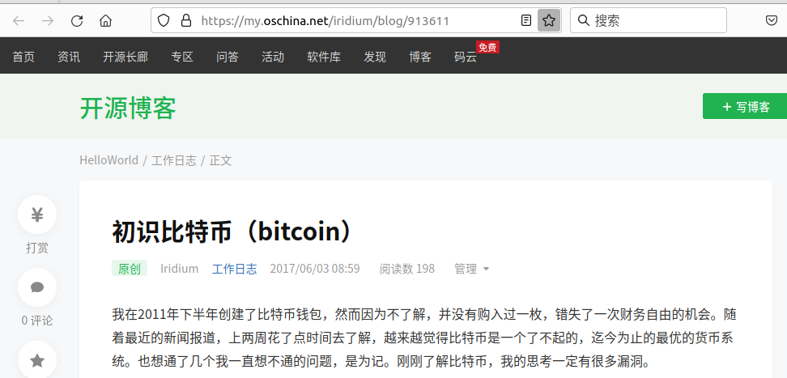

# 初识比特币

我在2011年下半年创建了比特币钱包，然而因为不了解，并没有购入过一枚，错失了一次财务自由的机会。随着最近的新闻报道，上两周花了点时间去了解，越来越觉得比特币是一个了不起的，迄今为止的最优的货币系统，也想通了几个我一直想不通的问题，是为记。刚刚了解比特币，我的思考一定有很多漏洞。

## 0. 优点

**1. 不可能滥发**

没有单独的人或机构可以操纵比特币的发行。美元和人民币都存在超发，特别是人民币。发行主体权力越大，滥发的程度也就越深。

- 比如津巴布韦货币天量超发，最后导致货币系统崩溃，个人财富被清零。
- 再比如朝鲜[2009年的货币改革](https://zh.wikipedia.org/wiki/2009%E5%B9%B4%E6%9C%9D%E9%B2%9C%E8%B4%A7%E5%B8%81%E6%94%B9%E9%9D%A9)，新版货币币值是旧版的100倍，但军政人员的薪水不变，本来已稀少的民财被洗劫。
- 土耳其里拉近年来跌了又跌。
- 俄罗斯在苏联解体后，卢布几乎清零，1998年只好发行新卢布，币值是旧卢布的1000倍，2010年代，卢布又打折。
- 中国的货币天量超发早已不是秘密，按实际汇率计算，恐怕30人民币也买不到1美金。但美元是不能在中国流通的。
- 即使是美元，通货膨胀也一直在持续。
- 全世界所有的法币都在贬值，只是程度不一样。即便是贬值程度很低的法币，年复一年的复利效果也不小。凯恩斯主义认为2%的年通胀率是有利于经济发展的。

所有法币，除了萨尔瓦多的比特币，都出现超发滥发现象，滥发程度和执政当局的权力大小程度正相关。比特币因为去中心化的原理，没有强人或强权能垄断铸币权，不存在滥发可能，它也规定了总量2100万。

**2. 流通方便**

没有什么比数字货币更好的流通性了。看看现在支付宝和微信支付的普遍使用就知道了。支付宝一类借助网络，支付非常便捷，但跨境仍不方便，毕竟它使用人民币。比特币是全球认可的货币，除了支付方便，交易双方即使在不同的国家，也不需要换汇。

**3. 没有换币的汇率损失**

汇率损失是法币时代特有的，不同货币兑换都会收取手续费。这个在比特币中是不存在的。比特币跨越了国界，因为它的私密性很强，即使政府立法禁止，也是无效的。可以参见俄罗斯的例子，当局虽然立法禁止了（俄罗斯的立法比较反复，2023又特许某些企业使用），但俄罗斯人还是在用比特币交易。

虽然没有换汇的手续费，但比特币有交易手续费。一般说，大额交易走一层网络，小额交易走二层（闪电）网络可以减少手续费损失。

**4. 没有银行手续费**

这也是法币时代特有的，比特币不需要。但交易并非无代价的，参与交易人可以贡献自己的计算资源，也可以付给矿工一定的金额作为回馈。

## 1. 问题

**1. 货币总量只有2100万，谁愿意花钱，难道不会通货紧缩吗？**

答：社会财富不断增加，但货币总量恒定。好在货币可以无限分割，不影响流通性。但也带来一个新的问题，一定量的比特币对应的社会财富总是在增加，也就是比特币总是在增值，会不会出现没人愿意消费呢？其实不会。原因是人要生存，总要消费。而且因为钱是自己的，人们会更爱惜这些财富，社会资源会得到更有效更经济的使用。比特币的去中心化特性消除了政府通过超发货币抢劫民财的可能，人们不会有「钱反正会不值钱，不如现在花了」的动机。

部分类似的有，黄金的储备是有限的，但并没有人因为爱黄金就不消费的。

**2. 既然是虚拟币，规则也是公开的，所有人都可以开发类似的货币，那么多虚拟货币，运行机制类似，为什么一定要选你的比特币？**

答：确实，理论上人人都可以发行货币，但比特币已经抢占先机。其他的有一定生存空间，但空间有限。虚拟货币也遵循「赢家通吃」的规则。

**3. 当更优秀的货币出现，比特币丧失竞争力，变得一文不值。**

答：这并非没可能，在比特币出现之前，谁能想出比国家发行货币更好的方式？但是，人类始终在自发寻找和使用更好的货币系统。法币成为主流货币已经有漫长的历史，但人类进入互联网时代後，我们见证了更优秀的货币登场。这个过程肯定会继续，也就是将来还会出现比比特币更优秀的货币。如果出现了，我们再转用就行了。这不是今天放弃比特币的理由，如果继续使用法币，还是会碰到这个问题。这种切换个人真的有什么损失吗？某人吃了很久地沟油，改吃普通油，他能有什么损失呢？只是一开始不习惯吧。

这种情况在别的领域也发生过，Yahoo 作为搜索引擎的先驱也曾今几乎独占过市场，但现在却是 Google 的天下。我们切换过来又有什么损失吗？

**4. 挖矿要消耗大量电能，挖出来的仅仅是虚拟数字，这不是浪费么？**

答：这是思维定势造成的一个不必要的疑惑。黄金有什么用？不能吃，不能穿，挖金矿要费多大的人力物力财力？是因为黄金被作为货币的价值，可以去换别的东西。比特币不也类似吗？据统计，比特币系统消耗的能源，比银行系统要小很多。

## 2. 担忧

**1. 交易数据占用空间很大，个人越来越不可能保有全部交易数据，去中心化的工作方式受到威胁。**

答：这点是显而易见的，我的 bitcoin core wallet 下载的区块链数据已经>130G了，随着比特币使用面的扩大，区块链数据的体积会越来越大，增长也会加速。

更新：2021年11月，Bitcoin Core Wallet 的区块链数据已经接近400G了。
更新：2023年04月，Bitcoin Core Wallet 的区块链数据已经接近500G了。

**2. 到帐确认时间长**

答：目前看来，交易确认还是比较费时。一次交易的被区块链确认短的话也需要10分钟，而且还可能永远不被确认。但是，layer2技术解决了这个问题，比如闪电网络。在萨尔瓦多，因为闪电网络，交易可以及时完成。

未来可能是这样，大额的交易，比如房产汽车，企业资金往来等，支付相对较高的手续费，在layer1完成，绝大多数小额交易，都在layer2完成。

## 3. 深远影响

**1. 法币地位动摇**

随着虚拟货币出现，即使不是比特币，法币地位动摇已无可避免。法币地位动摇，弱化已成定势。由此带来的次生影响，也可以沙盘推演。法币势弱，发行法币的主体就势弱，再往下，，，嘿嘿。可以预见的是短时期内，我们的墙会加高，但一切不过是旧势力临死前的挣扎罢了。

萨尔瓦多在2021年将美元和比特币并列为本国法币。

**2. 社会更和睦**

因为无法出现靠行政垄断背书的财富掠夺者，人类分配财富将更公平，个人拥有财富仍然会有差别，但都是公平的，都是彼此能认可和接受的，社会因此更加和睦。

**3. 社会资源配置更经济有效**

前面已经略有提过。这是出于人对自己财富本能地爱惜而言。比特币世界中，你的财富就是你的财富，没有任何人能用不正当方式夺走（如果他用犯罪的方式，就让他付出代价吧），因为私有财产得到完全的保护，你会更爱惜它，更有效地使用它。「公地悲剧」在比特币世界并不存在。

## 後记

一点小小的感慨。自互联网时代以降，社会发展一日千里。获取信息的方式陡然增多，信息的量也呈爆炸式增长，在此基础上出现的 Google，使信息获取更便捷更公平，进而极大地促进了信息的生产。Wikipedia 的出现凝聚了全人类所有的大脑，在 NPOV 的原则下，构建了一个空前丰富的信息宝库。信息垄断在一定程度上被 Google 和 Wikipedia 以及他们的伙伴们打破。Twitter 和 Facebook 使人类的沟通更便捷更高效。Uber/滴滴/摩拜/OFO 等等共享经济实体也是借助互联网，第一次将单个单个的人力财力汇聚起来，产生了空前的经济和社会效应。比特币的出现，打破了几千年来由垄断机构控制法币的定势，以後的发展难以想象。

这些都是人类历史上从未有过的。

## 2021-11-27更新

这篇文章最初于2017-06-03 08:59发布于[OSC的blog](https://my.oschina.net/iridium/blog/913611)里。

