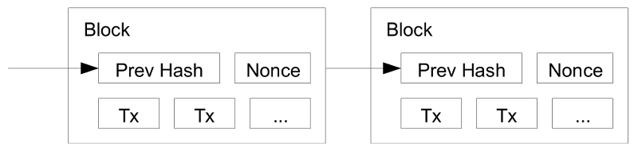

# Reading Through the Bitcoin White Paper, 通读比特币白皮书

[返回目录](whitepaper.md)

按：本文在写作中大量参考和引用ChatGPT的问答，有些并未明确指出。

## 4. Proof-of-Work 工作量证明

> To implement a distributed timestamp server on a peer-to-peer basis, we will need to use a proof- of-work system similar to Adam Back's Hashcash [6], rather than newspaper or Usenet posts. The proof-of-work involves scanning for a value that when hashed, such as with SHA-256, the hash begins with a number of zero bits. The average work required is exponential in the number of zero bits required and can be verified by executing a single hash.

> For our timestamp network, we implement the proof-of-work by incrementing a nonce in the block until a value is found that gives the block's hash the required zero bits. Once the CPU effort has been expended to make it satisfy the proof-of-work, the block cannot be changed without redoing the work. As later blocks are chained after it, the work to change the block would include redoing all the blocks after it.

> The proof-of-work also solves the problem of determining representation in majority decision making. If the majority were based on one-IP-address-one-vote, it could be subverted by anyone able to allocate many IPs. Proof-of-work is essentially one-CPU-one-vote. The majority decision is represented by the longest chain, which has the greatest proof-of-work effort invested in it. If a majority of CPU power is controlled by honest nodes, the honest chain will grow the fastest and outpace any competing chains. To modify a past block, an attacker would have to redo the proof-of-work of the block and all blocks after it and then catch up with and surpass the work of the honest nodes. We will show later that the probability of a slower attacker catching up diminishes exponentially as subsequent blocks are added.

> To compensate for increasing hardware speed and varying interest in running nodes over time, the proof-of-work difficulty is determined by a moving average targeting an average number of blocks per hour. If they're generated too fast, the difficulty increases.

解读如下：

> To implement a distributed timestamp server on a peer-to-peer basis, we will need to use a proof- of-work system similar to Adam Back's Hashcash [^6], rather than newspaper or Usenet posts. 

为了在P2P的基础上实现分布式时间戳服务器，我们需要使用工作量证明系统，类似于Adam Back提出的哈希货币(Hashcash)，而不是报纸或新闻组的帖子那样。

什么是Adam Back's Hashcash? ChatGPT的回答如下：

> Adam Back's Hashcash 是一种防止电子邮件滥用的技术。它的基本原理是在邮件头部添加一个随机字符串，然后对该字符串进行哈希计算，使其满足一定的条件。这个条件可以是哈希值的前几位必须为零，这样就需要进行多次尝试才能找到符合条件的哈希值，从而阻止了垃圾邮件的发送。
>
> Hashcash 技术最初是由 Adam Back 在 1997 年提出的，它被广泛用于防止垃圾邮件和拒绝服务攻击。除了用于邮件系统外，Hashcash 还可以用于其他需要防止滥用的系统中，例如密码学中的挖矿算法 Proof of Work 就是基于 Hashcash 技术的。

> The proof-of-work involves scanning for a value that when hashed, such as with SHA-256, the hash begins with a number of zero bits. 

工作量证明（Proof-of-Work）去寻找这样一个数值，当使用哈希算法（例如SHA-256）进行哈希计算时，哈希值以一定数量的零位开头。

> The average work required is exponential in the number of zero bits required and can be verified by executing a single hash.

所需的平均工作量在所需的零位数上是指数级的，可以通过执行单个哈希来进行验证。

这里的说法符合“计算很难，但验证简单”的特点。

1. 计算很难。生成一个随机数很容易，但要生成符合要求的随机数就要麻烦一些。这个随机数的长度是256，如果要求某一位为一个确定的数字，则难度上升一个数量级。因为具体到这一位上，本来所有的数字都可以，现在只有某个数字行，那只有1/10的可能，也就是原先需要尝试一次就能满足要求，现在最多可能要尝试10次。
2. 验证简单。不管随机数是如何生成的，验证都是按照现在的条件再生成一次就行了。

> For our timestamp network, we implement the proof-of-work by incrementing a nonce in the block until a value is found that gives the block's hash the required zero bits. 

对于我们的时间戳网络，我们这样实现工作量证明：不断增加块里随机数(nonce)，直到找出这么一个值：它能使块的哈希值开头的零的个数满足要求。

ChatGPT的翻译是：

> 于我们的时间戳网络，我们通过在区块中递增一个随机数（nonce），直到找到一个值使得区块的哈希值满足所需的前导0位，来实现工作量证明。

ChatGPT的版本比我的要好很多。

问：比特币区块中nonce的范围是什么？

答：比特币区块中nonce的范围是0到4294967295（0xFFFFFFFF）之间的整数。这个范围是由比特币协议的设计者设定的。在挖矿过程中，矿工会不断地改变区块中的nonce值，以尝试寻找符合条件的区块哈希值。由于nonce的取值范围有限，因此矿工可能需要尝试很多次才能找到符合条件的哈希值，这就是工作量证明机制的基本原理。

问：比特币块中 nonce 范围有限，如果尝试晚所有的值都不满足条件，重新尝试时，需要改变原先打包的交易吗？

答：如果在比特币块中尝试了所有的nonce值都不满足条件，重新尝试时不需要改变原先打包的交易。

在比特币挖矿的过程中，矿工需要不断地改变区块中的nonce值以尝试找到符合条件的哈希值。如果矿工在尝试了所有的nonce值后仍然没有找到符合条件的哈希值，矿工可以选择更改区块中的其他值再尝试。这些值包括区块的时间戳、交易的顺序等，但是这些更改不会影响原先打包的交易，因为这些更改只是对区块头的更改，而不是对交易本身的更改。

> Once the CPU effort has been expended to make it satisfy the proof-of-work, the block cannot be changed without redoing the work. 

一旦消耗了CPU算力使区块满足了工作量证明，那么区块就不能被更改，除非重新进行计算工作。

在比特币的挖矿过程中，矿工需要通过计算出符合工作量证明的哈希值来获得比特币的奖励。一旦矿工成功地找到了符合条件的哈希值并将其作为区块的一部分提交到比特币网络中，那么该区块就不能被更改了。如果需要更改该区块，比如更改其中的交易记录或者其他信息，那么矿工就需要重新进行计算工作，重新找到符合条件的哈希值。这是因为区块中的哈希值是由区块中的所有信息计算而来的，如果其中的任何一部分被更改，那么计算出的哈希值也会发生变化，因此需要重新进行计算工作来重新满足工作量证明的要求。

> As later blocks are chained after it, the work to change the block would include redoing all the blocks after it.

由于后面的区块是链在这个区块之后的，如果要改变这个区块，就得改变后面所有的区块。

从这幅图也可以看出，一块扣一块，一个块变了，后面所有块都得跟到变。

> The proof-of-work also solves the problem of determining representation in majority decision making. 

工作量证明机制也解决了在多数决策中确定代表的问题。

在传统的多数决策中，通常采用投票的方式来确定代表。然而，这种方式存在着一些问题，比如可能存在舞弊或者不公正的情况。而工作量证明机制通过让参与者进行计算工作来获得代表权，从而解决了这个问题。在比特币网络中，矿工需要通过计算出符合工作量证明的哈希值来获得比特币的奖励，同时也获得了参与网络决策的权利。这种方式保证了网络的安全性和公正性，因为只有那些愿意为网络做出贡献的人才能获得代表权，而不是通过简单的投票来决定代表。因此，工作量证明机制也被广泛应用于其他领域，例如区块链技术和密码学安全等方面。

> If the majority were based on one-IP-address-one-vote, it could be subverted by anyone able to allocate many IPs. 

如果“多数”是按IP来投票，一个IP一票，那它可能被拥有大量IP的人破坏。

> Proof-of-work is essentially one-CPU-one-vote. 

工作量证明的本质是一个CPU一票。

这里不能按字面意思理解，它说其实按算例来投票，算力强的，更有可能更早算出符合条件的哈希。

> The majority decision is represented by the longest chain, which has the greatest proof-of-work effort invested in it. 

最长的链代表多数决定，它证明最大的工作量投入其中。

> If a majority of CPU power is controlled by honest nodes, the honest chain will grow the fastest and outpace any competing chains. 

如果多数的CPU算力被诚实节点控制，诚实的链增长将会是最快的，并且会打败所有竞争链。

> To modify a past block, an attacker would have to redo the proof-of-work of the block and all blocks after it and then catch up with and surpass the work of the honest nodes. 

要修改过去的某个块，攻击者不得不重做这个块和着这个之后的所有块的工作量证明，并且要赶上并超过诚实节点的工作。

> We will show later that the probability of a slower attacker catching up diminishes exponentially as subsequent blocks are added.

我们稍后会展示，在随后的区块被添加时，慢一些的攻击者追赶上来的概率会指数级地下降。

在比特币网络中，每个区块都包含着若干笔交易记录。攻击者如果要篡改其中一笔交易，他不仅需要修改该区块的记录，还需要修改该区块之后所有区块的记录。因为区块之间是有顺序的，后面的区块建立在前面的区块之上。因此，攻击者需要重新计算并生成所有区块，这需要消耗大量的计算资源。 

随着时间的推移，比特币网络中的区块链会不断增加新的区块，这会使攻击者需要重新计算和生成的区块数量不断增加。因此，攻击者赶上比特币网络的概率会逐渐降低，直到趋近于零。这是因为攻击者需要消耗大量的计算资源，而比特币网络中的诚实节点数量越来越多，攻击者的计算资源相对减少，从而导致攻击成功的概率逐渐降低。

> To compensate for increasing hardware speed and varying interest in running nodes over time, the proof-of-work difficulty is determined by a moving average targeting an average number of blocks per hour. 

为了应对硬件速度提高和平衡不同时期节点的利益，工作量证明的难度是通过移动平均数法来确定每小时生成区块的平均数。

这里提到的“移动平均数法”（moving average）后续内容会讲到。

这句话是在讲述比特币中工作量证明机制的调整方法。工作量证明机制是比特币中用于保障区块链安全性的一种技术，它要求矿工通过计算复杂的数学题目来验证区块链上的交易记录，从而获得比特币的奖励。随着时间的推移，硬件技术不断提高，矿工的计算能力也在不断提高，这会导致比特币网络中的区块生成速度不断加快，从而影响到整个网络的稳定性。为了解决这个问题，比特币中的工作量证明难度会根据当前网络的状况进行自适应调整。具体来说，比特币网络会通过一个移动平均数来确定每小时的平均区块数，然后根据这个平均数来调整工作量证明的难度，以保证每小时能够生成相应数量的区块，从而保证整个网络的稳定性。

语法分析。by a moving average targeting an average number of blocks per hour

介词短语中，“by”后面的“a moving average”是一个名词短语，表示“移动平均数”。这个名词短语又由定语“targeting an average number of blocks per hour”修饰，表示“针对每小时平均块数”。因此，整个介词短语表示“通过一个针对每小时平均块数的移动平均数来确定”。

> If they're generated too fast, the difficulty increases.

如果区块增长得太快，难度会增加。

历史上，不但有难度增加也有难度降低的例子。2021年中国政府严厉禁止挖矿，中国的矿机绝大部分都关闭了，比特币网络的全球算力大跌，导致出块时间增加到半小时以上，随后，比特币网络降低了难度，使出块时间恢复到10分钟左右一次。

---

参考资料

* [^6]: A. Back, "Hashcash - a denial of service counter-measure," http://www.hashcash.org/papers/hashcash.pdf, 2002.