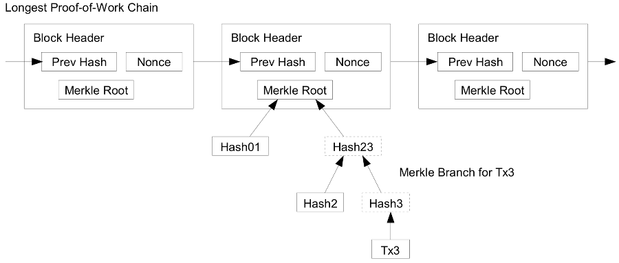

# Reading Through the Bitcoin White Paper, 通读比特币白皮书

[返回目录](whitepaper.md)

## 8. Simplified Payment Verification 简化支付验证

> It is possible to verify payments without running a full network node. A user only needs to keep a copy of the block headers of the longest proof-of-work chain, which he can get by querying network nodes until he's convinced he has the longest chain, and obtain the Merkle branch linking the transaction to the block it's timestamped in. He can't check the transaction for himself, but by linking it to a place in the chain, he can see that a network node has accepted it, and blocks added after it further confirm the network has accepted it.
> 
> 
>
> As such, the verification is reliable as long as honest nodes control the network, but is more vulnerable if the network is overpowered by an attacker.  While network nodes can verify transactions for themselves, the simplified method can be fooled by an attacker's fabricated transactions for as long as the attacker can continue to overpower the network. One strategy to protect against this would be to accept alerts from network nodes when they detect an invalid block, prompting the user's software to download the full block and alerted transactions to confirm the inconsistency. Businesses that receive frequent payments will probably still want to run their own nodes for more independent security and quicker verification.

解读如下：

> It is possible to verify payments without running a full network node. 

不运行完整节点也能验证交易是可能的。

> A user only needs to keep a copy of the block headers of the longest proof-of-work chain, which he can get by querying network nodes until he's convinced he has the longest chain, and obtain the Merkle branch linking the transaction to the block it's timestamped in. 

一个用户仅仅需要保存一份包含最长工作量证明链的区块头副本即可。他可以通过查询其他网络节点确认他拥有最长的链，并获取相应的默克尔树，这棵树链接那个交易和给交易打时间戳的区块。

> He can't check the transaction for himself, but by linking it to a place in the chain, he can see that a network node has accepted it, and blocks added after it further confirm the network has accepted it.

他不能自己验证交易，但如果交易已经链接到区块链里的某个位置，他能看到某个网络节点已经接受它，后续的区块进一步确认网络已经接受了这笔交易。

> 

> As such, the verification is reliable as long as honest nodes control the network, but is more vulnerable if the network is overpowered by an attacker.  

同样地，只要诚实节点控制网络，这种简化验证就是可信的，但是如果某个攻击者控制了网络，它就很脆弱。

> While network nodes can verify transactions for themselves, the simplified method can be fooled by an attacker's fabricated transactions for as long as the attacker can continue to overpower the network. 

网络节点能够自己验证交易，只要攻击者霸占了网络，他就能伪造交易，欺骗这种简化的方法。

> One strategy to protect against this would be to accept alerts from network nodes when they detect an invalid block, prompting the user's software to download the full block and alerted transactions to confirm the inconsistency. 

一个保护策略是，是接受网络其他节点检测到无效块时发出的警告，提醒用户下载完整区块和被警告的交易以验证其非一致性。

这句翻译出来其实不太符合汉语的表述，读起来拗口。还可以这么理解，系统提出一种保护策略，节点检测到无效快时广播警告，节点接受来之其他节点的警告，接受后，会按警告提示下载完整的区块和被警告的交易，然后验证是否一致。

> Businesses that receive frequent payments will probably still want to run their own nodes for more independent security and quicker verification.

对于频繁交易的商家，它们可能还是希望运行自己的节点（全节点），以确保更独立的安全性和更快的验证。