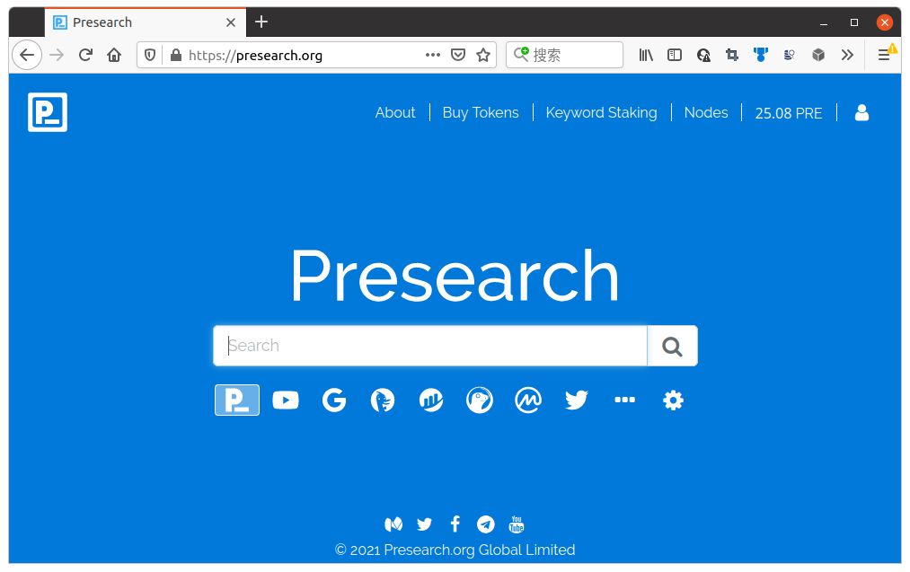

# Presearch助你探索未知并赚取奖励

按：本文已发布到[Publish0x](https://www.publish0x.com/iridiumcao/presearchzhu-ni-tan-suo-wei-zhi-bing-zhuan-qu-jiang-li-xnqgzgq).

推荐注册使用去中心化搜索引擎[Presearch](https://presearch.org/signup?rid=2341760)!

这是我的邀请链接：<https://presearch.org/signup?rid=2341760>

Presearch是一个**去中心化**的搜索引擎。不但有自己的搜索引擎，还集成了一大堆其他搜索引擎，如[Google](https://www.google.com), [DuckDuckGo](https://duckduckgo.com)等通用引擎，甚至有一些区块链工具，如[Etherscan](https://etherscan.io/)：


目前[Presearch](https://presearch.org/signup?rid=2341760)正在推广，对用户有一定回馈，具体是这样的：

用户每用[Presearch](https://presearch.org/signup?rid=2341760)搜索一次，系统奖励0.12PRE，每天最多奖励三十次。PRE是[Presearch](https://presearch.org/signup?rid=2341760)的代币，和美元及人民币的换算关系如下：

```text
1PRE ≈ 0.1USD ≈ 0.65CNY
```
（注：这是目前的汇率，将来PRE在更多平台上市，可能会显著拉高PRE的价格。）

一开始每天最多奖励30次，同时额外赠送50%的奖励，相当于每天用户最多可以得到45次奖励，即每天最多可以得到的奖励是

```text
45PRE ≈ 4.5USD ≈ 29.25CNY
```

用户凑够1000PRE即可提取到自己的钱包，此时用户也可以将PRE转到交易所兑取法币。

注册说明。通过[我的邀请链接](https://presearch.org/signup?rid=2341760)注册，可以得到额外的25PRE奖励。如果你正常使用30天，我也能额外得到25PRE的奖励。

再次放出我的邀请链接：<https://presearch.org/signup?rid=2341760>

探索和赚钱，都是美好的事情，从现在就开始使用[Presearch](https://presearch.org/signup?rid=2341760)吧！
