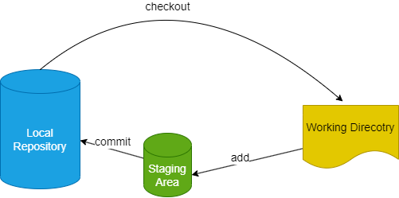
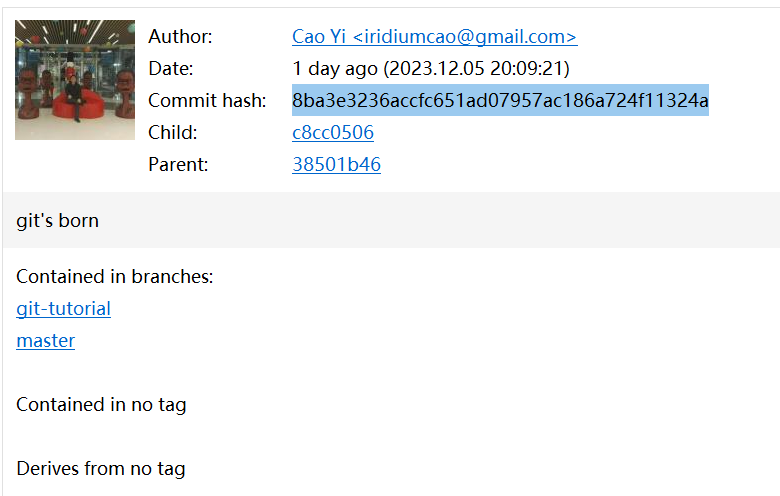
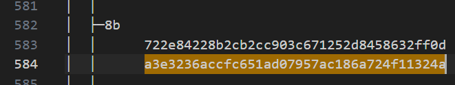

# 第五章 Git Repository 的目录结构

[⇦上一章](04.md) - [首页🏠](index.md) - [下一章⇨](06.md)

---

[上一章](04.md)通过 `git init` 在本地创建了一个 git repo, 并初步体验了一下版本管理的概念。本章将简单说明 git 的数据是如何存放的。

Git 管理文件分为三个区域：

* Working Directory: 又称 Workspace, 工作区，编辑的文档都在这里，人类用户直接接触的区域
* Staging Area: 又称 Stage/Index, stage, index, cache 等，暂存区，文档改动在入库之前存放的区域
* Local Repository: 仓库区，或本地 repo



下面举一个具体的例子，打开本地仓库下的 .git 目录，可以看到如下文件：

```plaintext
test_repo
├─.git
│   ├─hooks
│   ├─info
│   ├─logs
│   │  └─refs
│   │      └─heads
│   ├─objects
│   │  ├─02
│   │  ├─9a
│   │  ├─ac
│   │  ├─c7
│   │  ├─cd
│   │  ├─e8
│   │  ├─info
│   │  └─pack
│   └─refs
│       ├─heads
│       └─tags
└─helloworld.txt
```

在这个树形目录里：

* `.git`
  * Local Repository
  * Staging Area
* 其他所有文件：Working Directory

一般不需要区分「仓库」(Local Repository, Repo)和 Staging Area 时，我们习惯把 `.git` 就叫库。需要区分时，会特别指出。具体看上下文语境。
Working Directory 是整个可视目录，相当于排除 `.git` 的所有文件和文件夹。

我们平常所谓的代码入库，是指把变化提交 (commit) 到本地 repo 里。
改动的文件，如果还没执行 `add` 操作，就都在 Working Direcory 中，但如果执行了 `add` 操作，则进入 Staging Area 中，再执行 `commit`，就入库了。这些操作和本文开头的图是一致的。

## `git init`

`git init` 干了什么？它只干了一件事，就是在工作目录里创建 `.git` 子目录，并在 `.git` 生成一大堆文件。

`.git` 就是仓库(repository, repo)，它里边的文件都是 git 通过软件生成的，它记录了所有当前目录的所有版本信息，用户应避免直接修改 `.git` 里的内容。

这些目录的用途，我们会在进阶篇里描述，初学者知道这是 git repo 的系统目录不能手工修改即可，可以先不用了解具体细节。

## 进阶篇

_进阶篇的内容在对 git 有一定使用经验后阅读更佳，初学者可以跳过。_

前面基础部分是一个没有和远端库建立连接的例子，这里再举一个和远端库有连接的例子：

```plaintext
.git
  ├─hooks
  ├─info
  ├─logs
  │  └─refs
  │      ├─heads
  │      └─remotes
  │          └─origin
  ├─objects
  │  ├─03
  │  ├─..
  │  ├─8b
  │  ├─...
  │  ├─info
  │  └─pack
  └─refs
      ├─heads
      ├─remotes
      │  └─origin
      └─tags
```

可见比前面基础部分的例子，多了一些 `remotes` 相关的目录。

为了方便实验验证，这里使用本教程所在的 repo: <https://github.com/iridiumcao/iridiumcao.github.io>，可以 clone 这个 repo 继续下面的实验。

目录树的文本已上传，可以在这里下载[tree.txt](tree.txt)，截取这个文件的片段如下：

```plaintext
.git // repo 总目录
  │  COMMIT_EDITMSG
  │  config // 配置文件，可以手工修改，但不建议。建议使用 git config 指令来配置各种属性
  │  description // ignore it
  │  FETCH_HEAD
  │  HEAD
  │  index
  │  ORIG_HEAD
  │  packed-refs
  │  
  ├─hooks // 各种各样的 hook, 用以精细控制 git 行为，比如对 commit's comment 做检查等，用的时候把文件名的后缀名去掉，并写上自己的脚本即可
  │      applypatch-msg.sample
  │      commit-msg.sample
  │      ... // (ignore some)
  │      
  ├─info
  │      exclude
  │      refs
  │      
  ├─logs
  │  │  HEAD
  │  │  
  │  └─refs
  │      │  stash
  │      │  
  │      ├─heads
  │      │      git-tutorial
  │      │      master
  │      │      
  │      └─remotes
  │          └─origin
  │                  git-tutorial
  │                  HEAD
  │                  master
  │                  
  ├─objects // 每次提交的内容，git 会打包成一个一个块(block)，通过 hash tree 将它们串起来。注意，一次提交可能生成多个块。
  │  ├─03
  │  │      36a86bf41227b99a5b0ff536e3d2eb9bb27c77
  │  │      c8ebdc379d8ee891fa71e4f8f278d88b76df91
  │  │      
  │  ├─... // (ignore many)
  │  │      
  │  ├─8b
  │  │      722e84228b2cb2cc903c671252d8458632ff0d
  │  │      a3e3236accfc651ad07957ac186a724f11324a
  │  │      
  │  ├─... // (ignore many)
  │  │      
  │  ├─info
  │  │      commit-graph
  │  │      packs
  │  │      
  │  └─pack
  │          pack-85a82d35e06ea1e2e621d225a640bf3d92bc1f29.idx
  │          pack-85a82d35e06ea1e2e621d225a640bf3d92bc1f29.pack
  │          
  └─refs
      │  stash
      │  
      ├─heads // branch 的信息，记录本地库中各个 branch 的 hash
      │      git-tutorial  // branch git-tutorial 的 hash
      │      master
      │      
      ├─remotes // 远端 repo 的集合
      │  └─origin // 远端库 origin 的 repo
      │          git-tutorial // 记录远端 branch git-tutorial 的 hash
      │          HEAD
      │          master
      │          
      └─tags // tag 的信息，记录本地库中各个 tag 的 hash，当前 repo 没有打 tag，所以目录时空的。
```

本教程的第一个 commit 的元信息如图所示：



它的 commit id 是 8ba3e3236accfc651ad07957ac186a724f11324a

对应的文件就是 `.git/objects/8b/a3e3236accfc651ad07957ac186a724f11324a`

objects 目录里存放了全部的改动信息，为了避免同一个目录文件太多，它把 commit id 的前两位字符用来创建一个文件夹，这样就能将大量commit分散到不同的文件夹中。

### 实验提示

如果想要复现上面的实验，可以这么做：

#### 1. 取 commit id

通过 `git log` 找到任意一个 commit，记下它的 id. 

我前面专门找到了本教程的第一个 commit，取它的 id 8ba3e3236accfc651ad07957ac186a724f11324a 来用。

这个 commit 的元信息如下：

```plaintext
$ git cat-file -p 8ba3e3236accfc651ad07957ac186a724f11324a
tree 0441ae470a6225462a16a0f1b8f15d7c38cdd9d5
parent 38501b46228d68991273965cc7447698cba33c81
author Cao Yi <iridiumcao@gmail.com> 1701778161 +0800
committer Cao Yi <iridiumcao@gmail.com> 1701778161 +0800

git's born
```

(git-cat-file - Provide content or type and size information for repository objects)

#### 2. 查找对应的文件

每一个 commit 在 `.git/objects` 目录里都能找到对应的文件。
这个文件所在的目录是 `.git/objects/{commit id 的前两位}`，文件名是 commit id 截去前两位剩下的字串。

前面已提到过 8ba3e3236accfc651ad07957ac186a724f11324a 对应的文件所在的路径是：`.git/objects/8b/a3e3236accfc651ad07957ac186a724f11324a`

验证。前面已经有了[tree.txt](tree.txt), 可以打开它，直接搜 a3e3236accfc651ad07957ac186a724f11324a



（本文前面已经截取过这个目录树，也可以直接在本网页上搜 a3e3236accfc651ad07957ac186a724f11324a）

如果喜欢自己动手，就直接到 `.git/objects` 目录下去查找也行。

参考：[通过 .git 目录深入理解 Git！](https://zhuanlan.zhihu.com/p/106243588)

---

[⇦上一章](04.md) - [首页🏠](index.md) - [下一章⇨](06.md)