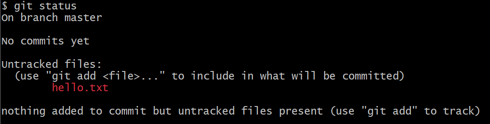
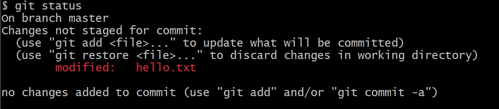
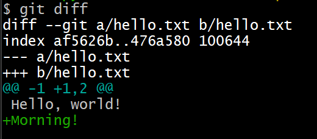
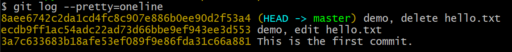
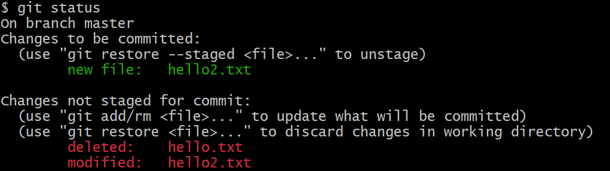

# 第六章 文档的版本操作

[⇦上一章](05.md) - [首页🏠](index.md) - [下一章⇨](07.md)

---

- [第六章 文档的版本操作](#第六章-文档的版本操作)
  - [1. 准备实验](#1-准备实验)
  - [2. 创建文档](#2-创建文档)
    - [2.1 创建文档](#21-创建文档)
    - [2.2 添加文档到 Staging Area](#22-添加文档到-staging-area)
    - [2.3 提交文档到 Repository](#23-提交文档到-repository)
  - [3. 修改文档](#3-修改文档)
  - [4. 删除文档](#4-删除文档)
  - [5. 查看指令帮助](#5-查看指令帮助)
  - [6. 进阶篇](#6-进阶篇)
    - [6.1 `git rm`](#61-git-rm)
    - [6.2 `git log --pretty=oneline`](#62-git-log---prettyoneline)
    - [6.3 综合有添加删除修改的例子](#63-综合有添加删除修改的例子)
    - [6.4 分支说明](#64-分支说明)

---

CRUD 可以概括一切对文档的操作，而 git 会记录一切 CUD 的痕迹，这也是 git 的职责所在。

* **C**reate 创建
* Read 读取, 查询
* **U**pdate 更新
* **D**elete 删除

本文将新建一个 repo，并演示文档的「增删改」操作在 git 版本管理系统中的痕迹。

## 1. 准备实验

创建新库并进入工作区

```plaintext
git init test_repo && cd test_repo
```

(创建新库可参考[第四章](04.md)，git repo 的目录结构可参考[第五章](05.md))

通过 `git status` 查看，这个新的 repo 空空如也——这正是我们想要的。

```plaintext
$ git status
On branch master

No commits yet

nothing to commit (create/copy files and use "git add" to track)
```

此时执行 `git log` 会报错：

```plaintext
$ git log
fatal: your current branch 'master' does not have any commits yet
```

## 2. 创建文档

本节演示创建一个文档 hello.txt 并入库。

### 2.1 创建文档

新建一个纯文本文档，并写入一行字：

```plaintext
$ echo "Hello, world!" >> hello.txt
```

用 `git status` 查看

```plaintext
$ git status
On branch master

No commits yet

Untracked files:
  (use "git add <file>..." to include in what will be committed)
        hello.txt

nothing added to commit but untracked files present (use "git add" to track)
```

Git Bash 的提示语信息简明扼要，值得认真看完，它告诉用户：

* 当前所在的分支: master (有关分支我们后续会讲到，这里先不用考虑)
* 当前没有 commit
* 有一个没有跟踪的文档 hello.txt (所谓「跟踪」就是有没有被仓库记录过)
* 提示如何跟踪文档：`git add`

文字不能着色，截图如下：



红色表示还在工作区，没有进入缓存区，也没有入库。

### 2.2 添加文档到 Staging Area

通过 `git add` 可以将文件变化从工作区添加到 Staging Area.

```plaintext
$ git add hello.txt
```

在 Windows 上执行上面的语句可能会得到警告信息：

```plaintext
$ git add hello.txt
warning: in the working copy of 'hello.txt', LF will be replaced by CRLF the next time Git touches it
```

这个问题现在可以忽略，在[第十五章](15.md)会讲怎么处理。

此时用 `git status` 检查：


绿色表示文件的改动已经放到 Staging Area 了。

### 2.3 提交文档到 Repository

通过 `git commit` 可以将文件变化从 Staging Area 添加到 Repository，简称入库。

```plaintext
$ git commit --message="This is the first commit."
[master (root-commit) 3a7c633] This is the first commit.
 1 file changed, 1 insertion(+)
 create mode 100644 hello.txt
```

上面这条指令执行后，Staging Area 的所有的变化就已经入库了，入库的操作称为 commit (提交)。文件一旦入库，就表明这个文件被仓库「跟踪(track)」了。入库时生成了一个 hash 字串 `3a7c633`, 它就是 commit hash. `--message` 表示本次入库需要注明的消息，由用户定义，必须写上，也可以简写为 `-m`.

现在我们再用 `git status` 查看一下状态：

```plaintext
$ git status
On branch master
nothing to commit, working tree clean
```

它提示当前没有东西需要提交，工作区和缓存区都是空的。

现在我们用 `git log` 回头查看版本记录：

```plaintext
$ git log
commit 3a7c633683b18afe53ef089f9e86fda31c66a881 (HEAD -> master)
Author: Cao Yi <iridiumcao@gmail.com>
Date:   Fri Dec 8 06:40:14 2023 +0800

    This is the first commit.
```

可以看到 commit hash：`3a7c633683b18afe53ef089f9e86fda31c66a881`，这是完整的 hash value，一般我们用它的前面几位就够了，比如前面执行 `git commit` 后的提示语里的 `3a7c633` 就只用了前面七位。只要取的那几位数字能和其他 commit 区分开就行了。


## 3. 修改文档

给 hello.txt 增加一行：

```plaintext
$ echo "Morning!" >> hello.txt
```

现在查看 repo 的状态：

```plaintext
$ git status
On branch master
Changes not staged for commit:
  (use "git add <file>..." to update what will be committed)
  (use "git restore <file>..." to discard changes in working directory)
        modified:   hello.txt

no changes added to commit (use "git add" and/or "git commit -a")
```

文字版没有着色，下面是截图：



上图红色文字显示已经修改的文件列表。可以通过 `git diff` 指令查看修改的具体内容。

```plaintext
$ git diff
diff --git a/hello.txt b/hello.txt
index af5626b..476a580 100644
--- a/hello.txt
+++ b/hello.txt
@@ -1 +1,2 @@
 Hello, world!
+Morning!
```

文字版没有着色，下面是截图：



接下来使用 `git add` 添加到缓存区(Staging Area):

```plaintext
$ git add hello.txt
warning: in the working copy of 'hello.txt', LF will be replaced by CRLF the next time Git touches it
```

再使用 `git commit` 入库：

```plaintext
$ git commit -m "demo, edit hello.txt"
[master ecdb9ff] demo, edit hello.txt
 1 file changed, 1 insertion(+)
```

可以通过 `git show` 查看最近版本的修改：

```plaintext
$ git show
commit ecdb9ff1ac54adc22ad73d66bbe9ef943ee3d553 (HEAD -> master)
Author: Cao Yi <iridiumcao@gmail.com>
Date:   Fri Dec 8 06:56:50 2023 +0800

    demo, edit hello.txt

diff --git a/hello.txt b/hello.txt
index af5626b..476a580 100644
--- a/hello.txt
+++ b/hello.txt
@@ -1 +1,2 @@
 Hello, world!
+Morning!
```

文字版没有着色，下面是截图：


用 `git log` 查看历史记录，能发现已经有两个版本了：

```plaintext
$ git log
commit ecdb9ff1ac54adc22ad73d66bbe9ef943ee3d553 (HEAD -> master)
Author: Cao Yi <iridiumcao@gmail.com>
Date:   Fri Dec 8 06:56:50 2023 +0800

    demo, edit hello.txt

commit 3a7c633683b18afe53ef089f9e86fda31c66a881
Author: Cao Yi <iridiumcao@gmail.com>
Date:   Fri Dec 8 06:40:14 2023 +0800

    This is the first commit.
```


## 4. 删除文档

删除文档 hello.txt 并查看状态

```plaintext
$ rm hello.txt
$ git status
On branch master
Changes not staged for commit:
  (use "git add/rm <file>..." to update what will be committed)
  (use "git restore <file>..." to discard changes in working directory)
        deleted:    hello.txt

no changes added to commit (use "git add" and/or "git commit -a")
```

文字版没有着色，下面是截图：


通过截图可以看到，删除的文件已经用红色标出。

添加改动，查看状态：

```plaintext
$ git add hello.txt
$ git status
On branch master
Changes to be committed:
  (use "git restore --staged <file>..." to unstage)
        deleted:    hello.txt
```

文字版没有着色，下面是截图：


提交改动，入库：

```plaintext
$ git commit -m "demo, delete hello.txt"
[master 8aee674] demo, delete hello.txt
 1 file changed, 2 deletions(-)
 delete mode 100644 hello.txt
```

上面特别要注意 `git add` 是添加「删除文件」这个改动，而不是添加文件。

用 `git log` 查看历史记录，能发现已经有三个版本了：

```plaintext
$ git log
commit 8aee6742c2da1cd4fc8c907e886b0ee90d2f53a4 (HEAD -> master)
Author: Cao Yi <iridiumcao@gmail.com>
Date:   Fri Dec 8 07:02:44 2023 +0800

    demo, delete hello.txt

commit ecdb9ff1ac54adc22ad73d66bbe9ef943ee3d553
Author: Cao Yi <iridiumcao@gmail.com>
Date:   Fri Dec 8 06:56:50 2023 +0800

    demo, edit hello.txt

commit 3a7c633683b18afe53ef089f9e86fda31c66a881
Author: Cao Yi <iridiumcao@gmail.com>
Date:   Fri Dec 8 06:40:14 2023 +0800

    This is the first commit.
```


## 5. 查看指令帮助

这一章提到的指令都很重要，必须掌握。

* `git status`
* `git add`
* `git commit`
* `git log`
* `git diff`
* `git show`

如果想要了解指令的详细信息，可以通过 `--help` 来查看，比如：

* `git --help`
* `git status --help`
* ...

## 6. 进阶篇

_进阶篇的内容在对 git 有一定使用经验后阅读更佳，初学者可以跳过。_

### 6.1 `git rm`

`git rm`, 将已添加到 Staging Area 的文件移除到 Working Directory 中。

例如在执行 `git add hello.txt` 后再执行 `git rm`：

```plaintext
$ git rm hello.txt
rm 'hello.txt'
```

它并非删除文件 hello.txt，而是将 hello.txt 的变化从缓冲区撤销，留在工作区里。

### 6.2 `git log --pretty=oneline`

参数 `--pretty=oneline` 可以更加紧凑地显示日志，仅显示 hash 和 message.



上面这个指令显示每个 commit 完整 hash, 一般用不上，还可以使用 `git log --oneline`, 它只显示 commit hash 前7位。

更多地查看日志的参数，可以通过 `git log --help` 查看。

本小节在[第十四章](14.md)还有更多描述。

### 6.3 综合有添加删除修改的例子

在实际的开发中，`git status` 更有可能像下面的样子，一个可能修改(CUD)多个文件。



上面 hello2.txt 既出现在缓存区 (绿色)，也出现工作区 (红色)，是因为将 hello2.txt 加入到缓存区后，又在工作区做了一些新的修改。

### 6.4 分支说明

本文中的所有 commit 都在同一个默认分支 `master` 上。

Git 的默认分支旧版是 `master`，新版是 `main`，这是受美国的黑人运动 Black Life Matters 的影响而做出的响应。

---

[⇦上一章](05.md) - [首页🏠](index.md) - [下一章⇨](07.md)