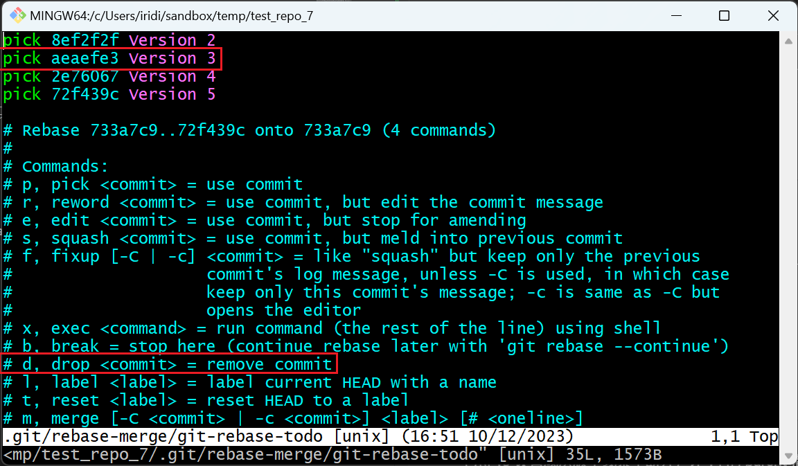
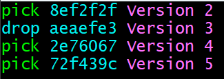

# 第七章 修改历史

[⇦上一章](06.md) - [首页🏠](index.md) - [下一章⇨](08.md)

---

- [第七章 修改历史](#第七章-修改历史)
  - [1. 实验准备](#1-实验准备)
  - [2. 重置版本 `reset`](#2-重置版本-reset)
    - [2.1 重置最近的一个版本](#21-重置最近的一个版本)
    - [2.2 重置最近的多个版本](#22-重置最近的多个版本)
    - [2.3 硬重置(hard reset)](#23-硬重置hard-reset)
    - [2.4 综合例子](#24-综合例子)
  - [3. 回滚某个版本 revert](#3-回滚某个版本-revert)
  - [4. 删除记录](#4-删除记录)
  - [5. 合并记录](#5-合并记录)
  - [6. 修改记录](#6-修改记录)
  - [7. 修改 message](#7-修改-message)
  - [8. 进阶篇](#8-进阶篇)
    - [8.1 实验——删除记录](#81-实验删除记录)
    - [8.2 实验——通过 `reflog` 找回删除的版本](#82-实验通过-reflog-找回删除的版本)
    - [8.3 调整版本的顺序](#83-调整版本的顺序)
    - [8.4 修改 commit 的元信息](#84-修改-commit-的元信息)
      - [8.4.1 `git commit --amend`](#841-git-commit---amend)
        - [8.4.1.1 修改 commit 的作者](#8411-修改-commit-的作者)
        - [8.4.1.2 修改 commit 的时间](#8412-修改-commit-的时间)
      - [8.4.2 修改任意 commit 元信息的方法](#842-修改任意-commit-元信息的方法)
    - [8.5 拆分 commit](#85-拆分-commit)
    - [8.6 HEAD~n VS HEAD@{n}](#86-headn-vs-headn)
    - [8.7 全部历史记录压缩到 init commit 上](#87-全部历史记录压缩到-init-commit-上)

---

[上一章](06.md)讲的是如何记录文档的版本变化——用 commit (更准确的词应该是 revision，表示 commit 的结果，[前言](preface.md)里有说明。)，一个 commit 对应一个文档版本。多个 commit 串起来，就成了历史记录，可以通过 `git log` 查看。

Git 还有一个特点，允许「篡改历史」，即调整已经存在的 commit (版本)，具体有

* 重置 commit
* 删除 commit
* 合并 commit
* 修改 message

## 1. 实验准备

_(实验用的 repo 可以在[这里下载](test_repo.7z)，内含 master 分支，已经五个 commit)_

新建一个 repo，造5个版本记录。将这个 repo 复制多份，一遍下面的实验多次使用。这部分内容可以参考[上一章](06.md)的方法。

```plaintext
$ git log --pretty=oneline
72f439c53b36063b5a90c4cdd9c950c1bda5878c (HEAD -> master) Version 5
2e760674a969439479ede654d69e5c0b5a806c96 Version 4
aeaefe37457aa32a4d5c5518f672f1604b461c37 Version 3
8ef2f2fa9f00daa5635dfb269bc8f618635d0fa4 Version 2
733a7c97f6f6845e0b636d562855ad297b2d9db2 Version 1
```


上图中 `HEAD` 表示当前版本，它指向当前分支的最后的一个 commit, `HEAD^`表示上一个版本，`HEAD^^`表示上上个版本，为了方便，一般用 `HEAD~n` 表示上 n 个版本。

你创建的 commit 的 id，肯定和我的不一样，但没关系，实验过程是类似的，可以参考本文记录的过程去做。

## 2. 重置版本 `reset`

如果你对刚刚提交的版本不满意，想要收回，继续改了再提交，怎么处理？假如你在文档或代码里写了脏话，并且提交了，然后你反悔了，怎么办？Git 已经考虑到了，重置刚才的操作即可。

### 2.1 重置最近的一个版本

重置到上一个版本

```plaintext
$ git reset HEAD^
```

此时执行 `git status` 可以看到 V5 对应的改动已经从本地仓库撤销到工作区了。再执行 `git log` 可以看到最后一个 commit 不见了，只剩下最早的四个 commit.

现在可以在工作区任意修改，再发起新的 `add` 和 `commit` 即可，这两个操作可以参[前一章](06.md).

### 2.2 重置最近的多个版本

重置到上n个版本，再启用一个前面准备的备份试下一次撤销多个版本

```plaintext
$ git reset HEAD~2
```

此时执行 `git status` 可以看到 V4 和 V5 对应的改动已经从本地仓库撤销到工作区了。再执行 `git log` 可以看到最后 V4 和 V5 两个版本都不见了，只剩下最早的三个 commit.

`git reset HEAD~n` 可以理解为撤销 n 个版本，也可以理解为撤销到上 n 个版本 `HEAD~n`.

### 2.3 硬重置(hard reset)

硬重置也是重置，但和前面的区别是：

* 普通重置(软重置, soft reset)：重置后，被撤销的版本会回滚到工作区。
* 硬重置：重置后，被撤销的版本不会回滚到工作区。

如：

```plaintext
$ git reset --hard HEAD~2
```

这条指令执行后，通过 `git status` 会发现工作区是没东西的。

但是，不管软重置还是硬重置，历史记录都可以通过 `git reflog` 找到。

### 2.4 综合例子

* 回退到上一个版本(撤销最近的1个版本)
  * `git reset HEAD^`
  * `git reset --hard HEAD^`
* 回退到上五个版本(撤销最近的5个版本)
  * `git reset HEAD~5`
  * `git reset --hard HEAD~5`
* 指定重置到 aeaefe37 版本，假若刚才删的就是这个版本，该指令相当于取消删除了。
  * `git reset aeaefe37`
  * `git reset --hard aeaefe37`

## 3. 回滚某个版本 revert

还有一种撤销版本的需求，就是原先的版本不能删，需要再创建一个恢复该版本的记录。

此时可用 `git revert` 指令，如：

```plaintext
$ git revert aeaefe37
[master 99648f7] Revert "Version 3"
 1 file changed, 1 deletion(-)

$ git log --pretty=oneline
99648f7fee74dff9d61581773200e5f8b579b44d (HEAD -> master) Revert "Version 3"
72f439c53b36063b5a90c4cdd9c950c1bda5878c Version 5
2e760674a969439479ede654d69e5c0b5a806c96 Version 4
aeaefe37457aa32a4d5c5518f672f1604b461c37 Version 3
8ef2f2fa9f00daa5635dfb269bc8f618635d0fa4 Version 2
733a7c97f6f6845e0b636d562855ad297b2d9db2 Version 1

```

`revert` 回归历史上的某个版本，它使用的方式是新增一个版本，不会修改历史记录。
它可能会需要处理文件冲突，处理完毕后，做一次新的提交。

## 4. 删除记录

如果需要删除最近的一条会几条记录(版本)，直接用 `reset` 就行了。

如果需要删除历史上的某些记录，用 `revert` 回滚也是可以的。

## 5. 合并记录

如果要合并最后提交的一些记录，可以先 `reset`，再整理提交。

## 6. 修改记录

可以结合 `reset` 和 `revert` 完成。

多个文件在工作区时，还可以选择一部分添加到 Staging Area 再提交，达到整理的效果。

## 7. 修改 message

当代码提交后，发现消息需要修改。我们可以直接 reset 这个消息，重新提交，顺便改掉 message. 但也可以通过指令修改。

查看最后一个 commit 的详细信息

```plaintext
$ git log -n 1
commit 72f439c53b36063b5a90c4cdd9c950c1bda5878c (HEAD -> master)
Author: Cao Yi <iridiumcao@gmail.com>
Date:   Sat Dec 9 21:34:59 2023 +0800

    Version 5
```

 执行修改指令

 ```plaintext
 $ git commit --amend
 ```

检查修改结果

```plaintext
$ git log -n 1
commit ff6e4aba0596c860819b61b4b5796de2a03ef5d7 (HEAD -> master)
Author: Cao Yi <iridiumcao@gmail.com>
Date:   Sat Dec 9 21:34:59 2023 +0800

    New Version 5
```

可见最后一个版本的 message 已经从 "Version 5" 变成了 "New Version 5".

## 8. 进阶篇

_进阶篇的内容在对 git 有一定使用经验后阅读更佳，初学者可以跳过。_

因为后面的内容涉及 `git reflog` 和 `git rebase -i`，所以放在进阶篇中，读者可以在对相关内容有所了解之后再来阅读和实验。在使用 `rebase` 有可能导致代码冲突，有冲突时按 git 的提示解决再继续就行。

### 8.1 实验——删除记录

基础部分讲了可以通过 `reset` 和 `revert` 实现删除操作。但有时，需要把历史上某些记录删除，并且不需要保留痕迹。例如，我们想要直接删除 V3：


实际上 git repo 中的版本(commit)是通过 hash 串在一起的，每一个 commit 里都有它的 parent commit 的 hash，除了根版本(第一个 commit)，所以实际上删除 V3 的操作如下图所示：


它将 v3 设置成从版本线索中断开，让 v4 的 parent 指向 v2.

我们可以通过交互式变基(`git rebase -i`)操作来完成记录的删除。我这里的编辑器用的是 vi，你也可以用其他的。

执行下面的指令

```plaintext
$ git rebase -i HEAD~4
```

进入到 `rebase` 交互界面



初学者可以花几分钟时间，认真读完交互界面中的文字提示。注意我用红线框出的部分，它提示删除 commit 的指令是 `drop`，简写 `d`，因此把要删除的第二行的 `pick` 改成 `drop` 再保存退出交互界面。



再看历史记录：

```plaintext
$ git log --pretty=oneline
0f20c8c5 8a551d81fb9eb897ae0c5a09d0a0dc7c (HEAD -> master) Version 5
82e61d7d e52480f06f12cc8afdfc5d261c034f17 Version 4
8ef2f2fa 9f00daa5635dfb269bc8f618635d0fa4 Version 2
733a7c97 f6f6845e0b636d562855ad297b2d9db2 Version 1
```

V3 已经消失，V4 和 V5 的版本 hash (commit hash)发生了变化，一个 commit hash 的生成依赖它的 pareent hash，parent hash 变化了，它也就变了。


注意，普通的 `rebase` 操作无法修改第一条 comment，此时可以通过加参数 `--root` 完成，命令示例如下：

```bash
$ git rebase -i --root
```

### 8.2 实验——通过 `reflog` 找回删除的版本

reflog, refrence log, 记录了所有改变 repo 的历史。

重置之后，原先的版本并未消失，还可以复原，但通过 `git reflog` 找到记录即可。下面是完整的实验过程：

先通过 `git log` 和 `git reflog` 查看 repo 中的情况：

```plaintext
$ git log --pretty=oneline
72f439c53b36063b5a90c4cdd9c950c1bda5878c (HEAD -> master) Version 5
2e760674a969439479ede654d69e5c0b5a806c96 Version 4
aeaefe37457aa32a4d5c5518f672f1604b461c37 Version 3
8ef2f2fa9f00daa5635dfb269bc8f618635d0fa4 Version 2
733a7c97f6f6845e0b636d562855ad297b2d9db2 Version 1

$ git reflog
72f439c (HEAD -> master) HEAD@{0}: commit: Version 5
2e76067 HEAD@{1}: commit: Version 4
aeaefe3 HEAD@{2}: commit: Version 3
8ef2f2f HEAD@{3}: commit: Version 2
733a7c9 HEAD@{4}: commit (initial): Version 1
```

可以看到五个 commit (版本)都在，`git reflog` 的输出内容里 HEAD@{n} 可以看着是 commit 对象的引用。

重置最后两个版本：

```plaintext
$ git reset HEAD~2
Unstaged changes after reset:
D       hello2.txt

$ git log --pretty=oneline
aeaefe37457aa32a4d5c5518f672f1604b461c37 (HEAD -> master) Version 3
8ef2f2fa9f00daa5635dfb269bc8f618635d0fa4 Version 2
733a7c97f6f6845e0b636d562855ad297b2d9db2 Version 1
```

上面显示重置成功，只剩下最早的三个版本在。此时用 `git reflog` 可以看到所有的 commit 对象：

```plaintext
$ git reflog
aeaefe3 (HEAD -> master) HEAD@{0}: reset: moving to HEAD~2
72f439c HEAD@{1}: commit: Version 5
2e76067 HEAD@{2}: commit: Version 4
aeaefe3 (HEAD -> master) HEAD@{3}: commit: Version 3
8ef2f2f HEAD@{4}: commit: Version 2
733a7c9 HEAD@{5}: commit (initial): Version 1
```

上面虽然重置了 V4 和 V5，但它们的 commit 对象并未消失，V4 对应 HEAD@{2} 这个版本(2e76067), V5 对应 HEAD@{1}这个版本(72f439c). 我们可以借助这个信息，恢复 V4, V5.

如果要恢复到 V5 (`72f439c HEAD@{1}: commit: Version 5`)，可以执行下面的指令：

```plaintext
$ git reset HEAD@{1}
```

或

```plaintext
$ git reset 72f439c
```

这里也可以通过 `git checkout 72f439c -b a_new_branch` 或 `git checkout HEAD@{1} -b a_new_branch` 来恢复，但这样又需要新建一个 branch 了。Git 的使用非常灵活，用户可以根据需要和个人习惯选择。

执行完毕后，我们可以通过 `git log` 验证。

### 8.3 调整版本的顺序

还是通过 `git rebase -i` 来完成，在编辑界面里手动调整顺序再保存就好了。

### 8.4 修改 commit 的元信息

基础部分已经有简单演示过修改最后一次提交的 message，但其实可以用 `git commit --amend` 和 `git rebase -i` 实现更多。

#### 8.4.1 `git commit --amend`

`git commit --amend` 主要用于改写最后一个 commit 的元信息。

##### 8.4.1.1 修改 commit 的作者

修改之前查下日志：

```plaintext
$ git log -n 1
commit 72f439c53b36063b5a90c4cdd9c950c1bda5878c (HEAD -> master)
Author: Cao Yi <iridiumcao@gmail.com>
Date:   Sat Dec 9 21:34:59 2023 +0800

    Version 5
```

修改为 Alice，`--no-edit` 表示不编辑 message, 所以执行下面语句，不会有交互式窗口弹出，但如果不加 `--no-edit` 这个参数，就会有交互式窗口弹出让用户修改 message.

```plaintext
$ git commit --amend --author="Alice <alice@alice.alice>" --no-edit
```

执行完毕，再次查看 log，发现 Author 变了，并且这个版本的 hash 值也变了：

```plaintext
$ git log -n 1
commit 356b5593195b55bc9892711ef22c82d9b7aa5fcf (HEAD -> master)
Author: Alice <alice@alice.alice>
Date:   Sat Dec 9 21:34:59 2023 +0800

    Version 5
```

如果要修改为当前用户，更简单：

```plaintext
$ git commit --amend --reset-author --no-edit
```

Ref:

* <https://stackoverflow.com/questions/750172/how-to-change-the-author-and-committer-name-and-e-mail-of-multiple-commits-in-gi>
* <https://stackoverflow.com/questions/3042437/how-to-change-the-commit-author-for-a-single-commit>

##### 8.4.1.2 修改 commit 的时间

更新到现在的时间：

```plaintext
$ git commit --amend --date=now --no-edit
```

修改到任意时间，但注意格式：

```plaintext
$ git commit --amend --date="Fri Dec 8 09:10 2023 +0800" --no-edit
[master 553ac37] Version 5
 Date: Fri Dec 8 09:10:00 2023 +0800
```

这个时间格式在哪里找？`git log -n 1` 执行下，看它用什么格式显示时间，这里就用什么格式。

Ref: <https://stackoverflow.com/questions/13262465/how-do-i-squash-commits-in-git-with-a-commit-date-that-is-not-in-the-past>

#### 8.4.2 修改任意 commit 元信息的方法

前面提到可以通过 `git commit --amend` 修改最近的版本的元信息。修改任意位置的 commit 元信息，可以以这个 commit 为 HEAD 创建一个新分支，再通过 `git commit --amend` 对它修改，改好后再 cherry-pick 剩下的 commit. 如果不太明白操作，没关系，可看完7.5再回头看这段。

### 8.5 拆分 commit

拆分最新的版本，即最后一次 commit. 可以先 reset，然后再按批次选择需要的文件到 Staging Area，再提交。

拆分任意的版本，可以先创建一个新的 branch，HEAD 指向需要拆分的 commit，按上面的方法拆分好之后，再将原先 branch 上这个 commit 之后的版本 cherry-pick 过来。

假如 target branch 有五个 commit：V1 ← V2 ← V3 ← V4 ← V5，我们需要把 V3 按业务功能拆分成两个 commit，可以这样操作：

1. 创建一个临时分支，HEAD 为 V3：V1 ← V2 ← V3
2. 拆分 V3：V1 ← V2 ← V3_1 ← V3_2
3. 将 V4 和 V5 cherry-pick 到临时分支上：V1 ← V2 ← V3_1 ← V3_2 ← V4 ← V5
4. 用临时分支替换掉目标分支。完工。

修改 commit 的内容。如果是最新的一个或几个版本，先 reset，再处理，再提交即可。如果是任意位置的 commit，可以如上面的例子，创建临时分支，把 HEAD 设置在需要修改的 commit 上，修改完这个 commit 之后，再把其余 commit 给 cherry-pick 过来就好了。

### 8.6 HEAD~n VS HEAD@{n}

* `HEAD~n` 本分支从 HEAD 往前数，第 (n+1) 个版本
* `HEAD@{n}` 记录在 reflog 中的版本名称

### 8.7 全部历史记录压缩到 init commit 上

如果要讲全部的历史记录和 init commit 合并，可以使用指令 `git rebase -i --root`.

---

[⇦上一章](06.md) - [首页🏠](index.md) - [下一章⇨](08.md)

<script src="https://giscus.app/client.js"
        data-repo="iridiumcao/iridiumcao.github.io"
        data-repo-id="MDEwOlJlcG9zaXRvcnkyOTUwNTIyODQ="
        data-category="Announcements"
        data-category-id="DIC_kwDOEZYj_M4Cxfqj"
        data-mapping="pathname"
        data-strict="0"
        data-reactions-enabled="1"
        data-emit-metadata="0"
        data-input-position="bottom"
        data-theme="preferred_color_scheme"
        data-lang="zh-CN"
        crossorigin="anonymous"
        async>
</script>