# 第八章 分支(Branch)

[⇦上一章](07.md) - [首页🏠](index.md) - [下一章⇨](09.md)

---

- [第八章 分支(Branch)](#第八章-分支branch)
  - [1. 查看当前分支](#1-查看当前分支)
  - [2. 创建分支](#2-创建分支)
  - [3. 切换分支](#3-切换分支)
  - [4. 重命名分支](#4-重命名分支)
  - [5. 删除分支(delete)](#5-删除分支delete)
  - [6. 合并分支(merge)](#6-合并分支merge)
    - [6.1 实验概述](#61-实验概述)
    - [6.2 创建新的分支](#62-创建新的分支)
    - [6.3 合并(Merge)](#63-合并merge)
    - [6.4 解决冲突(Resolve Conflicts)](#64-解决冲突resolve-conflicts)
    - [6.5 在合并后的 master 上继续添加版本](#65-在合并后的-master-上继续添加版本)
    - [6.6 过程总结](#66-过程总结)
  - [7. 变基(rebase)](#7-变基rebase)
    - [7.1 实验概述](#71-实验概述)
    - [7.2 变基操作](#72-变基操作)
  - [8. Cherry-pick](#8-cherry-pick)
    - [8.1 实验记录](#81-实验记录)
    - [8.2 具体操作](#82-具体操作)
  - [9. 进阶篇](#9-进阶篇)
    - [9.1 强制切换分支](#91-强制切换分支)
    - [9.2 检查一个 commit 已经包含在哪些 branch 中](#92-检查一个-commit-已经包含在哪些-branch-中)
    - [9.3 两种删除的不同](#93-两种删除的不同)
    - [9.4 main VS master](#94-main-vs-master)
    - [9.5 `checkout` VS `switch`](#95-checkout-vs-switch)
    - [9.6 合并的三种模式](#96-合并的三种模式)
      - [9.6.1 `--ff`](#961---ff)
      - [9.6.2 `--no-ff`](#962---no-ff)
      - [9.6.3 `--ff-only`](#963---ff-only)
      - [9.6.4 小结](#964-小结)

---

分支(Branch)就是不同的版本系列。比如从 V3 开始，张三继续修改，并发展出 Va4, Va5, ..., 李四也是从 V3 开始修改，并发展出 Vb4, Vb5, ..., 还有王五赵六等等的改动。它们都有各自的版本系列，即分支。

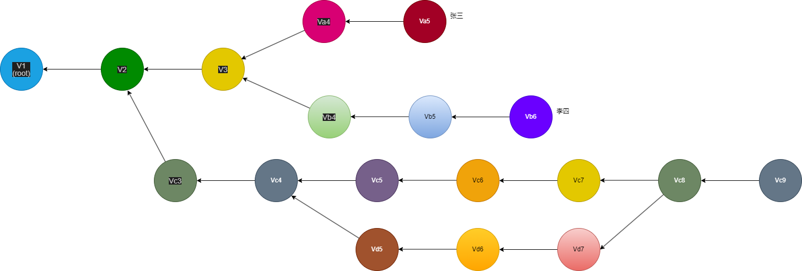

如上图，

* Branch Zhang San: V1 → V2 → V3 → Va4 → Va5
* Branch Li Si: V1 → V2 → V3 → Vb4 → Vb5 → Vb6
* Another Branch 1: V1 → V2 → Vc3 → Vc4 → ...
* Another Branch 2: V1 → V2 → Vc3 → Vc4 → Vd6 → ...

Git Repo 全部 commit 构成了一棵树，Git Repo 的一个版本就是树中的一个节点(node), 一个分支就是从根节点到某个子节点的路径。一个分支可以合并到另一个分支上。

之前的几章的所有操作其实也在一个分支上，即 master 分支。

几乎所有 VCS 都有分支功能，但 Git 的分支非常轻量，非常容易使用，这得益于它的对象树设计。从本章开始，我们将学习更多关于分支的知识。

## 1. 查看当前分支

可使用 `git branch`(不带参数)列举当前的分支列表，例如：

```plaintext
$ git branch
* git-tutorial
  ipfs
  java
  master
```

其中加星号表示当前所在的分支。`git-tutorial` 分支就是我当前写本教程的分支。这是我本地的一个 Git Repo 的分支情况，如果你从前面的教程看起，你在执行 `git branch` 可能是这样的：

```plaintext
$ git branch
* master
```

或

```plaintext
$ git branch
* main
```

刚刚创建的空库(Empty Repository)的分支列表也为空。下面一节我们将演示创建更多分支。

## 2. 创建分支

从某个节点(版本)创建一个新分支，在 master 分支上执行下面的操作：

```plaintext
$ git branch hello
$ git branch
  hello
* master
```

分支创建好后，可以通过 `git branch` 查看列表找到。但 HEAD 仍然在当前分支，不会切换到新分支上。空库上无法使用这个指令。

如果要创建并切换到新分支，可用 `git switch -c {branch name}`，在 master 分支上执行下面的操作：

```plaintext
$ git switch -c hello
Switched to a new branch 'hello'
$ git branch
* hello
  master
```

`git switch -c {branch name}` 在当前分支的代码点上创建一个新的分支，并切换到新的分支。这条指令相当于 `git branch {branch name}`, `git switch {branch name}` 两条指令的组合。新分支创建时所在的那个 commit 就是分支分叉的节点。

## 3. 切换分支

可使用 `git switch {branch name}`。例如：

```plaintext
$ git switch hello
Switched to branch 'hello'
```

## 4. 重命名分支

Git 没有 `rename` 这个指令，但它采用了变通方法：`move`

查看现在所在的分支：

```plaintext
$ git branch
* hello
  master
```

移动分支(`git branch --move {new branch name}`)：

```plaintext
$ git branch --move hello-moved
```

再查分支列表：

```plaintext
$ git branch
* hello-moved
  master
```

可见分支名称已经由 `hello` 变成了 `hello-moved`.

## 5. 删除分支(delete)

指令：`git branch -D {branch name}`

【实验过程】

查看当前分支列表：

```plaintext
$ git branch
* hello-moved
  master
```

创建并切换到新分支 `hello`：

```plaintext
$ git switch -c hello
Switched to a new branch 'hello'
```

再查分支情况：

```plaintext
$ git branch
* hello
  hello-moved
  master
```

删掉分支 `hello-moved`:

```plaintext
$ git branch -D hello-moved
Deleted branch hello-moved (was 730e097).
```

再查分支情况：

```plaintext
$ git branch
* hello
  master
```

可见分支真的删除了，这里通过多个步骤也实现了 `git branch --move` 的操作，实际工作和学习中应该选用更方便的方式，这里仅作演示。这也说明 git 的指令非常灵活，可以通过不同的方法完成同样的目标。

## 6. 合并分支(merge)

```plaintext
    o---o---o---o---o---o---o---o---o---o---o  master
  root       \             /
              o---o---o---o  feature
```

如上图 feature 分支从第三个节点开始分叉，到第七个节点又**合并**到 master 上。

* `git merge {branch name}` 把某分支的代码合并到当前分支
* `git merge {branch name} --no-ff` 把某分支的代码合并到当前分支，同时无论如何都记录合并痕迹

### 6.1 实验概述

_(实验用的 repo 可以在[这里下载](test_repo.7z)，内含 master 分支，已有五个 commit)_

从 V3 开始建一个新的分支，再造两个节点，然后合并到 master 的 V5 上，合并后，再造两个节点，最终效果如图所示

```plaintext
   v1---v2---v3---v4---v5---v8---v9    master
  root        \       /
               v6---v7                 feature
```

下面是实验的具体过程

### 6.2 创建新的分支

```plaintext
$ git log --pretty=oneline
72f439c53b36063b5a90c4cdd9c950c1bda5878c (HEAD -> master) Version 5
2e760674a969439479ede654d69e5c0b5a806c96 Version 4
aeaefe37457aa32a4d5c5518f672f1604b461c37 Version 3
8ef2f2fa9f00daa5635dfb269bc8f618635d0fa4 Version 2
733a7c97f6f6845e0b636d562855ad297b2d9db2 Version 1
```

用 `git checkout {commit hash} -b {branch name}` 从 V3 (aeaefe37) 开始创建新的分支 feature:

```plaintext
$ git checkout aeaefe37 -b feature
Switched to a new branch 'feature'
```

查看分支列表：

```plaintext
$ git branch
* feature
  master
```

接下来随便改点东西，做两次提交 (创建两个新的版本)：

```plaintext
$ ls
hello.txt  hello2.txt

$ echo "hello, v6" >> hello.txt
$ echo "hello, v6" >> hello2.txt
$ git add .
$ git commit -m "Version 6"
[feature d08dfb0] Version 6
 2 files changed, 2 insertions(+)


$ echo "hello, v7" >> hello.txt
$ echo "hello, v7" >> hello2.txt
$ git add .
$ git commit -m "Version 7"
[feature 8aba717] Version 7
 2 files changed, 2 insertions(+)
```

当前的 git repo 的所有 branch 应该是这样的：

```plaintext
   v1---v2---v3---v4---v5      master
  root        \ 
               v6---v7         feature
```

可以用 GUI 工具 [Git Extensions](16.md) 查看：

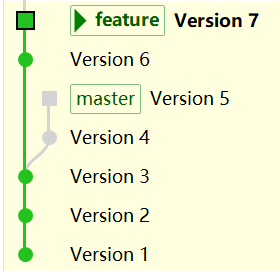

能很清楚看到 branch 从 V3 开始分叉，一个分支是 `master`, 另一个是 `feature`.

### 6.3 合并(Merge)

现在回到 `master` 并把 `feature` 的改动 V6 和 V7 合并进来。

```plaintext
$ git switch master
$ git merge feature
```

很遗憾，出现了代码冲突(conflicts).

注意看屏幕提示语，如想放弃，可以执行 `git merge --abort`.

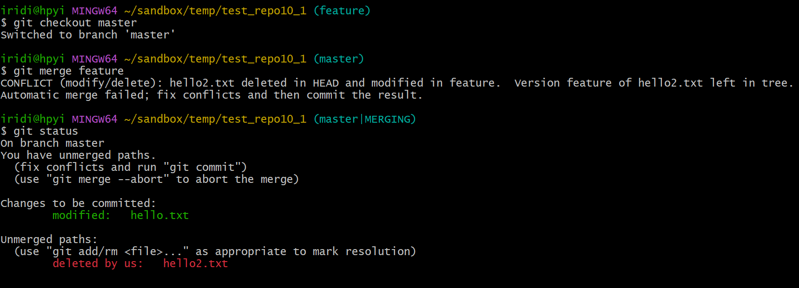

### 6.4 解决冲突(Resolve Conflicts)

依据 git 的界面提示，hello2.txt 在 master 上已经删除了，那我么这次就按 master 把它删了吧。注意冲突的处理方式是根据具体的需求来定的，你也可以选择保留 hello2.txt.

```plaintext
$ git rm hello2.txt
rm 'hello2.txt'

$ git merge --continue
[master 219ef32] Merge branch 'feature'
```

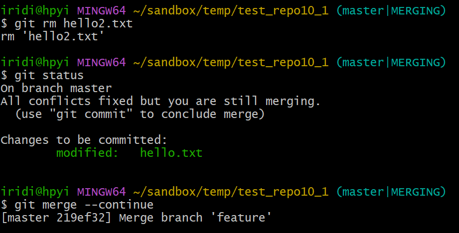

我这里执行了 `git merge --continue`，实际上按照提示执行 `git commit` 也行，git 的指令很灵活，诸出同归。这句执行后，会弹出一个 message 编辑界面，用来编辑合并节点的 message.

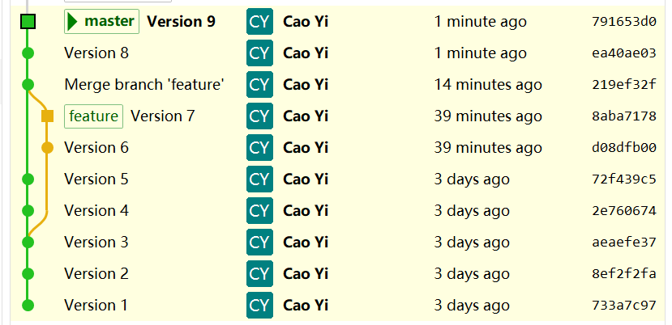

扩展阅读：[Who are "us" and "them"?](us_them.md)

### 6.5 在合并后的 master 上继续添加版本

```plaintext
$ ls
hello.txt

$ echo "hello v8">> hello.txt
$ git add .
$ git commit -m "Version 8"

$ echo "hello v9">> hello.txt
$ git add .
$ git commit -m "Version 9"
```

最后分支呈现的样子如下图所示：

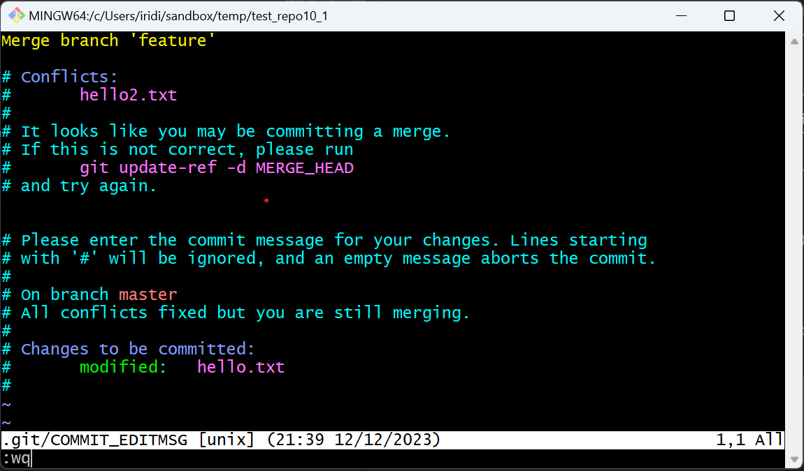

如果新分支 feature 从 V5 开始，那么 master 合并后，是不会有合并节点(219ef32f)的。但 `--no-ff` 参数会强制创建合并节点。

### 6.6 过程总结

HEAD 指向目标分支，即要合并别的分支的分支，例如在 master 上执行 `git merge feature`，会将 feature 分支上的改动合并到 master 分支上。如果合并失败，出现冲突，可以在 master 上手动修改文件，再在 master 上提交即可。

## 7. 变基(rebase)

「变基」的中文含义容易误解😀，不过可能不是你想的那个意思，它的全称可以理解为「改变基础」, rebase 一词也要分解为 re-base 就好理解了。

还是以前面的例子，我们从 V3 开始，创建了新的 branch feature，这个新 branch 就是以 V3 为「基(base)」的。我们新增两个 commit 之后，想把 feature 分支改成(re)以 V5 为「基(base)」，这就是变基。

本来是这样的：

```plaintext
   v1---v2---v3---v4---v5         master
  root        \ 
               v6---v7            feature
```

但我们想改成这样的：

```plaintext
   v1---v2---v3---v4---v5           master
  root                  \ 
                         v6---v7    feature
```

这就是「变基(rebase)」

### 7.1 实验概述

_(实验用的 repo 可以在[这里下载](test_repo.7z)，内含 master 分支，已有五个 commit)_

和上一节的实验一样，先创建新分支 feature，并创建两个新的提交。按[6.2 创建新的分支](#62-创建新的分支)再走一遍就行。如果6的实验已经做完，可以在 master 分支上直接用 `reset` 指令到 V5(72f439c5) 也可。

```plaintext
$ git reset --hard 72f439c5
HEAD is now at 72f439c Version 5
```

现在的 commit 树是这样的

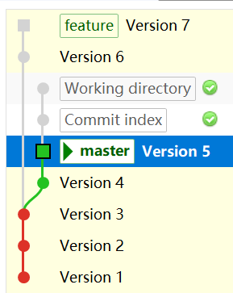

### 7.2 变基操作

切换到 feature 分支上开始变基：

```plaintext
$ git switch feature
$ git rebase master
CONFLICT (modify/delete): hello2.txt deleted in HEAD and modified in d08dfb0 (Version 6).  Version d08dfb0 (Version 6) of hello2.txt left in tree.
error: could not apply d08dfb0... Version 6
hint: Resolve all conflicts manually, mark them as resolved with
hint: "git add/rm <conflicted_files>", then run "git rebase --continue".
hint: You can instead skip this commit: run "git rebase --skip".
hint: To abort and get back to the state before "git rebase", run "git rebase --abort".
Could not apply d08dfb0... Version 6
```

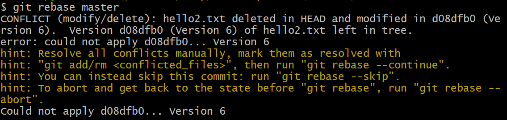

_(注意看屏幕提示语，如想放弃变基操作，可以执行 `git rebase --abort`)_

不幸遇到代码冲突，不要慌，用 `git status` 看下，再手工处理

```plaintext
$ git status
interactive rebase in progress; onto 72f439c
Last command done (1 command done):
   pick d08dfb0 Version 6
Next command to do (1 remaining command):
   pick 8aba717 Version 7
  (use "git rebase --edit-todo" to view and edit)
You are currently rebasing branch 'feature' on '72f439c'.
  (fix conflicts and then run "git rebase --continue")
  (use "git rebase --skip" to skip this patch)
  (use "git rebase --abort" to check out the original branch)

Changes to be committed:
  (use "git restore --staged <file>..." to unstage)
        modified:   hello.txt

Unmerged paths:
  (use "git restore --staged <file>..." to unstage)
  (use "git add/rm <file>..." as appropriate to mark resolution)
        deleted by us:   hello2.txt
```

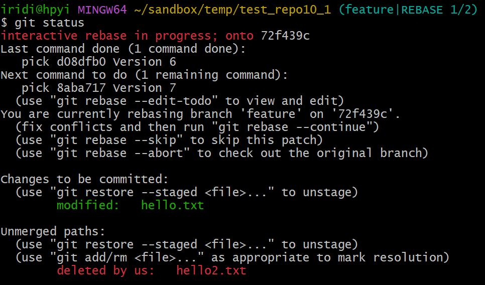

依据 git 的界面提示，hello2.txt 在 master 上已经删除了，那我么这次就按 master 把它删了吧。注意冲突的处理方式是根据具体的需求来定的，你也可以选择保留 hello2.txt.

```plaintext
iridi@hpyi MINGW64 ~/sandbox/temp/test_repo10_1 (feature|REBASE 1/2)
$ git rm hello2.txt
rm 'hello2.txt'
```

再看看现在的状态：

```plaintext
iridi@hpyi MINGW64 ~/sandbox/temp/test_repo10_1 (feature|REBASE 1/2)
$ git status
interactive rebase in progress; onto 72f439c
Last command done (1 command done):
   pick d08dfb0 Version 6
Next command to do (1 remaining command):
   pick 8aba717 Version 7
  (use "git rebase --edit-todo" to view and edit)
You are currently rebasing branch 'feature' on '72f439c'.
  (all conflicts fixed: run "git rebase --continue")

Changes to be committed:
  (use "git restore --staged <file>..." to unstage)
        modified:   hello.txt
```

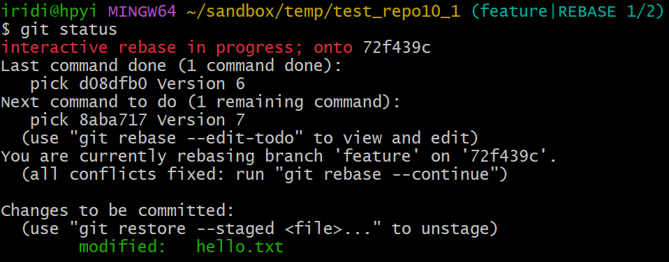

按提示，冲突解决了，可以用 `git rebase --continue` 继续，接下来又有一个冲突，没关系，按类似的方式解决就行：

1. `git status` 查看冲突的文件列表，有冲突的文件会放到工作区(Working Directory)里
2. 手工处理这些有冲突的文件
3. 处理完毕后，用 `git add` 指令把它们从工作区存放到缓存区(Staging Area)
4. 执行 `git rebase --continue` 即可。完毕。

处理完毕，feature 分支是这样的：

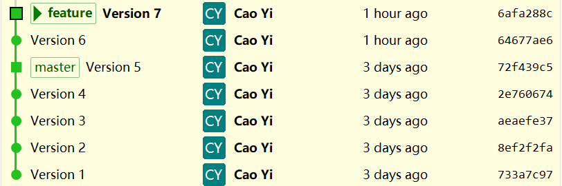

执行变基(rebase)操作后，基(base)变了的节点的 hash 会变。

## 8. Cherry-pick

合并(merge)会把一个分支的全部改动引入到当前分支，但有时我们只需要某个分支的几个 commit，此时我们需要这样的操作：将对方的 commit 抓过来，并接在当前的分支上。这种从其他分支挑选 commit, 抓取并接入当前分支的操作，就叫 cherry-pick.

比如当前的 commit tree 是这样的：

```plaintext
   v1---v2---v3---v4---v5         master
  root        \ 
               v6---v7            feature
```

我们并不希望 master 合并 feature 分支，但想 master 上也有和 v7 一样的改动。此时就可以用 `git cherrypick {commit hash}` 把 V7 抓取到 master 上。

### 8.1 实验记录

_(实验用的 repo 可以在[这里下载](test_repo.7z)，内含 master 分支，已有五个 commit)_

和上一节的实验一样，先创建新分支 feature，并创建两个新的提交。按[6.2 创建新的分支](#62-创建新的分支)再走一遍就行。如果6.1的实验已经做完，可以在 master 分支上直接用 `reset` 指令到 V5(72f439c5), feature 分支上 `reset` 到 V7(8aba7178) 也可。

```plaintext
$ git switch master
$ git reset --hard 72f439c5
HEAD is now at 72f439c Version 5

$ git switch feature
$ git reset --hard 8aba7178
HEAD is now at 8aba717 Version 7
```

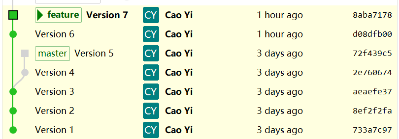

### 8.2 具体操作

指令：`git cherry-pick {commit hash}`

切换到 master 分支去 cherry-pick V7(8aba7178):

```plaintext
$ git switch master
$ git cherry-pick 8aba7178
Auto-merging hello.txt
CONFLICT (content): Merge conflict in hello.txt
CONFLICT (modify/delete): hello2.txt deleted in HEAD and modified in 8aba717 (Version 7).  Version 8aba717 (Version 7) of hello2.txt left in tree.
error: could not apply 8aba717... Version 7
hint: After resolving the conflicts, mark them with
hint: "git add/rm <pathspec>", then run
hint: "git cherry-pick --continue".
hint: You can instead skip this commit with "git cherry-pick --skip".
hint: To abort and get back to the state before "git cherry-pick",
hint: run "git cherry-pick --abort".
```

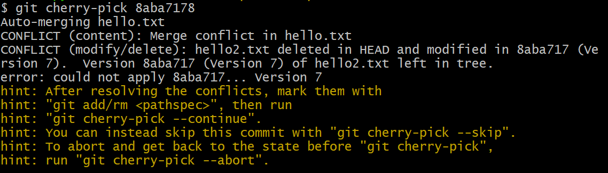

_(注意看屏幕提示语，如想中止操作，可以执行 `git cherry-pick --abort`)_

不幸碰到冲突，老办法，用 `git status` 查看具体的冲突内容：

```plaintext
$ git status
On branch master
You are currently cherry-picking commit 8aba717.
  (fix conflicts and run "git cherry-pick --continue")
  (use "git cherry-pick --skip" to skip this patch)
  (use "git cherry-pick --abort" to cancel the cherry-pick operation)

Unmerged paths:
  (use "git add/rm <file>..." as appropriate to mark resolution)
        both modified:   hello.txt
        deleted by us:   hello2.txt

no changes added to commit (use "git add" and/or "git commit -a")
```

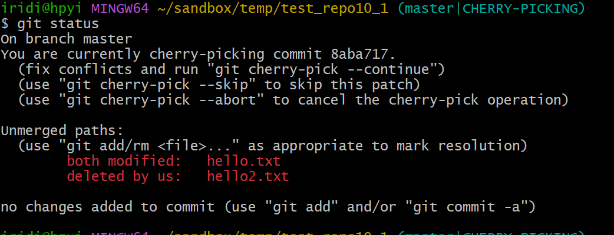

按需解决 (实验中请随意处理，工作中请按业务需求处理)：

```plaintext
$ git rm hello2.txt
$ vi hello.txt
```

我的处理是：删掉 hello2.txt, 编辑 hello.txt，具体略，你可以随意处理。

处理结束后，将文件从工作区 add 到缓存区，最后执行 `--continue` 指令即可。

```plaintext
$ git add .
$ git cherry-pick --continue
[master 50e9f5e] Version 7
 Date: Tue Dec 12 21:14:58 2023 +0800
 1 file changed, 2 insertions(+)
```

最终 commit tree 变成这样：

```plaintext
   v1---v2---v3---v4---v5---v7'   master
  root        \ 
               v6---v7            feature
```

因为 commit 被 cherry-pick 后 hash 会变，所以在 master 分支上我用 `v7'` 表示新 pick 的 commit.


从这个图中也能看出，两个 V7 的 hash 是不同的。

## 9. 进阶篇

_进阶篇的内容在对 git 有一定使用经验后阅读更佳，初学者可以跳过。_

### 9.1 强制切换分支

有时可能因为当前分支有改动没有保存等原因，切换过去会导致冲突，进而导致切换失败，这时可以使用 `--force` 进行强制切换：

* `git switch {branch name} --force`

如：

```plaintext
$ git switch hello --force
```

但强制切换也有一个后果：会丢弃当前分支的所有改动。

### 9.2 检查一个 commit 已经包含在哪些 branch 中

某个版本(commit)可能属于多个分支，我们想知道某个 commit 到底在哪些分支上有，可以用 `git branch --contains`，例如

我们知道 V1 的 hash 是 733a7c97，它是 master 和 feature 共有节点，测试如下：

```bash
$ git branch --contains 733a7c97
  feature
* master
```

而 V5(72f439c5) 仅在 master 分支上，测试如下：

```plaintext
$ git branch --contains 72f439c5
* master
```

### 9.3 两种删除的不同

删除分支时，可以用 `-d` 也可以用 `-D` 参数，初学者容易迷惑，为了省事，我一般就用 `-D` 参数强制删除，但这两个参数还是有区别的。

* `git branch -d {branch name}` 删除分支
* `git branch -D {branch name}` 强制删除分支

[官方文档](https://git-scm.com/docs/git-branch)值得一读：

> -d
>
> --delete
>
> Delete a branch. The branch must be fully merged in its upstream branch, or in HEAD if no upstream was set with > --track or --set-upstream-to.
>
> -D
>
> Shortcut for --delete --force.

### 9.4 main VS master

Git Repo 的默认分支从开始一直都是 master，但从2020年的美国黑人 George Floyd 事件后，[BLM](https://en.wikipedia.org/wiki/Black_Lives_Matter)的支持者在软件行业提出替换 `master` 一词，git 从2.28.0版本开始取消了默认分支的硬编码，支持自定义。

这个值可以调整：

```plaintext
$ git config init.defaultBranch
master
$ git config --global init.defaultBranch main
```

也可以在创建仓库时指定默认分支：

```plaintext
$ git init {repo name} -b {default branch}
```

or

```plaintext
$ git init {repo name} --initial-branch={default branch}
```

个人觉得比较无聊，这是科技界向种族主义分子妥协的一个例子。我当然支持黑人平权，但我也支持白人黄人平权。避免使用 master 有点捕风捉影。

[官方文档](https://raw.githubusercontent.com/git/git/master/Documentation/RelNotes/2.28.0.txt)的参考内容如下：

> The name of the primary branch in existing repositories, and the default name used for the first branch in newly created repositories, is made configurable, so that we can eventually wean ourselves off of the hardcoded 'master'.

### 9.5 `checkout` VS `switch`

切换分支可以用 `checkout` 或 `switch`

* `git switch {branch name}` 等同 `git checkout {branch name}`
* `git switch {branch name} --force` 等同 `git checkout {branch name} --force`
* `git swtich -c {branch name}` 等同 `git checkout -b {branch name}`

切换分支可以优先考虑使用 `switch` 指令，它的含义更清晰一些。`checkout` 还有一些其他含义。

### 9.6 合并的三种模式

`merge` 有三种模式

1. `--ff`, 快进
2. `--no-ff`, 禁用快进
3. `--ff-only`, 仅用快进

#### 9.6.1 `--ff`

ff 是 fast-forward 的缩写，顾名思义就是「快速推进」的意思，这里我翻译为「快进」模式。

当「被合并的分支」包含「发起合并的分支」的全部节点时，git 直接将 HEAD 指针移动一下就算合并了，这个很「快」。

假如两个分支当前状态是这样的

```plaintext
              HEAD of master
              /
   v1---v2---v3                          branch master
  root        \ 
               v6---v7                   branch feature
                     \
                     HEAD of feature
```

在 master 上合并 feature

```plaintext
$ git switch master
$ git merge feature
```

结果就是 master 分支的 HEAD 直接指向 v7 就完事：

```plaintext
   v1---v2---v3      HEAD of master
  root        \      /
               v6---v7                  branch master and feature
                     \
                     HEAD of feature
```

当「被合并的分支」不包含「发起合并的分支」的全部节点时，git 就创建一个合并节点。

假如两个分支当前状态是这样的

```plaintext
                        HEAD of master
                        /
   v1---v2---v3---v4---v5                    branch master
  root        \ 
               v6---v7                       branch feature
                     \
                     HEAD of feature
```

在 master 上合并 feature

```plaintext
$ git switch master
$ git merge feature
```

这里 master 和 HEAD 不能直接移动到 v7，否则会丢 v4 和 v5，此时，它会创建一个合并节点 v8.

```plaintext
                             HEAD of master
                             /
   v1---v2---v3---v4---v5---v8               branch master
  root        \             /
               v6---------v7                 branch feature
                           \
                           HEAD of feature
```

综上，git 尽量使用快速的方式，但如果不能「快进」，也会创建合并节点。这是 `merge` 默认的方式。

#### 9.6.2 `--no-ff`

禁用「快进」模式，在任何情况下都要创建一个合共节点，即使可以快进。

不能用「快进」的情况在[9.6.1 `--ff`](#961---ff)已有说明，这里再说明能用「快进」的情况如何处理。

假如两个分支当前状态是这样的

```plaintext
              HEAD of master
              /
   v1---v2---v3                          branch master
  root        \ 
               v6---v7                   branch feature
                     \
                     HEAD of feature
```

这个前面已经提到过，默认用「快进」，但是加了 `--no-ff` 会怎样呢？

在 master 上合并 feature

```plaintext
$ git switch master
$ git merge --no-ff feature
```

结果会是这样：

```plaintext
                        HEAD of master
                        /
   v1---v2---v3-------V8                          branch master
  root        \      /
               v6---v7                            branch feature
                     \
                     HEAD of feature
```

#### 9.6.3 `--ff-only`

只用「快进」模式，能快进就快进，不能快进就报错。

能用「快进」的情况在[9.6.1 `--ff`](#961---ff)已有说明，这里再说明不能用快进的情况如何处理。

假如两个分支当前状态是这样的

```plaintext
                        HEAD of master
                        /
   v1---v2---v3---v4---v5                    branch master
  root        \ 
               v6---v7                       branch feature
                     \
                     HEAD of feature
```

在 master 上合并 feature, 不能用「快进」，因为 feature 上不包含 v4 和 v5. 这种情况下。执行下面的指令会出现报错

```plaintext
$ git switch master
$ git merge --ff-only feature
```

此时，我们可以先做 `rebase`，再继续 `merge --ff-only`:

```plaintext
$ git switch feature
$ git rebase master
$ git switch master
$ git merge --ff-only feature
```

`rebase` 之后，commit tree 是这样的：

```plaintext
                        HEAD of master
                        /
   v1---v2---v3---v4---v5                             branch master
  root                  \ 
                        v6---v7                       branch feature
                              \
                              HEAD of feature
```

`merge --ff-only` 之后，commit tree 是这样的：

```plaintext
   v1---v2---v3---v4---v5     HEAD of master
  root                  \     /
                        v6---v7                       branch master and feature
                              \
                              HEAD of feature
```

#### 9.6.4 小结

1. `git merge feature --ff`, fast-forward 模式，默认模式，能「快进」就「快进」，不能就创建一个合并节点。
2. `git merge feature --no-ff`, non-fast-forward 模式，禁用快进，不论什么情况都会创建一个合并节点。
3. `git merge feature --ff--only`, fast-forward only 模式，只用快进，不能用快进的情况就报错。

如果要修改 `merge` 的默认模式可以设置 `merge.ff`

* `git config merge.ff false`, non-fast-forward
* `git config merge.ff only`, fast-forward only

---

[⇦上一章](07.md) - [首页🏠](index.md) - [下一章⇨](09.md)

<script src="https://giscus.app/client.js"
        data-repo="iridiumcao/iridiumcao.github.io"
        data-repo-id="MDEwOlJlcG9zaXRvcnkyOTUwNTIyODQ="
        data-category="Announcements"
        data-category-id="DIC_kwDOEZYj_M4Cxfqj"
        data-mapping="pathname"
        data-strict="0"
        data-reactions-enabled="1"
        data-emit-metadata="0"
        data-input-position="bottom"
        data-theme="preferred_color_scheme"
        data-lang="zh-CN"
        crossorigin="anonymous"
        async>
</script>