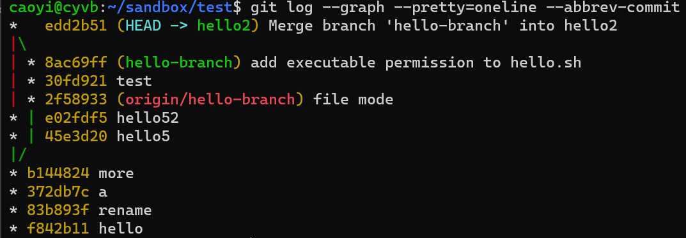

# 第十四章 了解仓库状态

[⇦上一章](13.md) - [首页🏠](index.md) - [下一章⇨](15.md)

---

- [第十四章 了解仓库状态](#第十四章-了解仓库状态)
  - [1. `git version`](#1-git-version)
  - [2. `git status`](#2-git-status)
  - [3. `git diff/difftool`](#3-git-diffdifftool)
  - [4. `git log`](#4-git-log)
    - [4.1 不带参使用](#41-不带参使用)
    - [4.2 瘦身显示](#42-瘦身显示)
    - [4.3 图形化显示](#43-图形化显示)
    - [4.4 占位符 (Placeholder)](#44-占位符-placeholder)
      - [4.4.1 示例1：获取当前分支最后一次提交的作者的 email](#441-示例1获取当前分支最后一次提交的作者的-email)
      - [4.4.2 更多示例](#442-更多示例)
    - [4.5 Find Deleted Files in Git Repository](#45-find-deleted-files-in-git-repository)
    - [4.6 查询某人提交的历史记录](#46-查询某人提交的历史记录)
  - [5. `git reflog`](#5-git-reflog)
  - [6. `git show`](#6-git-show)
  - [7. `git branch`](#7-git-branch)
  - [8. `git merge-base`](#8-git-merge-base)
  - [9. Tags](#9-tags)
  - [10. `git worktree`](#10-git-worktree)
  - [11. `git remote`](#11-git-remote)
  - [12. `git config`](#12-git-config)

---

在使用 git 时，我们需要时时刻刻了解 repo 的状态。了解正确的情况，是执行正确操作的前提和保障。

本章部分内容在前面的章节里也有出现。

## 1. `git version`

了解当前 git 的版本信息

```plaintext
$ git version
git version 2.40.1
```

Windows 版本还会带上操作系统信息

```plaintext
$ git version
git version 2.42.0.windows.2
```

旧版也可以用 `git --version`

## 2. `git status`

`git status` 请随时使用，随时了解库的状态：

* 目前的工作分支
* 工作区改动了哪些文件
* 有无新增的文件还没跟踪
* 暂存区里有哪些文件
* 分支是否有更新，是否需要更新
* 执行 `merge/rebase/cherr-pick/revert/pull` 时如果有代码冲突，它会显示哪些文件需要处理，会提示下一步的处理是什么

如果仅需简要显示，加参数 `-s` 即可：`git status -s`

```plaintext
$ git status
On branch git-tutorial
Changes not staged for commit:
  (use "git add <file>..." to update what will be committed)
  (use "git restore <file>..." to discard changes in working directory)
        modified:   git/14.md
        modified:   images/alipay_code.jpg
        modified:   images/wechat_code.png

no changes added to commit (use "git add" and/or "git commit -a")

$ git status -s
 M git/14.md
 M images/alipay_code.jpg
 M images/wechat_code.png
```

`git status` 非常有用，在各个场景下都应该多用。

## 3. `git diff/difftool`

如果工作区里对文件有改动，用 `git status` 可以知道哪些文件有变化，而用 `git diff` 可以查看到详细的改动内容。

```plaintext
$ git diff
diff --git a/git/14.md b/git/14.md
index b263c00..18fd84d 100644
--- a/git/14.md
+++ b/git/14.md
@@ -56,7 +56,15 @@ git version 2.42.0.windows.2

 ## `git status`

-`git status` 请随时使用，随时了解库的状态。
+`git status` 请随时使用，随时了解库的状态：
+
...
```

还可以使用 `difftool` 查看，效果更酷：

```plaintext
$ git difftool

This message is displayed because 'diff.tool' is not configured.
See 'git difftool --tool-help' or 'git help config' for more details.
'git difftool' will now attempt to use one of the following tools:
opendiff kdiff3 tkdiff xxdiff meld kompare gvimdiff diffuse diffmerge ecmerge p4merge araxis bc codecompare smerge emerge vimdiff nvimdiff

Viewing (1/1): 'git/14.md'
Launch 'vimdiff' [Y/n]?
```

(这里提到 `diff.tool` 没有配置，暂时不考虑，它会使用默认的 vimdiff. 配置相关的内容[下一章](15.md)会讲。)

输入 `Y` 回车后，界面展示如下：


查看上一个版本改动的文件列表：

```plaintext
$ git diff --name-only HEAD~1
git/14.md
images/alipay_code.jpg
images/wechat_code.png
```

查看前3个版本改动的文件列表：

```plaintext
$ git diff --name-only HEAD~3
git/01.md
git/14.md
git/index.md
git/preface.md
images/alipay_code.jpg
images/wechat_code.png
```

查看前面版本的具体修改内容：

```plaintext
$ git diff HEAD~1
$ git diff HEAD~3
```

还可以使用 `difftool` 查看，效果更酷：

```plaintext
 git difftool HEAD~1
 git difftool HEAD~3
```

对比某两次 commit 之间修改了哪些文件，如 HEAD~n 到 HEAD~m 的所有变化(包含 HEAD~n 和 HEAD~m)的变化：

```plaintext
$ git diff HEAD~n HEAD~m
```

如果只是查看变化的文件列表，加 `--name-only` 参数

```plaintext
$ git diff --name-only HEAD~n HEAD~m
```

如果需要更好的对比效果，用 `difftool`

```plaintext
$ git difftool HEAD~n HEAD~m
```

## 4. `git log`

`git log` 也是一个超级常用的指令，git 作为 VCS, 历史记录是核心，所以这个指令同时也非常重要。

* 官方文档：<https://git-scm.com/docs/git-log>

### 4.1 不带参使用

很多时候，我们执行不带参数指令就好：

```plaintext
$ git log
commit 16018180d2d8033a811561bb044baba9fdf3e4fc (HEAD -> git-tutorial)
Author: Cao Yi <iridiumcao@gmail.com>
Date:   Sat Dec 23 21:21:37 2023 +0800

    more

commit cd5105335c3260daf68af65e9de4173dcb64b54a
Author: Cao Yi <iridiumcao@gmail.com>
Date:   Sat Dec 23 21:08:40 2023 +0800

    Update Chapter 14, 15, 16

commit d61f9eb67ad0dd9818ce6d5028f7676443d699e4
Author: Cao Yi <iridiumcao@gmail.com>
Date:   Sat Dec 23 10:11:06 2023 +0800

    Chapter 15, Git Config
    chapter 16, Git GUI
...
```

如果记录较多，可以按「方向键」或「翻页键」向前或向后显示，按 `q` 停止显示并退出。

### 4.2 瘦身显示

如果不需要显示摘要信息，还可以加上参数 `--pretty=oneline` 简单显示 commit hash 和 message 就行

```plaintext
$ git log --pretty=oneline
16018180d2d8033a811561bb044baba9fdf3e4fc (HEAD -> git-tutorial) more
cd5105335c3260daf68af65e9de4173dcb64b54a Update Chapter 14, 15, 16
d61f9eb67ad0dd9818ce6d5028f7676443d699e4 Chapter 15, Git Config chapter 16, Git GUI
...
```

有时我们只需要看最后几行日志，我们可以加上条数限制 `-n {num}` 或 `-{num}`

```plaintext
$ git log --pretty=oneline -n 3
```

或

```plaintext
$ git log --pretty=oneline -3
```

`--pretty=oneline` 会显示每个版本完整的 hash, 很多时候是不需要的，大多数时候只需要简短的 commit hash 即可，这时可用参数 `--oneline`

```plaintext
$ git log --oneline -3
```

有时只要列出每次修改的文件名列表就好

```plaintext
$ git log --name-only -3
```

### 4.3 图形化显示

`--graph` 参数可以实现图形化显示，展示分支的衍合历史，如：

```plaintext
$ git log --graph --pretty=oneline --abbrev-commit
*   edd2b51 (HEAD -> hello2) Merge branch 'hello-branch' into hello2
|\
| * 8ac69ff (hello-branch) add executable permission to hello.sh
| * 30fd921 test
| * 2f58933 (origin/hello-branch) file mode
* | e02fdf5 hello52
* | 45e3d20 hello5
|/
* b144824 more
```



### 4.4 占位符 (Placeholder)

Git log 支持很多占位符为用户显示定制化的信息。比如：

```plaintext
#   %h: abbreviated commit hash
#   %d: ref names, like the --decorate option of git-log(1)
#   %cn: committer name
#   %ce: committer email
#   %cr: committer date, relative
#   %ci: committer date, ISO 8601-like format
#   %cd: committer date (format respects --date= option)
#   %ct: committer date, UNIX timestamp
#   %an: author name
#   %ae: author email
#   %ar: author date, relative
#   %ai: author date, ISO 8601-like format
#   %s: subject
...
```

committer date = commit date. committer date 属于一个提交(commit) 的元信息，因为它也表示提交动作发生时的时间，很多时候，用 commit date 也可。

还有很多，建议在[官方帮助文档](https://git-scm.com/docs/git-log)里搜 `placeholder` 找到相关内容查看。

可以通过 `--format` 和 `--pretty` 参数来使用占位符定制消息。

#### 4.4.1 示例1：获取当前分支最后一次提交的作者的 email

有多种方式可以做到：

```plaintext
$ git log -n 1 --format="%ae"
iridiumcao@gmail.com
```

或

```plaintext
$ git log -1 --pretty=format:"%ae"
iridiumcao@gmail.com
```

加上定制信息：

```plaintext
$ git log -1 --format="The last commit's email is %ae"
The last commit's email is iridiumcao@gmail.com
$ git log -1 --pretty=format:"The last commit's email is %ae"
The last commit's email is iridiumcao@gmail.com
```

如果我们不了解 `git log` 支持的占位符，就得用下面的笨办法去抓取：

```plaintext
$ git log -n 1 | head -2 | tail -1 | sed 's/^Author: //g'
Cao Yi <iridiumcao@gmail.com>
```

#### 4.4.2 更多示例

▷ 获取最近19个 commit hash

```plaintext
$ git log -19 --pretty=format:"%h"
$ git log -19 --format=%h
```

上述两条指令的效果完全一样。

▷ 显示上次修改的文件列表

```plaintext
git show --pretty=%gd --stat
git log -n 1 --stat --summary
```

上面两条还是有不一样的，show 能看目前未提交的，而 log 只能看已经提交的

[Ref](https://stackoverflow.com/questions/424071/how-do-i-list-all-of-the-files-in-a-commit)

▷ 显示某 branch/tag/commit 的时间信息

当前分支最新 commit 的作者时间(author time)：

```plaintext
$ git log -1 --format=%ai
2023-12-23 21:42:03 +0800
$ git log -1 --pretty=%ai
2023-12-23 21:42:03 +0800
$ git log -1 --pretty=format:%ai
2023-12-23 21:42:03 +0800
```

以上三条指令是等效的。

显示另一个 branch 或 tag 的作者时间：

```plaintext
$ git log -1 --format=%ai master
2023-12-23 07:17:24 +0800
```

显示某个特定的 commit 的作者时间：

```plaintext
$ git log -1 --format=%ai d61f9eb67a
2023-12-23 10:11:06 +0800
```

这条指令里的 `-1` 参数并非多余。

https://stackoverflow.com/questions/3814926/git-commit-date

### 4.5 Find Deleted Files in Git Repository

假如我们要寻找已经删掉的文件 16.md 在哪些 commit 中处理过，可以这样

```plaintext
$ git log --full-history -- "*16.md"
```

如果要找最后一条，加参数 `-1`

```plaintext
$ git log -1 --full-history -- "*16.md"
```

The quotes are not required, full path can be used too.

Ref: <https://stackoverflow.com/questions/6839398/find-when-a-file-was-deleted-in-git/34755406>

### 4.6 查询某人提交的历史记录

可以通过 git message 的 author 包含的字串来找，比如

```plaintext
$ git log --author="Cao Yi"
commit cd5105335c3260daf68af65e9de4173dcb64b54a
Author: Cao Yi <iridiumcao@gmail.com>
Date:   Sat Dec 23 21:08:40 2023 +0800

    Update Chapter 14, 15, 16

commit d61f9eb67ad0dd9818ce6d5028f7676443d699e4
Author: Cao Yi <iridiumcao@gmail.com>
Date:   Sat Dec 23 10:11:06 2023 +0800
...
```

或

```plaintext
$ git log --author="iridiumcao"
$ git log --author="iridiumcao@gmail"
$ git log --author="iridiumcao@gmail.com"
```

查出来的内容还可以进一步格式化或输入到一个文件中

```plaintext
git log --author="Cao Yi" --pretty=oneline >gitlog.txt
```

## 5. `git reflog`

`reflog`, reference log, 通常认为是 git 日志的日志，凡是对 repository 有改动的操作，它都记录在案，即便是分支删除了，它都在。reflog 只存在于本地，有一段默认的保存时间，可以通过属性 `gc.reflogExpire` 设置，但**不建议**用户设置。

```plaintext
$ git config gc.reflogExpire 100.days.ago
```

它的使用场景主要是恢复一个已经不在版本库中的某个版本。具体处理方法是先用 `git reflog` 列出记录，再找到那个想要恢复的版本用 `git checkout HEAD@{n} -b {new branch name}` 恢复。

话说 reflog 的输出真的很难读，不是万不得已，不建议使用。如果要找某个 commit 可以搭配 `grep` 使用。

Ref:

- <https://git-scm.com/docs/git-reflog>
- [【学了就忘】Git操作 — 51.git reflog命令](https://www.jianshu.com/p/7e4cef3863e7) (by 繁华似锦Fighting)
- [Git进阶系列: 8. 用Reflog恢复丢失的提交](https://zhuanlan.zhihu.com/p/639564741) (by 俞凡)

## 6. `git show`

不带任何参数时，`git show` 显示最新版本的摘要信息和具体改动，也就是 `git show` = `git log -1` + `git diff HEAD~1`.

如果要显示最近 n 个变化，可以用

```plaintext
$ git show HEAD~n
```

`git show` 还可以帮助我们获取一些专门信息，比如

获取 committer date ([Ref](https://stackoverflow.com/questions/3814926/git-commit-date))

```plaintext
git show -s --format=%ci <commit>
```

示例：

```plaintext
$ git show -s --format=%ci c6664a
2022-01-11 17:17:06 -0500
```

调节 `--format` 参数，还可以获取 author date，如

```plaintext
$ git show -s --format=%ai c6664a
2022-01-04 11:49:27 +0800
```

## 7. `git branch`

* `git branch` 显示本地分支
* `git branch -r` 显示远程库的分支
* `git branch -v` 显示本地分支更详细的信息，即分支列表，每个分支最后一个提交和它的 message
* `git branch --v` 同上
* `git branch --verbose` 同上
* `git branch --verbose --remote` 显示远程分支的详细信息
* `git branch -v -r` 同上
* `git branch -vv` 显示本地分支更详细的信息，除了 `--verbose` 有的，还包含本地分支关联的远程引用
* `git branch --verbose --verbose` 同上

Branches merged into the master branch

```plaintext
$ git switch master
$ git branch --merged
$ git branch -r --merged
$ git branch -r --merged  | wc -l
```

Branches NOT merged into the master branch

```plaintext
$ git switch master
$ git branch -r --no-merged
```

## 8. `git merge-base`

`git merge-base` 是一个比较罕用的指令，可以用它找到两个 branch 分叉的 commit ID. 官方的说明如下：

```plaintext
git-merge-base - Find as good common ancestors as possible for a merge
```

示例：

```plaintext
$ git merge-base week18 master
645f4089873e48ec7beb1faa1c0518d04d03a1ca
```

它表示 `week18` 和 `master` 这两个分支在 ID 为 645f4089873e48ec7beb1faa1c0518d04d03a1ca 的 commit 分叉。

简明帮助可以通过指令 `git merge-base help` 查看，详细帮助可以通过[这里](https://git-scm.com/docs/git-merge-base)查看。

## 9. Tags

* `git tag` 显示本地 tag 列表
* `git ls-remote --tags` 显示远程 tag 列表
* `git ls-remote --tags {remote repo name}` 显示远程 tag 列表，注意远程的库名要跟在指令最后

## 10. `git worktree`

* `git worktree list` 显示现在的 worktree 列表，一个 workspace 包含一个 worktree

## 11. `git remote`

* `git remote` 显示远程库列表
* `git remote -v` 显示远程库列表，并显示其 git URL

## 12. `git config`

* `git config --global --list` 显示所有全局属性
* `git config --list` 显示当前仓库的属性
* `git config --global user.name` 显示全局属性中 `user.name` 的值
* `git config user.name` 显示本仓库属性中 `user.name` 的值

---

[⇦上一章](13.md) - [首页🏠](index.md) - [下一章⇨](15.md)
