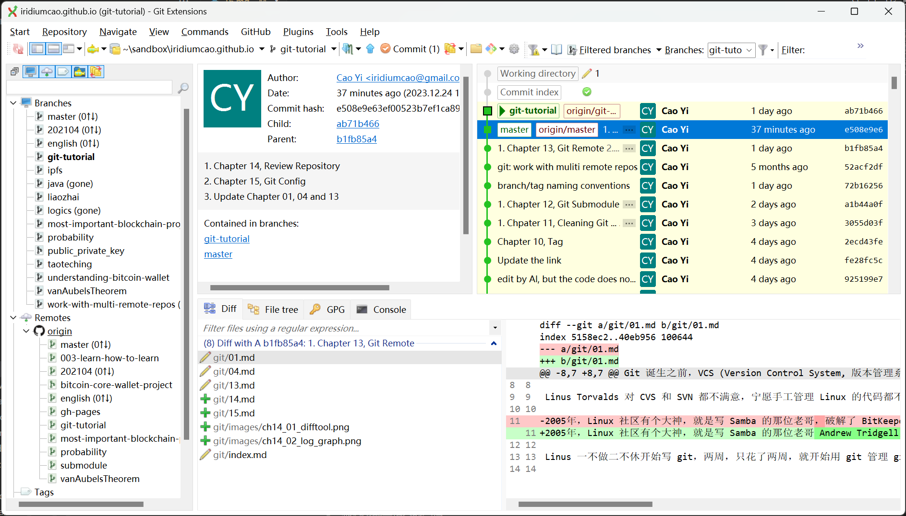

# 第十六章 谈谈 Git GUI 客户端

[⇦上一章](15.md) - [首页🏠](index.md) - [前言⇨](preface.md)

---

- [第十六章 谈谈 Git GUI 客户端](#第十六章-谈谈-git-gui-客户端)
  - [Git Extentions](#git-extentions)
  - [Git with IDE](#git-with-ide)

---

理论上只使用命令行可以完成所有的 git 操作，但是使用 GUI 工具能给我们带来很多方便——从繁琐的命令行中解放出来，将注意力集中在的业务上。

熟悉命令行能帮助我们对 GUI 工具的理解，所以前面对命令行的学习并没白费，所谓功不唐捐是也。

Git GUI 客户端工具有[很多](https://git-scm.com/downloads/guis)，这里仅仅极简地介绍一下 Git Extensions.

## Git Extentions

* 项目主页：<https://gitextensions.github.io/>
* 帮助文档：[Git Extensions 4.2 Manual](https://git-extensions-documentation.readthedocs.io/en/release-4.2/index.html) (非常好的文档)

Git Extentions 最新版只有 Windows 版本，其他系统的用户不用考虑它。

下面是它的主界面上的信息展示截图：

打开这个界面，相当于同时执行了如下指令：

1. `git branch`
2. `git branch -r`
3. `git tag`
4. `git show`
5. `git diff`
6. `git diff --name-only`
7. `git log`
8. `git status`
9. ...

而且它的展示方式非常直观。这大概就是 GUI Client 存在的理由。其他很多 GUI client 的界面功能其实是类似的。我一般用 Git Extensions 查看状态，并用命令行执行其他操作。

## Git with IDE

几乎所有的 IDE 都集成有 git 插件，此不赘述。VS Code 的 Git 插件特别多，可以按自己的喜好选用。

---

[⇦上一章](15.md) - [首页🏠](index.md) - [前言⇨](preface.md)
