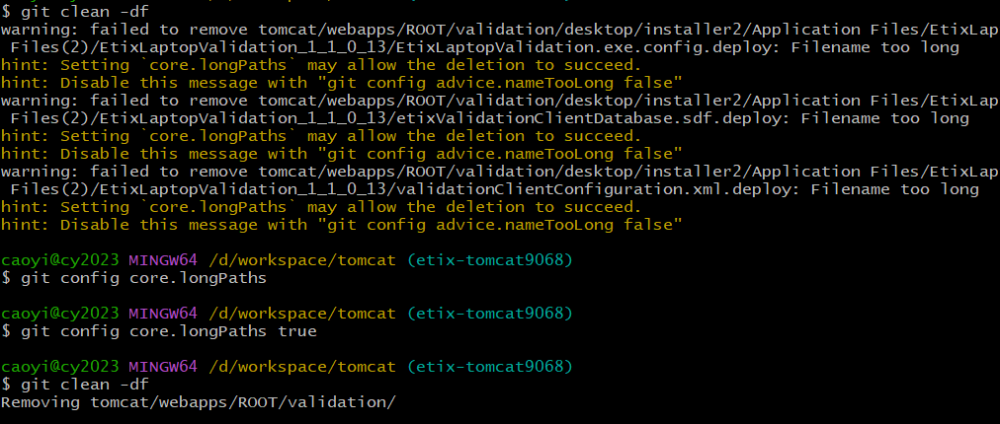

# Clean Files with a Long Path (Git)

[Index](index.md)

It's failed to clean files in the git repository

```bash
$ git clean -df
warning: failed to remove tomcat/webapps/ROOT/validation/desktop/installer2/Application Files/HelloLaptopValidation_1_1_0_13/source/HelloLaptopValidation/bin/Release/app(2).publish/Application Files(2)/HelloLaptopValidation_1_1_0_13/HelloLaptopValidation.exe.config.deploy: Filename too long
hint: Setting `core.longPaths` may allow the deletion to succeed.
hint: Disable this message with "git config advice.nameTooLong false"
```

Follow the hint, set `core.longPaths` and run `clean` again, it works

```bash
$ git config core.longPaths true
$ git clean -df
Removing tomcat/webapps/ROOT/validation/
```


