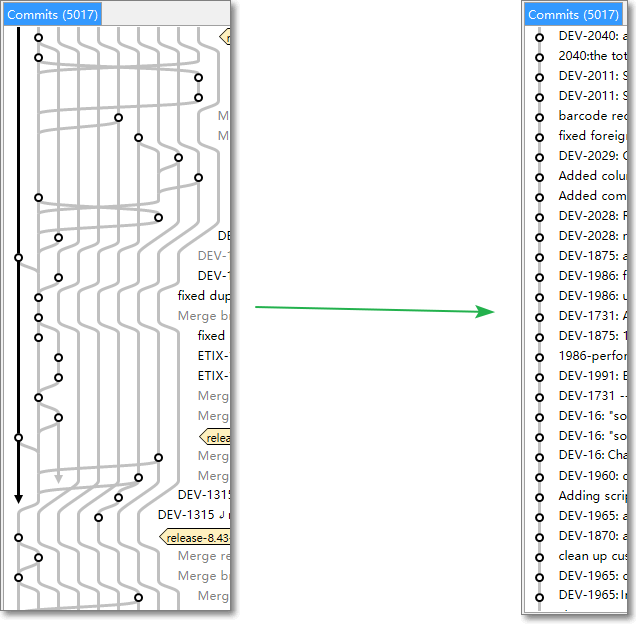

# Git 分支整洁之道

[Home](index.md)

([English](keeping_branches_clean.md))

## 目标

使工作分支 feature branch 始终包含 master branch 的最新代码，并保持 git 线索清晰。

## 问题

要达成上述目标不难，每天不间断 merge 最新代码到 feature branch 就行了。但是，这样做的副作用就是 git history 线索混乱，feature branch 上自身的 commit 东一个西一个不能放在一块，不便 review，不便合并整理。

## 解决

每日通过 rebase 集成 master branch 的最新代码。先更新 master 分支，再 checkout 到工作分支通过 rebase 更新。

参考指令：

```plaintext
git stash // if needed
git checkout master 
git pull --rebase
git checkout your_branch
git rebase master // solve the conflict if needed
```

推送到远程库：也要检查集成 master branch 的最新代码，并清理提交记录。
参考指令：

```plaintext
git rebase -i HEAD~n // 整理提交，n 为需要整理的提交次数，从最后一次提交数起
git checkout master
git pull --rebase // 保证 master 是当前最新
git checkout your_branch
git rebase master // solve the conflict if needed
git push origin --delete your_branch // if this branch is in the remote repository
git push origin your_branch
```

多用 rebase 可以显著减少一般提交(commit)记录和合并(merge)记录，但时间隔的太长的分支，用 merge 可能会减少处理 conflict 的难度。一般说，feature branch 到 master branch 的合并记录是有意义的，可以标识和区分一个 ticket 的代码，而 master branch 到 feature branch 的合并记录看起来更像是无谓合并，而且会使线索混乱，用 rebase 更好。

在你执行合并(merge)或变基(rebase)操作之前，可以使用 `git branch bak_bransh` 创建一个备份分支备用。

如果有多个同事工作在同一个分支，你在执行`rebase`时要特别小心可能带来的冲突。

解决 rebasing/merging 时的冲突

1. Modify conflicted code
2. `$ git add the_file_you_changed`
3. `$ git rebase --continue`

如果你想取消`rebase`，可以执行这个: `git rebase --abort`

清理本地 git 库

```plaintext
$ git remote prune origin
$ git gc --prune=now
```

附：

1. 清理本地过期的远程分支的引用：`git remote prune origin` (from Curt Tudor’s mail)
2. 查询本人相关的远程分支（最后一个 grep 参数换上自己的 git 名称）：
`git for-each-ref --format='%(committerdate)%09%(authorname)%09%(refname)' | sort -k5n -k2M -k3n -k4n | grep remotes | awk -F "\t" '{ printf "%-32s %-27s %s\n", $1, $2, $3 }' | grep Cao`
(from Robert Seaton’s mail)
3. [Git 使用规范流程（阮一峰）](http://www.ruanyifeng.com/blog/2015/08/git-use-process.html)
（不推荐使用 --force 参数，建议删除远程分支再重新推送，以保留清晰的分支的删除和重推记录）
4. [Git Protocol (by ThoughtBot)](https://github.com/thoughtbot/guides/tree/master/protocol/git)
(A very helpful guide, strongly recommend to read!)
5. [About Git rebase (from GitHub Help)](https://help.github.com/articles/about-git-rebase/)
6. [Rebase and fast-forwarding (from Eclipse Help)](http://help.eclipse.org/juno/index.jsp?topic=%2Forg.eclipse.egit.doc%2Fhelp%2FEGit%2FGit_For_Eclipse_Users%2FGit-For-Eclipse-Users.html&cp=20_4_9&anchor=Rebasing_and_fast-forwarding)
(What’s a good practice to perform rebase)


