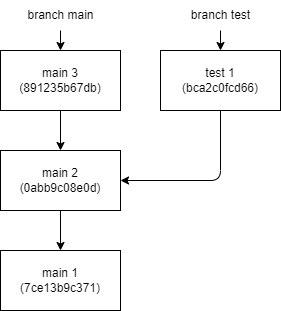

# Who are *us* and *them*?

[Index](index.md)

*按：可以简单查看第一句的结论即可，如果要查看简明示例，可以看 [Examples](#examples) 部分即可，详细的实验过程记录在最后一部分，比较繁琐，有兴趣可以慢慢看。*


在执行 `merge`, `rebase` 和 `cherry-pick` 时，可能会碰到代码冲突，在提示信息里，会告诉你 *us* 或 *them* 干了啥，但谁是 *us*，谁又是 *them*，往往让人一头雾水。
经过我的实验证明，在执行这些操作时，总有一个 branch 原先的任何 `commit` 都不会变，那这个 branch 就是 *us*，另外一个 branch 就是 *them*.

## I. Examples

### 1. `merge`

```bash
git checkout a
git merge b
```

* *us*: a (current branch)
* *them*: b (the branch that will be merged into a)

当前 branch 是 a，a 上现有的所有 commit 都不会改变， branch a 就是 *us*.
而 branch b 合并过来后，不一定能保持原样，可能有合并痕迹，也可能因代码冲突会做一些修改， branch b 就是 *them*.

### 2. `rebase`

```bash
git checkout a
git rebase b
```

* *us*: b (the base branch)
* *them*: a (after the rebase, this branch's commits hash would be reset)

当前 branch 是 a，它的历史 commit 可能会在 rebase 操作结束后发生变化， branch a 是 *them*.
而 branch b 在 rebase 操作接受后，原先的 commit 并不会改变， branch b 是 *us*.

### 3. `cherry-pick`

```bash
git checkout a
git rebase <hash_value>
```

* *us*: current branch: a
* *them*: the commit to pick

当前 branch 是 a，a 上现有的所有 commit 都不会改变， branch a 就是 us. 这点和 `merge` 的情况是一样的。
而 *them* 就是现在 hash 值为 <have_value> 的 commit 所在的 branch 了。

## II. 实验

### 1. 初始化 repo

```bash
mkdir us_them
cd us_them
git init
```

到这里就创建了一个空的 repo，默认 branch 是 `main`

### 2. 构建分支，准备数据

这里构建两个不同的 branch 用于测试

* main
* test

为了方便，创建一个文本文档 `hello.txt`，填充内容和 commit comment 一致。

**main**

```plaintext
$ git checkout main

$ echo "main 1" >> hello.txt
$ git add .
$ git commit -m "main 1"

$ echo "main 2" >> hello.txt
$ git add .
$ git commit -m "main 2"

$ rm hello.txt
$ git add .
$ git commit -m "main 3, remove hello.txt"
```

**test**

查历史

```plaintext
$ git log --pretty=oneline
891235b67dbc4b359a9591729858e45aac1ff17c (HEAD -> main) main 3, remove hello.txt
0abb9c08e0de0b455f14358bddd3882b0cd74f3f main 2
7ce13b9c371c1fc47e739fcf936b48f54e29b653 main 1
```

为了制造代码冲突，我们从第二个 commit 创建 branch test，它的 ID 是 0abb9c08e0de0b455f14358bddd3882b0cd74f3f

```plaintext
$ git checkout 0abb9c08e0de0b455f14358bddd3882b0cd74f3f -b test
```

创建好后，可以验证一下，确保无误：

```plaintext
$ git log --pretty=oneline
0abb9c08e0de0b455f14358bddd3882b0cd74f3f (HEAD -> test) main 2
7ce13b9c371c1fc47e739fcf936b48f54e29b653 main 1
```

由上可见，head 确实在第二个 commit 上。

接下来添加一个 commit:

```plaintext
$ echo "test 1" >> hello.txt
$ git add .
$ git commit -m "test 1"
```

再来验一下历史：

```plaintext
$ git log --pretty=oneline
bca2c0fcd6679b03a941944f1bbe3aaedb298f7f (HEAD -> test) test 1
0abb9c08e0de0b455f14358bddd3882b0cd74f3f main 2
7ce13b9c371c1fc47e739fcf936b48f54e29b653 main 1
```

最后一个也就是第三个 commit 和 branch main 上的第三个 commit 是不一样的。



数据准备结束。

### 3. 测试

准备数据很费事，可以把 repo 复制一份，以备不时之需。

#### 3.1 `merge`

```plaintext
$ git checkout main
Switched to branch 'main'
$ git merge test
CONFLICT (modify/delete): hello.txt deleted in HEAD and modified in test.  Version test of hello.txt left in tree.
Automatic merge failed; fix conflicts and then commit the result.
$ git status
On branch main
You have unmerged paths.
  (fix conflicts and run "git commit")
  (use "git merge --abort" to abort the merge)

Unmerged paths:
  (use "git add/rm <file>..." as appropriate to mark resolution)
        deleted by us:   hello.txt

no changes added to commit (use "git add" and/or "git commit -a")

$ git merge --abort
```

这里提到 *us* 删除了 hello.txt。我们知道当前 branch 是 main，并且是 main 删除了文件，说明在 `merge` 时，*us* 指当前 branch.

我们还可以切换到 branch test 继续验证：

```plaintext
$ git checkout test
Switched to branch 'test'
$ git merge main
CONFLICT (modify/delete): hello.txt deleted in main and modified in HEAD.  Version HEAD of hello.txt left in tree.
Automatic merge failed; fix conflicts and then commit the result.
$ git status
On branch test
You have unmerged paths.
  (fix conflicts and run "git commit")
  (use "git merge --abort" to abort the merge)

Unmerged paths:
  (use "git add/rm <file>..." as appropriate to mark resolution)
        deleted by them: hello.txt

no changes added to commit (use "git add" and/or "git commit -a")

$ git merge --abort
```

现在它提示 *them* 删除了 hello.txt。我们知道当前 branch 是 test，文件是 branch main 删除的，说明在 `merge` 时，*them* 不是当前 branch.

上面的试验后需要使用 `git merge --abort` 中断 `merge` 操作，因为我们的实验目的是观察 *us* 和 *them* 到底是哪个 branch, 而不是真的需要完成 `merge` 操作。

#### 3.2 `rebase`

```plaintext
$ git checkout main
$ git rebase test
CONFLICT (modify/delete): hello.txt deleted in 891235b (main 3, remove hello.txt) and modified in HEAD.  Version HEAD of hello.txt left in tree.
error: could not apply 891235b... main 3, remove hello.txt
hint: Resolve all conflicts manually, mark them as resolved with
hint: "git add/rm <conflicted_files>", then run "git rebase --continue".
hint: You can instead skip this commit: run "git rebase --skip".
hint: To abort and get back to the state before "git rebase", run "git rebase --abort".
Could not apply 891235b... main 3, remove hello.txt
$ git status
interactive rebase in progress; onto bca2c0f
Last command done (1 command done):
   pick 891235b main 3, remove hello.txt
No commands remaining.
You are currently rebasing branch 'main' on 'bca2c0f'.
  (fix conflicts and then run "git rebase --continue")
  (use "git rebase --skip" to skip this patch)
  (use "git rebase --abort" to check out the original branch)

Unmerged paths:
  (use "git restore --staged <file>..." to unstage)
  (use "git add/rm <file>..." as appropriate to mark resolution)
        deleted by them: hello.txt

no changes added to commit (use "git add" and/or "git commit -a")
$ git rebase --abort
```

这里提到 *them* 删除了 hello.txt。我们知道当前 branch 是 main，并且是 main 删除了文件，说明在 `rebase` 时，*them* 指当前 branch.

我们再切换到 branch test 继续验证：

```plaintext
$ git checkout test
Switched to branch 'test'
$ git rebase main
CONFLICT (modify/delete): hello.txt deleted in HEAD and modified in bca2c0f (test 1).  Version bca2c0f (test 1) of hello.txt left in tree.
error: could not apply bca2c0f... test 1
hint: Resolve all conflicts manually, mark them as resolved with
hint: "git add/rm <conflicted_files>", then run "git rebase --continue".
hint: You can instead skip this commit: run "git rebase --skip".
hint: To abort and get back to the state before "git rebase", run "git rebase --abort".
Could not apply bca2c0f... test 1
$ git status
interactive rebase in progress; onto 891235b
Last command done (1 command done):
   pick bca2c0f test 1
No commands remaining.
You are currently rebasing branch 'test' on '891235b'.
  (fix conflicts and then run "git rebase --continue")
  (use "git rebase --skip" to skip this patch)
  (use "git rebase --abort" to check out the original branch)

Unmerged paths:
  (use "git restore --staged <file>..." to unstage)
  (use "git add/rm <file>..." as appropriate to mark resolution)
        deleted by us:   hello.txt

no changes added to commit (use "git add" and/or "git commit -a")
$ git rebase --abort
```

现在它提示 *us* 删除了 hello.txt。我们知道当前 branch 是 test，文件是 branch main 删除的，说明在 `rebase` 时，*us* 不是当前 branch.

上面的试验后需要使用 `git rebase --abort` 中断 `rebase` 操作，因为我们的实验目的是观察 *us* 和 *them* 到底是哪个 branch, 而不是真的需要完成 `rebase` 操作。

#### 3.3 `cherry-pick`

根据前面的 log 记录，两个 branch 最后一个 commit 的 hash 分别是：

* main: 891235b67dbc4b359a9591729858e45aac1ff17c
* test: bca2c0fcd6679b03a941944f1bbe3aaedb298f7f

先在 branch main 上 cherr-pick test 的最后一个 commit:

```plaintext
$ git checkout main
$ git cherry-pick bca2c0fcd6679b03a941944f1bbe3aaedb298f7f
CONFLICT (modify/delete): hello.txt deleted in HEAD and modified in bca2c0f (test 1).  Version bca2c0f (test 1) of hello.txt left in tree.
error: could not apply bca2c0f... test 1
hint: After resolving the conflicts, mark them with
hint: "git add/rm <pathspec>", then run
hint: "git cherry-pick --continue".
hint: You can instead skip this commit with "git cherry-pick --skip".
hint: To abort and get back to the state before "git cherry-pick",
hint: run "git cherry-pick --abort".
$ git status
On branch main
You are currently cherry-picking commit bca2c0f.
  (fix conflicts and run "git cherry-pick --continue")
  (use "git cherry-pick --skip" to skip this patch)
  (use "git cherry-pick --abort" to cancel the cherry-pick operation)

Unmerged paths:
  (use "git add/rm <file>..." as appropriate to mark resolution)
        deleted by us:   hello.txt

no changes added to commit (use "git add" and/or "git commit -a")
$ git cherry-pick --abort
```

这里提到 *us* 删除了 hello.txt。我们知道当前 branch 是 main，并且是 main 删除了文件，说明在 `cherry-pick` 时，*us* 指当前 branch.

再在 branch test 上 cherr-pick main 的最后一个 commit:

```plaintext
$ git checkout test
$ git cherry-pick 891235b67dbc4b359a9591729858e45aac1ff17c
CONFLICT (modify/delete): hello.txt deleted in 891235b (main 3, remove hello.txt) and modified in HEAD.  Version HEAD of hello.txt left in tree.
error: could not apply 891235b... main 3, remove hello.txt
hint: After resolving the conflicts, mark them with
hint: "git add/rm <pathspec>", then run
hint: "git cherry-pick --continue".
hint: You can instead skip this commit with "git cherry-pick --skip".
hint: To abort and get back to the state before "git cherry-pick",
hint: run "git cherry-pick --abort".
$ git status
On branch test
You are currently cherry-picking commit 891235b.
  (fix conflicts and run "git cherry-pick --continue")
  (use "git cherry-pick --skip" to skip this patch)
  (use "git cherry-pick --abort" to cancel the cherry-pick operation)

Unmerged paths:
  (use "git add/rm <file>..." as appropriate to mark resolution)
        deleted by them: hello.txt

no changes added to commit (use "git add" and/or "git commit -a")
$ git cherry-pick --abort
```

现在它提示 *them* 删除了 hello.txt。我们知道当前 branch 是 test，文件是 branch main 删除的，说明在 `cherry-pick` 时，*them* 不是当前 branch.

上面的试验后需要使用 `git cherry-pick --abort` 中断 `merge` 操作，因为我们的实验目的是观察 *us* 和 *them* 到底是哪个 branch, 而不是真的需要完成 `cherry-pick` 操作。

## 3.4 总结

通过前面的实验可以看出 `merge` 和 `cherry-pick` 的情况是一样的，当前 branch 是 *us*, `rebase` 与它们不同，当前 branch 是 *them*.

## 参考

> When you merge, *us* refers to the branch you're merging into, as opposed to *them*, the branch to be merged.
>
> When you rebase, *us* refers the upstream branch, and *them* is the branch you're moving about. It's a bit counter-intuitive in case of a rebase.
>
> The reason is that Git uses the same merge-engine for rebase, and it's actually cherry-picking your stuff into the upstream branch. *us* = into, *them* = from.
>
> <https://stackoverflow.com/questions/21025314/who-is-us-and-who-is-them-according-to-git/21025695#21025695>
