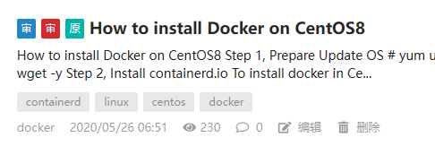

# How to install Docker on CentOS8

## Step 1, Prepare
Update OS
```
# yum update -y
```
Install download tool ``wget``
```
# yum install wget -y
```

## Step 2, Install containerd.io
To install docker in CentOS 8 is different from other CentOS versions, if you do not install this package manually, the docker service will not work.

Access page https://download.docker.com/linux/centos/7/x86_64/stable/Packages/ and copy the latest version's link, run the following commands in the new CentOS8:
```
# wget https://download.docker.com/linux/centos/7/x86_64/stable/Packages/containerd.io-1.2.13-3.2.el7.x86_64.rpm
# dnf install containerd.io-1.2.13-3.2.el7.x86_64.rpm
```
The latest version of ``containerd.io`` is ``containerd.io-1.2.13-3.2.el7.x86_64.rpm`` till 2020-05-25
Ref:  https://www.cnblogs.com/zbseoag/p/11736006.html

## Step 3, Install ``docker-ce`` by ``yum``
```
# yum install -y yum-utils
# yum-config-manager --add-repo https://download.docker.com/linux/centos/docker-ce.repo
# yum install docker-ce docker-ce-cli containerd.io
```
Ref:  https://docs.docker.com/engine/install/centos/

## Step 4, Add user to docker group
The user to user docker needs to add in the docker group. 
```
# gpasswd -a root docker
# newgrp docker
```
The above example is for ``root``, you can replace it by any other user for docker. If you do not apply this step, you have to use ``sudo`` to run docker commands, with non-root user.

## Step 5, Enable & Start
```
# systemctl enable docker
# systemctl start docker
```

## Step 6, Run Hello-World
```
# docker run hello-world
```

OK, it's done.

---

This artical was originally published to OSC, but I don't know why it was in censorship.

