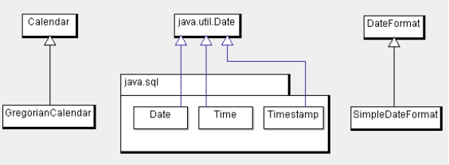

# Java 中的日期处理

[Index](index.md)

_按：这篇文章是从旧站（Google Sites）上转过来的，已经十多年了。将来有时间再更新。_

日期和时间是生活中必不可少的基本概念，同样，在程序中，也是无论什么语言也都会遇到。

## 1. 一般概念

### 1.1 UTC

协调世界时，又称世界标准时间或世界协调时间，简称 UTC（从英文“Coordinated Universal Time”／法文“Temps Universel Cordonné”而来）。

注：来源于维基百科。

### 1.2 GMT

格林尼治平時（又称格林尼治平均時間或格林尼治標準時間，旧譯格林威治標準時間；英语：Greenwich Mean Time，GMT）是指位於英國倫敦郊區的皇家格林尼治天文台的標準時間，因為本初子午線被定義在通過那裡的經線。

注：来源于维基百科。

### 1.3 时区

全球使用统一的时间即 UTC，但在表示上，按经度划作不同的时区，对应一个偏移量，描述本地时间时，用这个偏移量加上 GMT 时间即可。

### 1.4 历法

目前通用公历，即所谓的格里历(Gregorian calendar)，这也是 Java 中实现的历法。

## 2. 一些常见的需求

### 2.1 创建当前时间对象

Java 中有三种方式得到当前时间

```java
System.out.println(System.currentTimeMillis()); // 1370160262844, 得到当前时间的数值
Date d = new Date ();
Calendar cal  = Calendar.getInstance();
```

### 2.2 已知时间，按格式输出

这部分内容，主要用到 SimpleDateFormat 类。

```java
SimpleDateFormat sdf = new SimpleDateFormat("yyyy-MM-dd" ); 
System.out.println(sdf.format( new Date()));// 2013-06-02
sdf = new SimpleDateFormat("yyyy-MM-dd HH:mm:ss" ); // 24时制
System.out.println(sdf.format( new Date())); // 2013-06-02 15:28:01
sdf = new SimpleDateFormat("yyyy-MM-dd hh:mm:ss" ); // 12时制
System.out.println(sdf.format( new Date())); // 2013-06-02 03:28:25
sdf = new SimpleDateFormat("yyyy-MM-dd hh:mm:ss:SSS Z" ); // 12时制，输出毫秒和时区信息
System.out.println(sdf.format( new Date())); // 2013-06-02 07:29:05:008 +0800
```

附，格式化时需要用到的符号：

```plaintext
G Era designator Text AD
y Year Year 1996; 96
Y Week year Year 2009; 09
M Month in year Month July; Jul; 07
w Week in year Number 27
W Week in month Number 2
D Day in year Number 189
d Day in month Number 10
F Day of week in month Number 2
E Day name in week Text Tuesday; Tue
u Day number of week (1 = Monday, ..., 7 = Sunday) Number 1
a Am/pm marker Text PM
H Hour in day (0-23) Number 0
k Hour in day (1-24) Number 24
K Hour in am/pm (0-11) Number 0
h Hour in am/pm (1-12) Number 12
m Minute in hour Number 30
s Second in minute Number 55
S Millisecond Number 978
z Time zone General time zone Pacific Standard Time; PST; GMT-08:00
Z Time zone RFC 822 time zone -0800
X Time zone ISO 8601 time zone -08; -0800; -08:00
```

### 2.3 已知时间，求时间的某个单位值

如求年份数，月份数，日，时，秒等，当然也可以按上节所讲，用 SimpleDateFormat 来输出对应的时间值就可以了。这里给出另一种方式，用 Calendar 类实现。

```java
Calendar cal = Calendar.getInstance();
System.out.println(cal.get(Calendar.YEAR)); // 2013
System.out.println(cal.get(Calendar.MONTH)); // 5，从0开始
System.out.println(cal.get(Calendar.DAY_OF_MONTH)); // 2, 从1开始
System.out.println(cal.get(Calendar.DAY_OF_WEEK)); // 1, 默认以星期日为第一天
System.out.println("ddd" + cal.get(Calendar.DAY_OF_WEEK)); // 1, 默认以星期日为第一天
System.out.println(cal.get(Calendar.DAY_OF_YEAR)); // 153，从0?1?开始
```

### 2.4 已知时间，求和这个时间的过去或未来某个时刻的时间

```java
Calendar cal = Calendar.getInstance();
System.out.println(cal.get(Calendar.HOUR_OF_DAY));
cal.add(Calendar.HOUR_OF_DAY , 2);
System.out.println(cal.get(Calendar.HOUR_OF_DAY));
```

以上代码输出：

```plaintext
18
20
```

如果要求过去某个时间点，数值设置为负数就可以了。例子中设置的是小时数，当然也可以设置其他量，如年月日等。

### 2.5 时区问题

如何知道所有时区？

```java
String[] tzArray = TimeZone. getAvailableIDs();
 for (String tz : tzArray) {
       System.out.println(tz);
}
```

如何打印其他时区的时间信息？如打印日本的时间

```java
Calendar chinaCal = Calendar.getInstance();
Calendar japanCal = GregorianCalendar.getInstance(TimeZone. getTimeZone("Japan" ));

System.out.println(chinaCal.getTime());
System.out.println(japanCal.getTime());

System.out.println(chinaCal.get(Calendar.HOUR_OF_DAY));
System.out.println(japanCal.get(Calendar.HOUR_OF_DAY));
```

输出：

```plaintext
Sun Jun 02 18:58:26 CST 2013
Sun Jun 02 18:58:26 CST 2013
18
19
```

第一，第二行输出成相同的，其实他们都是按 CST(China Standard Time) 输出的，当然是一样的。而第三第四行不同，说明同样的时间，在不同的时区的小时序号是不一样的。

## 3. Java 中日期类的类层次结构

相关类的类图如下所示：



java.util.Date 有三个子类:

```java
java.sql.Date
java.sql.Time
java.sql.Timestamp
```

注意一下两个方法对上面类的使用：

```java
void PreparedStatement.setDate(int parameterIndex, java.sql.Date x) throws SQLException
void PreparedStatement.setTime(int parameterIndex, java.sql.Time x) throws SQLException
```

## Ref

- <http://docs.oracle.com/javase/7/docs/api/java/util/Calendar.html>
- <http://docs.oracle.com/javase/7/docs/api/java/util/TimeZone.html>
- <http://docs.oracle.com/javase/7/docs/api/java/text/SimpleDateFormat.html>