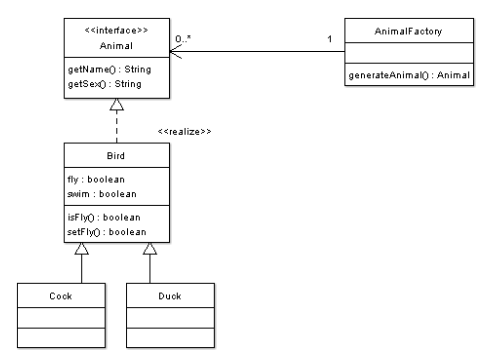

# 工厂模式 Factory Method

[Index](../index.md)

按：本文从[旧站](https://sites.google.com/site/iridiumsite/it/software-engineering/design-pattern/Factory-Method)转移而来。

工厂模式(Factory Method)是创建模式的一种。当系统需要一簇同类的对象时，先造一个工厂，然后由这个工厂去生产这一簇对象。这个模式的好处是，通过所谓的『产品树』结构，把那一簇产品搞得很有层次感，结构清晰。看看下面的图，鸭子和鸡鸡，都统一在『鸟』这个概念下，是多么的和谐啊。鸟又是一种动物，这个种属类别体现的多么清晰啊。牛儿马儿也是动物啊，这里怎么没有？嗯，那样吧，实现一下接口 Animal，来一个 Mammal 的抽象类，再扩展（extend）它为 Ox 和 Horse 就搞定了——这个，这里就省了吧，看那几只鸟，也能说明问题。

抽象工厂模式可以看着它的一个衍生模式。



上代码了：

Animal.java

```java
public interface Animal {
    public String getName();
    public String getSex();
}
```

Bird.java

```java
public abstract class Bird implements Animal {
    private boolean fly;
    private boolean swim;
    public boolean isFly() {
        return fly;
    }
    public void setFly(boolean fly) {
        this.fly = fly;
    }
    public boolean isSwim() {
        return swim;
    }
    public void setSwim(boolean swim) {
        this.swim = swim;
    }
}
```

Cock.java

```java
public class Cock extends Bird {
    public Cock() {
        this.setFly(false);
        this.setSwim(false);
    }
    public String getName() {
        return "家养鸡小明";
    }
    public String getSex() {
        return "母";
    }
}
```

Duck.java

```java
public class Duck extends Bird {
    public Duck() {
        this.setFly(false);
        this.setSwim(true);
    }
    public String getName() {
        return "北京板鸭";
    }
    public String getSex() {
        return "公";
    }
}
```

AnimalFactory.java

```java
public class AnimalFactory {
    Animal generateAnimal(AnimalType type) {
        if (type.equals(AnimalType.COCK)) {
            return new Cock();
        } else if (type.equals(AnimalType.DUCK)) {
            return new Duck();
        }
        return null;
    }
}
```

另外，还一个纯粹在编程实现上需要的一个动物类别的枚举类：

AnimalType.java

```java
public enum AnimalType {
    COCK, DUCK;
}
```

上面的代码写好后，是需要找个东东调用一下，让它们跑起来：

Client.java

```java
public class Client {
    public static void main(String[] args) {
        AnimalFactory factory = new AnimalFactory();
        Animal cock = factory.generateAnimal(AnimalType.COCK);
        System.out.println(cock.getName());
        System.out.println("Can I fly? " + ((Cock) cock).isFly());
    }
}
```

## 编译提示

以上这些代码也在本站的[目录](https://github.com/iridiumcao/iridiumcao.github.io/tree/master/java/code/dp_factory_factory)里。
下载后放在同一个目录，使用下面的指令编译：

```plaintext
$ javac -encoding UTF8 Client.java
```

运行看效果

```plaintext
$ java Client
家养鸡小明
Can I fly? false
```
