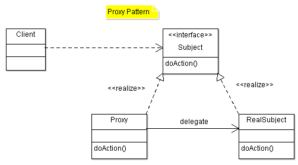

# Proxy Pattern

Proxy, 代理模式。是一种对象结构模式。按照 GoF 的定义，它是为其他对象提供一种代理以控制这个对象的访问。

具体实现中，不直接使用目标，而是通过代理间接使用。代理实现和被代理类同样的接口，让 client 能够和使用被代理类一样使用代理类。



这里的图和[维基百科《代理模式》词条](https://zh.wikipedia.org/wiki/%E4%BB%A3%E7%90%86%E6%A8%A1%E5%BC%8F)用的略有不同，但含义是一致的。

## Static Proxy

以上图示部分代码如下：

Subject

```java
public interface Subject {
        void doAction();
}
```

RealSubject

```java
public class RealSubject implements Subject {
        @Override
        public void doAction() {
              System.out.println("Hello from realSubject.doAction()!" );
       }
}
```

Proxy

```java
public class Proxy implements Subject {
        @Override
        public void doAction() {
              System. out.println("before proxy" );
               new RealSubject().doAction();
              System. out.println("after proxy" );
       }
}

```

这些代码可以在[这里](https://github.com/iridiumcao/iridiumonline/tree/master/hellodesignpattern/src/main/java/info/iridium/dp/proxy1)下载。

## Dynamic proxy

注：关于动态代理，廖雪峰([code](https://github.com/iridiumcao/iridiumcao.github.io/tree/master/java/code/dp_proxy))和《Java与模式（阎宏）》讲的有些不一样。这里的记录还需要进一步厘清。

> ...动态代码，我们仍然先定义了接口`Hello`，但是我们并不去编写实现类，而是直接通过JDK提供的一个`Proxy.newProxyInstance()`创建了一个`Hello`接口对象。这种没有实现类但是在运行期动态创建了一个接口对象的方式，我们称为动态代码。JDK提供的动态创建接口对象的方式，就叫动态代理。

以上例子中被代理的接口方法只有一个，如果 `Subject` 接口中有 n 个方法需要代理，就需要写 n 个，n 大了之后就比较麻烦，于是有了动态代理的需求，允许程序在运行时刻动态地创建代理类和对象。Java 中可以通过反射机制提供动态代理，这个功能是在 JDK 5 引入的。

动态代理的部分示例代码如下：

DynProxy

```java
public class DynProxy implements InvocationHandler {
        private Object tar ;
        public Object bind(Object tar) {
               this.tar = tar;
               return Proxy.newProxyInstance(tar.getClass().getClassLoader(), tar
                           .getClass().getInterfaces(), this );
       }
        @Override
        public Object invoke(Object proxy, Method method, Object[] args)
                      throws Throwable {
              System. out.println("before proxy" );
              Object result = null ;
               // 这里就可以进行所谓的AOP编程了
               // 在调用具体函数方法前，执行功能处理
              result = method.invoke( tar , args);
               // 在调用具体函数方法后，执行功能处理
              System. out.println("after proxy" );
               return result;
       }
}
```

Client

```java
public class Client {
        public static void main(String[] args) {
              DynProxy proxy = new DynProxy();
               //绑定该类实现的所有接口
        Subject sub = (Subject) proxy.bind( new RealSubject());
        sub.doAction();
       }
}
```

动态代理完整的代码可在[这里](https://github.com/iridiumcao/iridiumonline/tree/master/hellodesignpattern/src/main/java/info/iridium/dp/proxy2)下载。

---

* [动态代理·廖雪峰](https://www.liaoxuefeng.com/wiki/1252599548343744/1264804593397984)
* [维基百科·代理模式](https://zh.wikipedia.org/wiki/%E4%BB%A3%E7%90%86%E6%A8%A1%E5%BC%8F)
* [知乎：动态代理的作用是什么](http://www.zhihu.com/question/20794107)
* [Java 深度历险（七）——Java 反射与动态代理](http://www.infoq.com/cn/articles/cf-java-reflection-dynamic-proxy)

本文从[旧站的内容](https://sites.google.com/site/iridiumsite/it/software-engineering/design-pattern/proxy)整理而来。

<script src="https://giscus.app/client.js"
        data-repo="iridiumcao/iridiumcao.github.io"
        data-repo-id="MDEwOlJlcG9zaXRvcnkyOTUwNTIyODQ="
        data-category="Announcements"
        data-category-id="DIC_kwDOEZYj_M4Cxfqj"
        data-mapping="pathname"
        data-strict="0"
        data-reactions-enabled="1"
        data-emit-metadata="0"
        data-input-position="bottom"
        data-theme="preferred_color_scheme"
        data-lang="zh-CN"
        crossorigin="anonymous"
        async>
</script>
