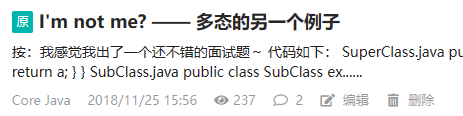

# I'm not me? —— 多态的另一个例子

[Index](index.md)

按：我感觉我出了一个还不错的面试题～

代码如下：

SuperClass.java
``` java
public class SuperClass {
    int a = 3;

    public int getA() {
        return a;
    }
}

```

SubClass.java
``` java
public class SubClass extends SuperClass{
    int a = 4;

    @Override
    public int getA() {
        return a;
    }
}
```

Client.java
``` java
public class Client {
    public static void main(String[] args) {
        SuperClass s = new SubClass(); //!!! s 的编译时类型是 SuperClass, 运行时类型是 SubClass
        System.out.println(s.a); // 3
        System.out.println(s.getA()); // 4
        System.out.println(s.a != s.getA()); // true
    }
}
```

``Client`` 的几个输出语句的输出结果写在代码注释中了。其中，需要特别注意的是：
**``s.a != s.getA()``** 是 ``true``! 这个初看有点让人不解，``s.a`` 怎么会不等于自身？(I'm not me?) 出现这个情况，正是 **多态(Polymorphism)** 的限定所决定的：

- 对象的方法具有多态性，所以 ``s.getA()`` 访问的是子类 ``SubClass`` 的方法 ``getA()``.
- 对象的域(field)不具有多态性，访问时依据父类的类型，所以 ``s.a`` 的值是父类 ``SupperClass`` 的 ``a``, 为3.
- 通过对象的方法访问对象的变量，它使变量_间接_地有了多态性. ``SubClass.getA()`` 中访问的是 ``SubClass`` 的实例的变量 ``a``, 所以为4.

PS: 刚刚写了个多态的[例子](https://my.oschina.net/iridium/blog/2960729 "例子")，想了下，觉得比较麻烦，罗嗦，就改了一个简化版如上。

---

这篇文章最初于2018.11.25 15:56发布在OSC上


<script src="https://giscus.app/client.js"
        data-repo="iridiumcao/iridiumcao.github.io"
        data-repo-id="MDEwOlJlcG9zaXRvcnkyOTUwNTIyODQ="
        data-category="Announcements"
        data-category-id="DIC_kwDOEZYj_M4Cxfqj"
        data-mapping="pathname"
        data-strict="0"
        data-reactions-enabled="1"
        data-emit-metadata="0"
        data-input-position="bottom"
        data-theme="preferred_color_scheme"
        data-lang="zh-CN"
        crossorigin="anonymous"
        async>
</script>
