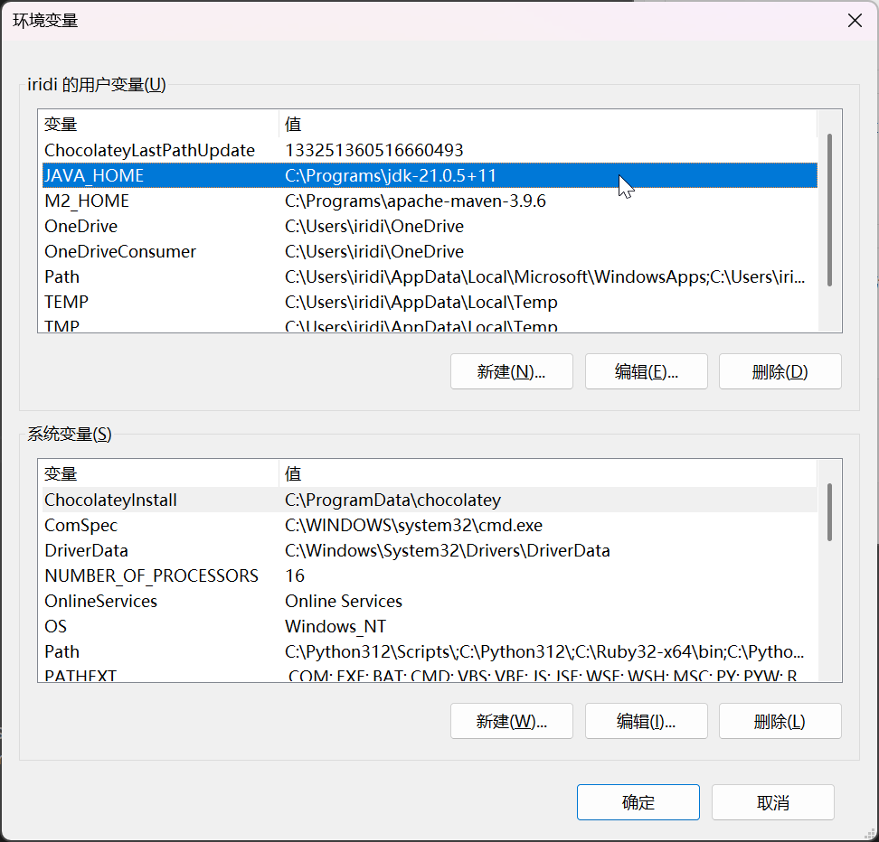
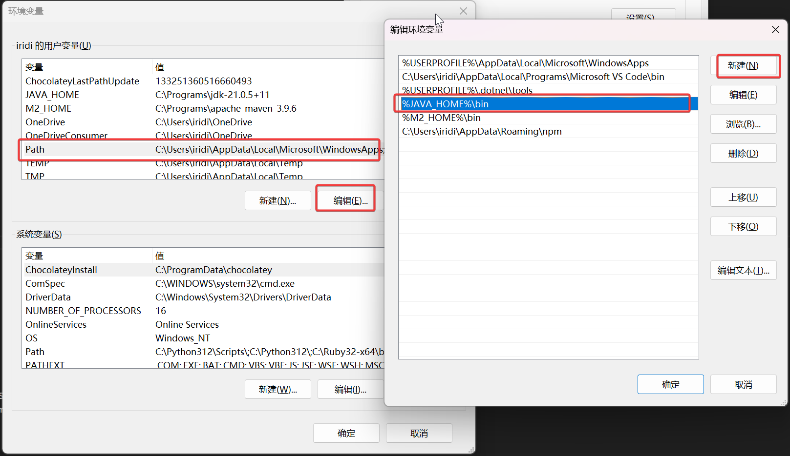

# 安装 JDK 21

[返回目录](index.md)

- [安装 JDK 21](#安装-jdk-21)
  - [1. Windows](#1-windows)
    - [1.1 下载](#11-下载)
    - [1.2 解压](#12-解压)
    - [1.3 配置环境变量](#13-配置环境变量)
    - [1.4 验证](#14-验证)
  - [2. Ubuntu](#2-ubuntu)
    - [2.1 安装](#21-安装)
    - [2.2 验证安装](#22-验证安装)
    - [2.3 （可选）安装源码](#23-可选安装源码)
  - [3. 验证编译工具 `javac`](#3-验证编译工具-javac)

---

- JRE, Java Runtime Environment, 即 Java 的运行时环境，仅支持程序运行，不包含编译工具。
- JDK, Java Development Kit, 即 Java 开发工具包，用于编译 Java 源代码等。它包含 JRE.

Java 项目的开发环境必须安装 JDK，但项目运行只需 JRE 即可，所以生产环境安装 JRE 即可。

为了避免 license 限制，本文选用统统选用开源免费的 OpenJDK. OpenJDK 也有好些版本， 本文的 Windows 部分介绍的 Temurin JDK 和 Linux 部分的 OpenJDK 略有区别，但一般场景使用下，几乎不用考虑。

本文选用的是 JDK 21，安装其他版本多有类似。

## 1. Windows

Windows 上安装 OpenJDK 很简单，三步即可：下载 → 解压 → 设置环境变量。

### 1.1 下载

下载地址：[Temurin OpenJDK](https://adoptium.net/temurin/releases/)

根据自己的硬件和系统情况，下载合适的版本。

### 1.2 解压

我的解压目录是：`C:\Programs\jdk-21.0.5+11`

这个目录就是所谓的 Java Home（Java 安装目录）, 它之下的文件列表是：

```plaintext
PS C:\Programs\jdk-21.0.5+11> ls


    目录: C:\Programs\jdk-21.0.5+11


Mode                 LastWriteTime         Length Name
----                 -------------         ------ ----
d-----        2024.10.16     07:14                bin
d-----        2024.10.16     06:50                conf
d-----        2024.10.16     06:50                include
d-----        2024.10.16     06:50                jmods
d-----        2024.10.16     06:50                legal
d-----        2024.10.16     06:50                lib
-a----        2024.10.16     07:09           2400 NOTICE
-a----        2024.10.16     07:09           1651 release
```

### 1.3 配置环境变量

Windows 设置 → 系统 → 系统信息 → 高级系统设置 → 环境变量

新增 `JAVA_HOME`



编辑 `PATH`， 把 `%JAVA_HOME\bin` 加到系统 PATH 里去，方便调用 `java` 和 `javac`.



### 1.4 验证

以上步骤完成后，重新打开 PowerShell 执行指令如下：

```plaintext
PS C:\Users\iridi> java -version
openjdk version "21.0.5" 2024-10-15 LTS
OpenJDK Runtime Environment Temurin-21.0.5+11 (build 21.0.5+11-LTS)
OpenJDK 64-Bit Server VM Temurin-21.0.5+11 (build 21.0.5+11-LTS, mixed mode, sharing)
```

输出正常，JDK 安装成功。

## 2. Ubuntu

Ubuntu 提供了更简便的安装方式，通过包管理器即可完成，而且不用手动配置环境变量。

### 2.1 安装

```plaintext
$ sudo apt update
$ sudo apt install openjdk-21-jdk
Installing:                     
  openjdk-21-jdk

Installing dependencies:
  ca-certificates-java     libsm-dev     openjdk-21-jdk-headless
  fonts-dejavu-extra       libx11-dev    openjdk-21-jre
  java-common              libxau-dev    openjdk-21-jre-headless
  libatk-wrapper-java      libxcb1-dev   x11proto-dev
  libatk-wrapper-java-jni  libxdmcp-dev  xorg-sgml-doctools
  libice-dev               libxt-dev     xtrans-dev

Suggested packages:
  default-jre  libxcb-doc         visualvm              | fonts-wqy-zenhei
  libice-doc   libxt-doc          fonts-ipafont-gothic  fonts-indic
  libsm-doc    openjdk-21-demo    fonts-ipafont-mincho
  libx11-doc   openjdk-21-source  fonts-wqy-microhei

Summary:
  Upgrading: 0, Installing: 19, Removing: 0, Not Upgrading: 3
  Download size: 137 MB
  Space needed: 318 MB / 39.3 GB available
```

### 2.2 验证安装

```plaintext
$ java -version
openjdk version "21.0.5" 2024-10-15
OpenJDK Runtime Environment (build 21.0.5+11-Ubuntu-1ubuntu124.10)
OpenJDK 64-Bit Server VM (build 21.0.5+11-Ubuntu-1ubuntu124.10, mixed mode, sharing)
```

### 2.3 （可选）安装源码

以上几条指令执行完成即可，上文我保留了一些输出信息。

考虑到调试代码时如果有 JDK 的源代码有时会比较方便，可以把 JDK 的源码也安装了，安装指令如下：

```plaintext
$ sudo apt install openjdk-21-source
```

`openjdk-21-source` 这个包名出现在之前的 Suggested packages 列表中。

## 3. 验证编译工具 `javac`

一般说，指令 `java -version` 输出正常即可认为安装成功，但也可以用一小段代码进一步验证 `javac`.

```java
public class HelloWorld {
    public static void main(String[] args) {
        System.out.println("Hello, World!");
    }
}
```

把这段代码保存为 `HelloWorld.java` 然后用下面的指令编译并运行：

```bash
javac HelloWorld.java && java HelloWorld
```

如果输出 `Hello, World!` 字串即为正常。