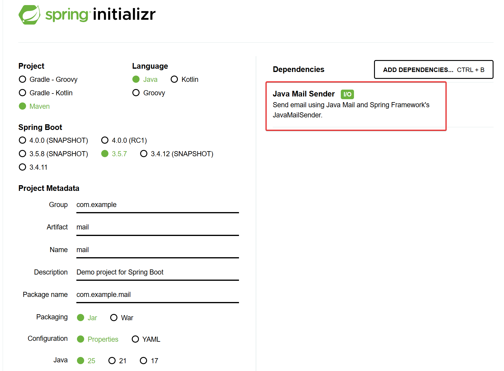

# 在 Spring Boot 中使用 QQ 邮箱发送邮件

[Index](../index.md)

本文演示如何在 Spring Boot 项目中使用 QQ 邮箱发送邮件。

## 1. QQ 邮箱设置

登录 QQ 邮箱网页版，进入【设置】-【账号与安全】-【安全设置】，**开启 SMTP 服务**并生成授权码。请记住这个授权码，后面的程序会用到。

假设本文用到的授权码是: d67fe079485k

## 2. 创建项目

在 [Spring Initializr](https://start.spring.io/) 中选择 Java Mail Sender 创建工程即可。本实验只做最简单的演示，所以只选这个就行了。



生成项目 POM 文件中会包含如下内容：

```xml
<dependency>
	<groupId>org.springframework.boot</groupId>
	<artifactId>spring-boot-starter-mail</artifactId>
</dependency>
```

## 代码

application.properties

```plaintext
spring.application.name=mail
spring.mail.host=smtp.qq.com
spring.mail.port=465
spring.mail.username=yourname@qq.com
spring.mail.password=d67fe079485k
spring.mail.properties.mail.smtp.ssl.enable=true
spring.mail.properties.mail.smtp.ssl.protocols=TLSv1.2
```

这里需要注意：

- `spring.mail.username` 的值是完整的邮箱地址
- `spring.mail.password` 并非登录密码，而是**授权码！**
- `spring.mail.port` 端口 465 使用 SSL，587 使用 STARTTLS（但 QQ 推荐 465 以避认证失败）

新增 Service:

```java
package com.example.mail;

import org.springframework.beans.factory.annotation.Autowired;
import org.springframework.beans.factory.annotation.Value;
import org.springframework.mail.MailException;
import org.springframework.mail.MailSender;
import org.springframework.mail.SimpleMailMessage;
import org.springframework.stereotype.Service;

@Service
public class MailService {
    @Value("${spring.mail.username}")
    private String fromAddress;

    @Autowired
    private MailSender mailSender;

    public String sendMail(String toAddress, String subject, String content) {
        SimpleMailMessage message = new SimpleMailMessage();
        message.setFrom(fromAddress);
        message.setTo(toAddress);
        message.setSubject(subject);
        message.setText(content);
        
        try {
            mailSender.send(message);
        } catch (MailException e) {
            e.printStackTrace();
            return "failure";
        }
        return "success";
    }
}
```

新增测试类：

```java
package com.example.mail;

import org.junit.jupiter.api.Test;
import org.springframework.beans.factory.annotation.Autowired;
import org.springframework.boot.test.context.SpringBootTest;

import static org.junit.jupiter.api.Assertions.assertEquals;

@SpringBootTest
class MailApplicationTests {
    @Autowired
    MailService mailService;

	@Test
	void testSendMail() {
        String sendTo = "caoxiansheng@qq.com";
        String subject = "@@@Test@@@";
        String content = "Hello World!";
        String result = mailService.sendMail(sendTo, subject, content);
        assertEquals("success", result);
    }
}
```

## 3. 测试

运行以下 maven 命令测试发送邮件功能：

```bash
mvn clean compile test
```

测试运行完成后，登录收件邮箱 `caoxiansheng@qq.com`，如果能看到新邮件，则实验成功。如果测试失败，请检查日志或常见问题：

- 认证失败？重置授权码。
- 邮件进垃圾箱？检查邮件内容或主题是否触发垃圾过滤规则。

<script src="https://giscus.app/client.js"
        data-repo="iridiumcao/iridiumcao.github.io"
        data-repo-id="MDEwOlJlcG9zaXRvcnkyOTUwNTIyODQ="
        data-category="Announcements"
        data-category-id="DIC_kwDOEZYj_M4Cxfqj"
        data-mapping="pathname"
        data-strict="0"
        data-reactions-enabled="1"
        data-emit-metadata="0"
        data-input-position="bottom"
        data-theme="preferred_color_scheme"
        data-lang="zh-CN"
        crossorigin="anonymous"
        async>
</script>
