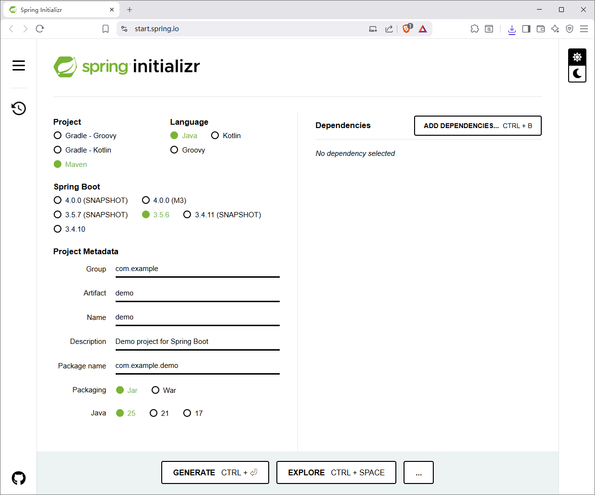

# Quickly Check If Your Environment Supports Spring Boot

[Index](../index.md)

The easiest way to verify if your local setup supports Spring Boot development and deployment is to build and run a simple demo app. It won't do anything fancy, but that's the point—it's just enough to confirm everything works.

## Prerequisites

You'll need just two tools: **JDK** and **Maven**. Let's check they're installed and ready.

### JDK

Make sure you have a recent JDK (like version 25) installed. Run this command to confirm:

```plaintext
$ java --version
```

You should see output like this (yours may vary slightly):

```plaintext
openjdk 25 2025-09-16 LTS
OpenJDK Runtime Environment Temurin-25+36 (build 25+36-LTS)
OpenJDK 64-Bit Server VM Temurin-25+36 (build 25+36-LTS, mixed mode, sharing)
```

If it's missing or outdated, download and install from [Adoptium](https://adoptium.net) or your preferred provider, then update your PATH.

### Maven

Maven handles dependencies and builds. Verify it with:

```plaintext
$ mvn --version
```

Example output:

```plaintext
Apache Maven 3.9.9 (8e8579a9e76f7d015ee5ec7bfcdc97d260186937)
Maven home: D:\Programs\apache-maven-3.9.9
Java version: 25, vendor: Eclipse Adoptium, runtime: D:\Programs\jdk-25+36
Default locale: zh_CN, platform encoding: UTF-8
OS name: "windows 11", version: "10.0", arch: "amd64", family: "windows"
```

If not installed, grab it from [Apache Maven](https://maven.apache.org/) and add it to your PATH.

## Build and Run a Basic Spring Boot App

You can refer to the [official tutorial](https://spring.io/quickstart), but this demo is even simpler.

### Step 1: Generate the Project

- Spring Initializr: [https://start.spring.io](https://start.spring.io/)

Head to [Spring Initializr](https://start.spring.io):



and set these options:

- Project: Maven
- Language: Java
- Spring Boot: 3.5.6
- Packaging: Jar
- Java: 25

Leave Group, Artifact, Description, and Package name as defaults. Hit **GENERATE** to download the ZIP.


Group, Artifact, Description and Package name do not need to edit, just keep them.

Click button "GENERATE" to download the package of the application.

### Step 2: Build and Launch

Unzip the downloaded file, navigate to the project directory in your terminal, and run these Maven commands:

```bash
mvn clean compile
mvn spring-boot:run
```

If successful, you'll see the Spring Boot banner and startup logs like this—no errors means your environment is good to go:

```plaintext
[INFO] Attaching agents: []

  .   ____          _            __ _ _
 /\\ / ___'_ __ _ _(_)_ __  __ _ \ \ \ \
( ( )\___ | '_ | '_| | '_ \/ _` | \ \ \ \
 \\/  ___)| |_)| | | | | || (_| |  ) ) ) )
  '  |____| .__|_| |_|_| |_\__, | / / / /
 =========|_|==============|___/=/_/_/_/

 :: Spring Boot ::                (v3.5.6)

2025-10-21T20:59:20.021+08:00  INFO 26120 --- [demo] [           main] com.example.demo.DemoApplication         : Starting DemoApplication using Java 25 with PID 26120 (C:\Users\iridi\Downloads\demo_springboot\demo\target\classes started by iridi in C:\Users\iridi\Downloads\demo_springboot\demo)
2025-10-21T20:59:20.023+08:00  INFO 26120 --- [demo] [           main] com.example.demo.DemoApplication         : No active profile set, falling back to 1 default profile: "default"
2025-10-21T20:59:20.331+08:00  INFO 26120 --- [demo] [           main] com.example.demo.DemoApplication         : Started DemoApplication in 0.582 seconds (process running for 0.791)
[INFO] ------------------------------------------------------------------------
[INFO] BUILD SUCCESS
[INFO] ------------------------------------------------------------------------
[INFO] Total time:  2.695 s
[INFO] Finished at: 2025-10-21T20:59:20+08:00
[INFO] ------------------------------------------------------------------------
```

Now you’ve confirmed your environment is ready for Spring Boot development.
