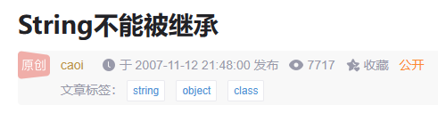

# String不能被继承

[Index](index.md)

2023-06-16

[`String`](https://docs.oracle.com/en/java/javase/20/docs/api/java.base/java/lang/String.html)是一个类，而不是接口，这里说的不能被继承指的是不能**extends**。
`String`不能被继承，因为它是`final`的。

`String`的完整签名是

```java
public final class String
  extends Object
  implements Serializable, Comparable<String>, CharSequence, Constable, ConstantDesc
```

注意，对接口的`implementation`（实现）和对类的`extends`（扩展），都会继承一些上游接口或类的特性，经常不区分它们，都叫继承。

---

这篇文章最早于2007-11-12 21:48:00发布在CSDN上


<script src="https://giscus.app/client.js"
        data-repo="iridiumcao/iridiumcao.github.io"
        data-repo-id="MDEwOlJlcG9zaXRvcnkyOTUwNTIyODQ="
        data-category="Announcements"
        data-category-id="DIC_kwDOEZYj_M4Cxfqj"
        data-mapping="pathname"
        data-strict="0"
        data-reactions-enabled="1"
        data-emit-metadata="0"
        data-input-position="bottom"
        data-theme="preferred_color_scheme"
        data-lang="zh-CN"
        crossorigin="anonymous"
        async>
</script>
