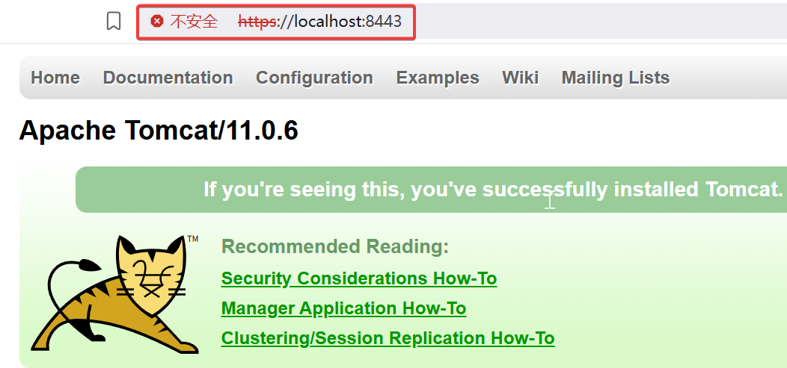

# Tomcat 支持 HTTPS 的配置

[Index](index.md)

Date: 2025.05.04

---

本实验的环境配置是：

- Windows 11
- JDK 24
- Tomcat 11

为 Tomcat 配置 HTTPS 支持需要几个步骤，包括：

1. 生成密钥库文件
2. 配置 Tomcat 的 server.xml 文件

以下是详细的步骤：

## 1. 生成密钥库文件 (Keystore)

我们需要一个 SSL/TLS 证书来启用 HTTPS，可以使用 Java 自带的 `keytool` 工具生成自签名证书，也可以从证书颁发机构（CA）获取正式证书。

### 1.1 使用 `keytool` 生成自签名证书

此步需要调用 `{JDK}/bin/keytool`，必须保证 JDK 环境正常可用。

运行以下命令：

```powershell
keytool -genkeypair -alias tomcat -keyalg RSA -keysize 2048 -validity 365 -keystore keystore.jks
```

参数说明

- `-genkeypair`: 生成公钥-私钥对。
- `-alias tomcat`: 密钥的别名，用于后续在 Tomcat 中引用。
- `-keyalg RSA`: 使用 RSA 算法生成密钥对（HTTPS 常用）。
- `-keysize 2048`: 密钥长度为 2048 位（现代安全标准推荐）。
- `-validity 365`: 证书有效期为 365 天（可根据需要调整）。
- `-keystore keystore.jks`: 指定生成的密钥库文件名（存储密钥和证书）。

验证生成的证书：

```powershell
keytool -list -keystore .\keystore.jks
输入密钥库口令:
密钥库类型: PKCS12
密钥库提供方: SUN

您的密钥库包含 1 个条目

tomcat, 2025年5月3日, PrivateKeyEntry,
证书指纹 (SHA-256): DF:00:9B:5F:6D:FF:98:31:91:AD:97:B3:7C:C9:09:B0:DC:81:B1:2B:86:8E:97:E8:8D:42:F5:C2:81:D5:21:A7
```

自签名证书一般用于测试，正式的网站一般会从 CA 申请正式的证书，具体请参考1.2的内容

### 1.2 使用正式证书（可选）

如果有正式证书（例如 `.pem` 或 `.crt` 文件），需要将其导入密钥库：

```bash
keytool -import -alias tomcat -keystore keystore.jks -file yourcertificate.crt
```

## 2. 修改 Tomcat 配置文件

找到 Tomcat 的安装目录，编辑 `conf/server.xml` 文件，添加或修改 HTTPS 连接器 (Connector)。

**示例配置**

将前面生成的密钥文件移动到 `{tomcat_home}/conf/keystore.jdk`，在 `<Service>` 标签内添加以下内容：（取消 `<Connector port="8443"...` 的注释再修改即可）

```xml
<Connector port="8443" protocol="org.apache.coyote.http11.Http11NioProtocol"
           maxThreads="150" SSLEnabled="true">
    <UpgradeProtocol className="org.apache.coyote.http2.Http2Protocol" />
    <SSLHostConfig>
        <Certificate certificateKeystoreFile="conf/keystore.jks"
                     certificateKeystorePassword="Abc-1234" type="RSA" />
    </SSLHostConfig>
</Connector>
```

- `port="8443"`：HTTPS 默认端口（可改为 443，但需要 root 权限）。
- `certificateKeystoreFile`：密钥库文件的路径（这里已经放在 conf 目录下）。
- `certificateKeystorePassword`：密钥库密码，替换为你在第一步设置的密码。

## 3. 启动 Tomcat

保存修改后，启动 Tomcat，如果已经启动，请重启。

```powershell
.\bin\shutdown.bat
.\bin\startup.bat
```

## 4. 测试 HTTPS

在浏览器中访问 `https://localhost:8443`（根据你的端口配置调整）。如果是自签名证书，浏览器可能会提示“不安全”，需要手动信任。

