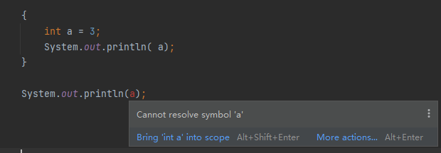

# Java中的变量, Notes of Variable in Java

[Index](index.md)

1. Java中没有全局变量，只有方法变量、实例变量（类中的非静态变量）、类变量（类中的静态变量）。
1. 方法中的变量不能够有访问修饰符。所以访问修饰符表（[链接](https://docs.oracle.com/javase/tutorial/java/javaOO/accesscontrol.html)）仅针对于在类中定义的变量。
1. 声明实例变量时，如果没有赋初值，将被初始化为`null`（引用类型）或者`0`、`false`（原始类型）。
1. 可以通过实例变量初始化器来初始化较复杂的实例变量，实例变量初始化器是一个用{}包含的语句块，在类的构造器被调用时运行，运行于父类构造器之后，构造器之前。
1. 类变量（静态变量）也可以通过类变量初始化器来进行初始化，类变量初始化器是一个用`static{}`包含的语句块，只可能被初始化一次。
1. Java 变量作用域是块级别的, 这点和 JavaScript 不一样, 后者是方法级别的。

---

注：本文从旧站搬运而来。
