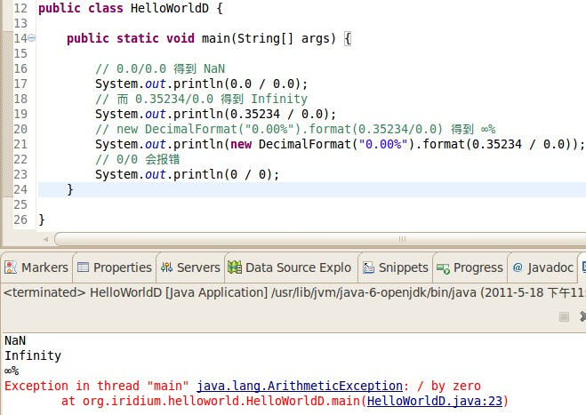

# Java 对零作为除数的处理

在 Java 里，同是零作为除数，没想到几个简单的运算都得到意料之外的结果，如何？

具体代码是这样的（参截图）



代码片段：

```java
    // 0.0/0.0 得到 NaN
    System.out.println(0.0 / 0.0);
    // 而 0.35234/0.0 得到 Infinity
    System.out.println(0.35234 / 0.0);
    // new DecimalFormat("0.00%").format(0.35234/0.0) 得到 ∞%
    System.out.println(new DecimalFormat("0.00%").format(0.35234 / 0.0));
    // 0/0 会报错
    System.out.println(0 / 0);
```

上面程序的这几种输出结果，和现实逻辑是违背的，作为 Java 用户，使用时尤其需要当心，应避免0作除数的运算。

本文所呈现的问题可以看作是 Java 语言的缺陷导致的陷阱。

---

本文从[Google Sites](https://sites.google.com/site/iridiumsite/it/java/java-lang/zero-devide)转移而来。