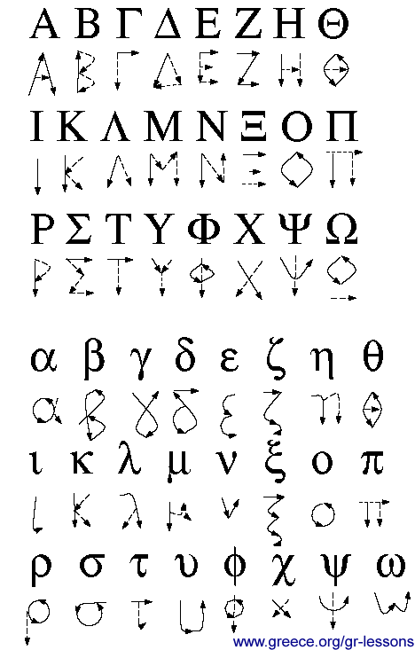

# 希腊字母 Greek Alphabet

[返回目录](index.md)

|     序号    | 大写字母 | 小写字母 |   名称  |   LaTeX  |     发音    |  国际音标 |  更多发音                                                        |
|:-----------:|:--------:|:--------:|:-------:|:--------:|:-----------:|:---------:|------------------------------------------------------------------|
| 1           | Α        | α        | Alpha   | \alpha   | ah-luh-fuh  | ˈælfə     |  /ˈælfə/                                                         |
| 2           | Β        | β        | Beta    | \beta    | bay-tuh     | ˈbeɪtə    |  /ˈbiːtə/,   US /ˈbeɪtə/                                         |
| 3           | Γ        | γ        | Gamma   | \gamma   | gah-muh     | ˈɡæmə     |  /ˈɡæmə/                                                         |
| 4           | Δ        | δ        | Delta   | \delta   | dell-tuh    | ˈdɛltə    |  /ˈdɛltə/                                                        |
| 5           | Ε        | ε        | Epsilon | \epsilon | eh-psuh-lon | ˈɛpsilɒn  |  /ˈɛpsɨlɒn/,   UK also /ɛpˈsaɪlən/                               |
| 6           | Ζ        | ζ        | Zeta    | \zeta    | zay-tuh     | ˈziːtə    |  /ˈziːtə/,   US /ˈzeɪtə/                                         |
| 7           | Η        | η        | Eta     | \eta     | ay-tuh      | ˈeɪtə     |  /ˈiːtə/,   US /ˈeɪtə/                                           |
| 8           | Θ        | θ        | Theta   | \theta   | thay-tuh    | ˈθeɪtə    |  /ˈθiːtə/,   US /ˈθeɪtə/                                         |
| 9           | Ι        | ι        | Iota    | \iota    | eye-o-tuh   | aɪˈoʊtə   |  /aɪˈoʊtə/                                                       |
| 10          | Κ        | κ        | Kappa   | \kappa   | kap-uh      | ˈkæpə     |  /ˈkæpə/                                                         |
| 11          | Λ        | λ        | Lambda  | \lambda  | lam-duh     | ˈlæmdə    |  /ˈlæmdə/                                                        |
| 12          | Μ        | μ        | Mu      | \mu      | mew         | mjuː      |  /ˈmjuː/,   US less commonly /ˈmuː/                              |
| 13          | Ν        | ν        | Nu      | \nu      | new         | njuː      |  /ˈnjuː/,   US /ˈnuː/                                            |
| 14          | Ξ        | ξ        | Xi      | \xi      | ksee        | zaɪ       |  /ˈzaɪ/,   /ˈksaɪ/                                               |
| 15          | Ο        | ο        | Omicron | o        | oh-muh-kron | oʊˈmɪkrɒn |  /ˈɒmɨkrɒn/,   traditional UK /oʊˈmaɪkrɒn/                       |
| 16          | Π        | π        | Pi      | \pi      | pie         | paɪ       |  /ˈpaɪ/                                                          |
| 17          | Ρ        | ρ        | Rho     | \rho     | row         | roʊ       |  /ˈroʊ/                                                          |
| 18          | Σ        | σ/ς      | Sigma   | \sigma   | sig-muh     | ˈsɪɡmə    |  /ˈsɪɡmə/                                                        |
| 19          | Τ        | τ        | Tau     | \tau     | tow         | taʊ       |  /ˈtaʊ/,   also /ˈtɔː/                                           |
| 20          | Υ        | υ        | Upsilon | \upsilon | oop-suh-lon | ˈʌpsɪlɒn  |  /juːpˈsaɪlən/,   /ˈʊpsɨlɒn/, UK also /ʌpˈsaɪlən/, US /ˈʌpsɨlɒn/ |
| 21          | Φ        | φ        | Phi     | \phi     | fye         | faɪ       |  /ˈfaɪ/                                                          |
| 22          | Χ        | χ        | Chi     | \chi     | kye         | kaɪ       |  /ˈkaɪ/                                                          |
| 23          | Ψ        | ψ        | Psi     | \psi     | sigh        | saɪ       |  /ˈsaɪ/,   /ˈpsaɪ/                                               |
| 24          | Ω        | ω        | Omega   | \omega   | oh-may-guh  | oʊˈmeɪɡə  |  US   /oʊˈmeɪɡə/, traditional UK /ˈoʊmɨɡə/                       |

本文表格，除最后一列，是用 ChatGPT 制作的，具体的指令是：

1. 请整理一张希腊字母的表格，包含这些列： 序号，大写，小写，名称，LaTex，发音
2. 请在最右侧添一列：国际音标

## 书写

来源：<http://www.greece.org/gr-lessons/gr-english/Gif/script.gif>

---

Ref:

- <http://en.wikipedia.org/wiki/Greek_alphabet>
- <http://en.wikipedia.org/wiki/English_pronunciation_of_Greek_letters>

---

本文是从[旧站](https://sites.google.com/site/iridiumsite/Home/others/mathematics/greek-alphabet)搬迁并改写的。